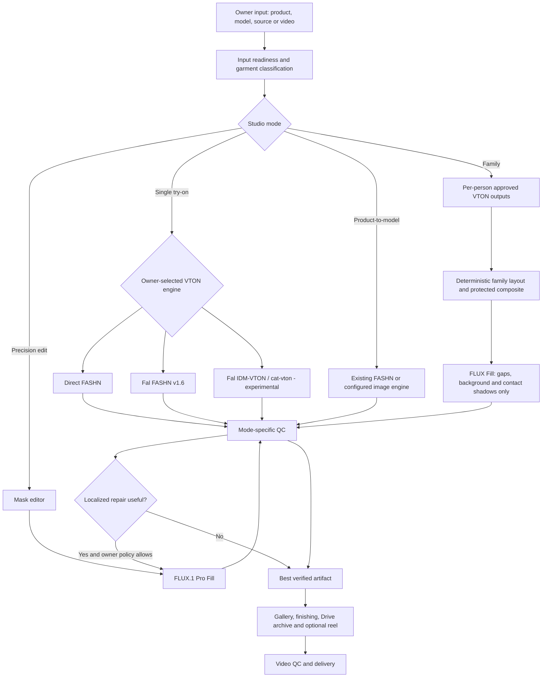

# Creative Studio Professional Upgrade Roadmap

**Program:** Fal.ai IDM-VTON + FLUX Fill + Creative Studio quality hardening

**Owner:** Maruf, ALMA Lifestyle / ALMA Trading

**Prepared:** 2026-07-16 (Asia/Dhaka)

**Status:** Approved roadmap; implementation not started

**Execution rule:** One phase per Claude Code session. Never start the next phase in the same session.

## 1. Outcome

Upgrade the existing Creative Studio into a professional, measurable fashion-production pipeline covering:

- product-to-model;
- selectable single-person virtual try-on;
- father-son, mother-daughter, couple, and full-family collections;
- precision background replacement and localized repair;
- generated short product reels;
- owner-shot video editing, captions, audio, branding, and covers;
- repeatable QC, cost tracking, recovery, and browser proof.

The upgrade must preserve the current FASHN, Gemini, Seedream, Veo, ffmpeg, Gallery, Google Drive, and Redis worker paths. It must add Fal.ai capabilities without turning the current working system into a one-model rewrite.

## 2. Locked owner decisions

1. **IDM-VTON must be available as a manual choice for single-person Try-On.**
2. IDM-VTON is not a family compositor. Hide or disable it for multi-person family modes.
3. The current Fal endpoint corresponding to the requested IDM-VTON experience is `fal-ai/cat-vton`.
4. Fal currently marks `fal-ai/cat-vton` as **Research only**. Show that warning clearly, keep it opt-in, do not make it the automatic default, and do not silently auto-publish its output.
5. Production-safe Fal try-on must also support `fal-ai/fashn/tryon/v1.6` as a commercial alternative through the same `FAL_KEY` account.
6. The requested Fill endpoint is `fal-ai/flux-pro/v1/fill` (FLUX.1 Pro Fill). `fal-ai/flux-pro/v1.1` is a separate text-to-image model and must not be mislabeled as Fill.
7. FLUX Fill is a **precision editor**, not a general replacement for every image engine. It should edit only the masked region.
8. Existing direct FASHN remains available and must not be deleted.
9. Family outputs should be built from individually approved people/garments, then composited and harmonized. Do not ask one model to reinvent all people and garments in one call when a deterministic alternative exists.
10. All generated customer-facing/staff-facing text remains pure Bangla and follows existing Islamic guardrails.

Official references:

- Fal IDM-style endpoint: <https://fal.ai/models/fal-ai/cat-vton>
- Fal FASHN v1.6: <https://fal.ai/models/fal-ai/fashn/tryon/v1.6>
- FLUX.1 Pro Fill API: <https://fal.ai/models/fal-ai/flux-pro/v1/fill/api>
- Fal FLUX Virtual Try-On commercial alternative: <https://fal.ai/models/fal-ai/flux-pro/v1/vto/api>

## 3. Non-negotiable repository rules

Claude Code must read and follow the repository `AGENTS.md` before every phase. In addition:

- Never modify existing ERP code outside the exact files listed for the active phase.
- Never touch `/api/agent/*` or its authentication.
- New assistant routes stay under `/api/assistant/*`.
- Every assistant route checks `requireAgentEnabled()` first.
- No secrets in git. Only placeholders go in `.env.example`.
- Long work runs through the durable VPS worker queue, never a Vercel request that waits for model completion.
- Database changes are additive only and only when the phase explicitly permits a migration.
- Before a phase, create its exact branch and pre-phase tag.
- Never merge to `main` or deploy production. Push a branch for a Vercel preview; the owner approves the merge.
- Build/typecheck passing is not browser proof.
- Before saying a phase is done, exercise the feature in the owner's Chrome browser on the Vercel preview and capture a screenshot.
- One phase per session. Stop after the final report for that phase.

## 4. Audited baseline

The existing system already has:

- Product-to-Model, Try-On, Model Swap, Face-to-Model, Edit, and Image-to-Video modes.
- Saved model roles: father, mother, son, daughter, and single/default.
- FASHN single-person try-on and product-to-model.
- A family accuracy chain: adult FASHN try-on -> generated child garment -> child FASHN try-on -> Gemini pair merge; full family uses two pair chains plus a group merge.
- Gemini/Seedream/OpenAI image routing through the image worker.
- Gemini vision garment classification and an image QC loop with bounded regeneration.
- Veo 3.1 short image-to-video generation and multi-clip chains.
- Owner-shot video recipes using ffmpeg, scene detection, captions, music, voiceover, stings, and cover candidates.
- BullMQ/Redis durable processing, job-result callbacks, retry controls, Gallery, and Google Drive archive.

Audit findings that this roadmap must resolve:

- Studio provider types are effectively limited to FASHN/Gemini; Fal Seedream logic is hard-coded inside the main worker.
- Family UI says multi-person work runs on Gemini even when the backend uses the FASHN/Gemini accuracy chain.
- Background replacement is prompt-based full-image editing, which can change face, garment, embroidery, buttons, and hands.
- Normal QC can accept a `2/5` individual axis when overall passes.
- No durable shared Fal submit/status/result/cancel adapter exists.
- `FAL_KEY` is consumed in code but missing from `.env.example`.
- Gallery samples show hand/anatomy defects, face/age drift, and near-duplicate compositions.
- Family quality errors compound across multiple generative steps.
- Video generation lacks temporal garment/identity QC.
- Duplicate video uploads are possible.
- Gallery can expose raw ffmpeg/internal error text to the owner.
- Audio processing does not enforce a consistent social-platform loudness target.

Current verification at roadmap creation:

- Production Creative Studio inspected in the owner's Chrome session.
- Auto, Advanced, family, Gallery, and Video UI inspected.
- `npm run type-check`: PASS.
- Creative Studio/Try-On targeted tests: 47/47 PASS.
- All Creative Studio assistant routes checked for `requireAgentEnabled()`.

## 5. Target architecture



### 5.1 Provider roles

| Provider/endpoint | Role | Availability |
|---|---|---|
| Current direct FASHN | Existing production try-on/product-to-model | Preserve |
| `fal-ai/fashn/tryon/v1.6` | Commercial Fal single-person try-on | Add |
| `fal-ai/cat-vton` | Owner-selectable IDM-VTON-style single-person try-on | Add, experimental/research warning |
| `fal-ai/flux-pro/v1/fill` | Masked background/edit/repair/outpaint | Add |
| Gemini/Seedream | Multi-reference generation and current fallback | Preserve |
| Veo 3.1 | Generated product reel | Preserve and harden |
| ffmpeg | Owner-shot video recipes and finishing | Preserve and harden |

### 5.2 Shared Fal job contract

Every Fal-backed job must use a normalized payload/result contract. Exact field names may be adjusted during implementation, but the capabilities are mandatory.

```ts
type FalJobState = {
  endpointId: string
  requestId?: string
  submittedAt?: string
  pollStartedAt?: string
  lastStatus?: 'IN_QUEUE' | 'IN_PROGRESS' | 'COMPLETED' | 'FAILED'
  inputFingerprint: string
  modelVersionLabel: string
  attempt: number
}

type FalArtifactResult = {
  provider: 'fal'
  endpointId: string
  requestId: string
  storagePath: string
  seed?: number
  latencyMs: number
  costUsd?: number
  inputFingerprint: string
}
```

Requirements:

- Persist `requestId` immediately after submit.
- Resume the same request after worker restart.
- Never retry a paid generation merely because result download/callback failed.
- Retry only explicitly transient network/429/5xx failures with bounded backoff.
- Support request cancellation where Fal supports it.
- Download outputs into `agent-files`; Gallery never depends on a temporary Fal URL.
- Record endpoint, request ID, latency, cost, seed, and QC in result metadata.
- Keep `FAL_KEY` on server/worker only.

## 6. Quality targets

Build a fixed golden set before judging engines:

- 8 plain/solid panjabis;
- 8 embroidery/detail-heavy panjabis;
- 4 koti/layered sets;
- 4 pajama/contrast-bottom sets;
- 6 child/family collections;
- saved adult/child models with front, three-quarter, seated, and difficult-hand poses.

Target acceptance after the final phase:

| Metric | Target |
|---|---|
| Publishable single try-on without full rerun | >= 90% |
| Garment fidelity | >= 4/5 and never below 4 in strict mode |
| Model identity | >= 4/5 and never below 4 in strict mode |
| Anatomy/hands | >= 4/5 and never below 4 in strict mode |
| Correct family member count | 100% |
| Correct saved-role identities in family output | >= 90% |
| Worker restart duplicate paid request | 0 |
| Raw internal error exposed to owner | 0 |
| Gallery artifact has provider/model/request lineage | 100% |
| Video black/frozen-frame critical failures | 0 accepted outputs |

Cost facts to surface in the UI, not hard-code without a model-price configuration:

- Fal FASHN v1.6 currently advertises approximately `$0.075/generation`.
- FLUX Fill currently advertises `$0.05/MP`, rounded up to the next megapixel.
- The IDM/cat-vton listing does not provide a reliable production pricing contract and is research-only; measure actual billed test cost and keep it configurable.

## 7. Phase index

| Phase | Branch | Purpose | Initial status |
|---|---|---|---|
| CS5 | `agent-phase-cs5` | Fal foundation, provider registry, flags, durable client | READY FOR OWNER |
| CS6 | `agent-phase-cs6` | Selectable IDM-VTON and Fal FASHN single try-on | READY FOR OWNER |
| CS7 | `agent-phase-cs7` | FLUX Fill precision editor and mask workflow | READY FOR OWNER |
| CS8 | `agent-phase-cs8` | Professional single/product pipeline and localized repair | READY FOR OWNER |
| CS9 | `agent-phase-cs9` | Family/couple/full-family protected compositing | READY FOR OWNER |
| CS10 | `agent-phase-cs10` | QC 2.0, golden evaluation and model comparison | TODO |
| CS11 | `agent-phase-cs11` | Short-video and owner-shot video hardening | TODO |
| CS12 | `agent-phase-cs12` | Observability, rollout controls and final E2E certification | TODO |

The roadmap file itself is allowed in every phase only for updating that phase's status/checklist. Do not rewrite future phase scope while implementing the current phase unless the owner explicitly approves a roadmap change.

---

## Phase CS5 - Fal foundation and provider registry

**Branch:** `agent-phase-cs5`

**Pre-phase tag:** `pre-agent-phase-cs5`

**Goal:** Add a reusable, durable Fal foundation without changing the current default output.

### Allowed files

- `.env.example`
- `docs/CREATIVE_STUDIO_FAL_IDM_VTON_FLUX_FILL_ROADMAP.md`
- `src/lib/creative-studio/constants.ts`
- `src/lib/creative-studio/provider-registry.ts` (new)
- `src/lib/creative-studio/__tests__/provider-registry.test.ts` (new)
- `src/app/api/assistant/creative-studio/config/route.ts`
- `src/app/api/assistant/creative-studio/settings/route.ts`
- `src/agent/components/creative-studio/studio-api.ts`
- `src/agent/components/creative-studio/CreativeStudio.tsx`
- `worker/src/fal/client.mjs` (new)
- `worker/src/fal/fingerprint.mjs` (new)
- `worker/src/fal/__tests__/client.test.mjs` (new, if the worker test runner is added without changing dependencies)
- `worker/src/index.mjs`
- `worker/src/cost-log.mjs`

### Work

- Add `FAL_KEY=` placeholder and comments to `.env.example`.
- Introduce a typed provider registry separating engine identity, capability, commercial/research status, and UI label.
- Preserve existing `fashn` and `gemini` values through compatibility mapping.
- Add owner-tunable flags/settings:
  - `cs_fal_enabled`
  - `cs_idm_vton_enabled`
  - `cs_flux_fill_enabled`
  - `cs_single_vton_default`
- Implement Fal queue submit/status/result/cancel and durable request-state helpers.
- Add endpoint allowlisting so arbitrary endpoint IDs cannot be injected from the client.
- Add fingerprint/idempotency support.
- Do not expose unfinished Fal engines as runnable UI choices yet.
- Fix the family provider label so it describes the accuracy chain honestly rather than saying the whole job is Gemini.

### Acceptance

- Existing Studio defaults are unchanged.
- Provider registry tests cover capability and commercial/research metadata.
- Fal client tests/mock contract prove submit -> persist request ID -> resume -> result.
- Missing Fal key produces a clear availability state, not a runtime crash in unrelated modes.
- No secret reaches the browser bundle.
- Typecheck, targeted tests, build, diff-scope check, Vercel preview, and Chrome screenshot pass.
- Update CS5 status to `READY FOR OWNER` and stop. Do not begin CS6.

### CS5 verification notes (2026-07-16, branch `agent-phase-cs5`, tag `pre-agent-phase-cs5` from main `bb04b6c1`)

**Status: READY FOR OWNER**

- Provider registry (`src/lib/creative-studio/provider-registry.ts`): identity/capability/commercial metadata for fashn, gemini, fal_fashn_v16 (commercial), fal_idm_vton (research_only + Bangla warning), fal_flux_fill; legacy fashn/gemini mapping; Fal endpoint allowlist (exactly cat-vton, fashn/tryon/v1.6, flux-pro/v1/fill); single-VTON default validation. 15 vitest tests PASS.
- Durable Fal queue client (`worker/src/fal/client.mjs` + `fingerprint.mjs`): submit persists request_id to `agent_kv_settings` (`fal_request:<pendingActionId>`) BEFORE polling; restart with same fingerprint resumes the same paid request (proved: zero POSTs on resume path); result-download failure keeps state (retrieval retry, no re-pay); only transient (408/429/5xx/network) poll errors retried, bounded; Fal-side FAILED clears state. 9 node:test tests PASS (`node --test worker/src/fal/__tests__/`). No worker package.json change.
- Owner flags via kv, all default OFF: `cs_fal_enabled`, `cs_idm_vton_enabled`, `cs_flux_fill_enabled`, `cs_single_vton_default` (default `fashn`, allowlist-validated, 422 on injection). Settings UI section "Fal ইঞ্জিন" added under লাইব্রেরি → স্টুডিও সেটিংস; nothing new is runnable in the Run tab — existing defaults unchanged.
- Config route exposes truthful availability (`falConfigured` + per-engine configured/enabled/runnable); missing FAL_KEY = clear state, no crash.
- Family label honesty: multi-person family Run button now reads "Run — FASHN + Gemini চেইন" with hint "প্রতি জনের FASHN try-on, তারপর Gemini দিয়ে এক ফ্রেমে merge" (was claiming plain Gemini).
- `FAL_KEY=` placeholder documented in `.env.example`; fal list-price helpers in `worker/src/cost-log.mjs` (FASHN v1.6 $0.075/gen flat; FLUX Fill $0.05/MP round-up).
- Checks: `npm run type-check` PASS; `npm run build` PASS; targeted vitest (creative-studio + tryon) 62/62 PASS; diff scope = allowed files only; no secrets.
- Browser proof (owner's Chrome, Vercel preview `alma-erp-git-agent-phase-cs5-maruf-s-projects2.vercel.app`, owner logged in): Settings shows Fal section with "FAL_KEY আছে" badge, research-only badge on IDM-VTON; toggle round-trip verified (IDM on → reload persists → back off); config API returned engines with enabled:false/runnable:false for all Fal entries and familyChainLabelBn; family Run button screenshot captured showing the honest chain label.
- No paid Fal generation exercised in CS5 (foundation only — engines intentionally not runnable). API cost this phase: $0.
- Ambiguity noted: repo has no `AGENTS.md` (roadmap §3 references it); `CLAUDE.md` was followed as the binding repo rules.

---

## Phase CS6 - Selectable IDM-VTON and Fal FASHN single try-on

**Branch:** `agent-phase-cs6`

**Pre-phase tag:** `pre-agent-phase-cs6`

**Goal:** Let the owner choose IDM-VTON for a single saved/uploaded model plus product garment.

### Allowed files

- `docs/CREATIVE_STUDIO_FAL_IDM_VTON_FLUX_FILL_ROADMAP.md`
- `src/lib/creative-studio/constants.ts`
- `src/lib/creative-studio/provider-registry.ts`
- `src/lib/creative-studio/create-run.ts`
- `src/lib/creative-studio/__tests__/provider-registry.test.ts`
- `src/lib/tryon/art-director.ts`
- `src/app/api/assistant/creative-studio/config/route.ts`
- `src/app/api/assistant/creative-studio/run/route.ts`
- `src/app/api/assistant/creative-studio/gallery/route.ts`
- `src/app/api/assistant/creative-studio/settings/route.ts`
- `src/agent/components/creative-studio/studio-api.ts`
- `src/agent/components/creative-studio/CreativeStudio.tsx`
- `worker/src/fal/client.mjs`
- `worker/src/fal/adapters/cat-vton.mjs` (new)
- `worker/src/fal/adapters/fashn-v16.mjs` (new)
- `worker/src/fal/__tests__/vton-adapters.test.mjs` (new)
- `worker/src/index.mjs`
- `worker/src/image-qc.mjs`
- `worker/src/cost-log.mjs`

### Work

- In **single Try-On only**, show these choices:
  - Direct FASHN Pro (existing)
  - Fal FASHN v1.6 (commercial)
  - IDM-VTON (experimental / research-only)
  - Gemini fallback where currently supported
- Hide/disable IDM for family, couple, full-family, model swap, face, edit, and video.
- `fal-ai/cat-vton` mapping:
  - person -> `human_image_url`
  - product -> `garment_image_url`
  - panjabi/long kurta/one-piece outfit -> `overall`
  - koti/waistcoat -> `outer`
  - pajama/bottom only -> `lower`
  - tunic/top-only cases -> `upper`
- Add an owner-visible override when auto classification is uncertain.
- Default initial benchmark: 30 inference steps, guidance 2.5, fixed/reported seed when supplied.
- Normalize orientation/size without distorting person proportions.
- Add provider/model badges, seed, latency, request ID, and cost metadata to Gallery details.
- Research-only warning must be visible before Run. The owner can still make the manual choice.
- Do not make IDM the Auto-mode default during this phase.
- Run at least one real preview generation through each new Fal VTON adapter, subject to configured key/credit.

### Acceptance

- IDM is selectable and runnable for single Try-On.
- IDM cannot be selected for family modes.
- Fal FASHN v1.6 is selectable and identified as commercial.
- Worker restart/resume test proves no duplicate paid submit.
- Failed output download can resume result retrieval without a new generation.
- Gallery displays correct provider lineage.
- Real Chrome preview proof includes model/product selection, IDM choice, finished Gallery artifact, and metadata.
- Update CS6 status to `READY FOR OWNER` and stop. Do not begin CS7.

### CS6 verification notes (2026-07-16, branch `agent-phase-cs6`, tag `pre-agent-phase-cs6`, PR #406 — owner instructed merge + same-session continuation)

**Status: READY FOR OWNER (merged to main at owner's instruction; live-verified on production)**

- Engine picker (single Try-On ONLY): Direct FASHN Pro / Fal FASHN v1.6 (commercial) / IDM-VTON (research-only) / Gemini draft. Multi-person family presets hide the picker entirely (verified live — chain label returns). Research warning shown before Run.
- cat-vton mapping per owner lock (overall/outer/lower/upper) with classifier auto + owner-visible গার্মেন্ট override; FASHN v1.6 categories derived (one-pieces/tops/bottoms/auto). Defaults: 30 steps, guidance 2.5, optional fixed seed.
- Worker adapters on the durable client — node:test proves: one paid submit per fingerprint, restart resume with zero re-submit, result-download failure keeps state for retrieval-only retry, QC regens fingerprint-salted and bounded.
- **Real production runs (owner's Chrome, alma-erp-six, VPS worker deployed at owner's "worker deploy koro"):**
  - Fal FASHN v1.6: executed, request `019f6bde-9bb6-78e2-be3a-3401f6160ed1`, 16.2s, QC 3 bounded attempts, honestly flagged "weak garment fidelity 3/5", actual cost $0.225 (3×$0.075).
  - IDM-VTON (fal-ai/cat-vton): executed, request `019f6be5-2e90-7030-afc0-c69cbb3560e6`, 9.7s final attempt, QC 3 attempts flagged 3/5, cost $0.15 (3×$0.05 kv-default `cs_idm_vton_cost_usd`).
  - Gallery lineage verified in lightbox: engine chip, ⚠ পরীক্ষামূলক badge, latency, $, request id, QC flag. Grid badges FAL FASHN / IDM ⚠.
  - Total real API spend this phase: **$0.375**.
- Note: test product photo was a marketing composite (2 people + text) — low garment-fidelity scores expected; golden-set evaluation with clean garment shots is CS10 scope.
- Checks: type-check PASS, build PASS, vitest 64/64, worker node:test 16/16 (`node --test worker/src/fal/__tests__/client.test.mjs worker/src/fal/__tests__/vton-adapters.test.mjs`).
- Process deviations (owner-directed): CS6 ran in the same session as CS5; Claude merged PR #406 himself and deployed the VPS worker — both at the owner's explicit instruction.

---

## Phase CS7 - FLUX Fill precision editor

**Branch:** `agent-phase-cs7`

**Pre-phase tag:** `pre-agent-phase-cs7`

**Goal:** Add safe masked editing for background replacement, artifact repair, hand repair, shadow, and outpaint.

### Allowed files

- `docs/CREATIVE_STUDIO_FAL_IDM_VTON_FLUX_FILL_ROADMAP.md`
- `src/lib/creative-studio/constants.ts`
- `src/lib/creative-studio/provider-registry.ts`
- `src/lib/creative-studio/create-run.ts`
- `src/lib/creative-studio/mask-contract.ts` (new)
- `src/lib/creative-studio/__tests__/mask-contract.test.ts` (new)
- `src/agent/components/creative-studio/CreativeStudio.tsx`
- `src/agent/components/creative-studio/LifestyleEditor.tsx`
- `src/agent/components/creative-studio/MaskEditor.tsx` (new)
- `src/agent/components/creative-studio/studio-api.ts`
- `src/app/api/assistant/creative-studio/run/route.ts`
- `src/app/api/assistant/creative-studio/gallery/route.ts`
- `src/app/api/assistant/creative-studio/mask-upload/route.ts` (new)
- `worker/src/fal/client.mjs`
- `worker/src/fal/adapters/flux-fill.mjs` (new)
- `worker/src/fal/__tests__/flux-fill-adapter.test.mjs` (new)
- `worker/src/index.mjs`
- `worker/src/image-qc.mjs`
- `worker/src/cost-log.mjs`

### Work

- Add a proper mask canvas with brush, erase, undo, clear, invert, size, feather, and preview.
- Base image and mask dimensions must match exactly.
- Establish mask polarity with an automated fixture/contract test; never assume it silently.
- Add presets:
  - Replace Background
  - Remove Object/Artifact
  - Repair Hand/Small Area
  - Add Contact Shadow
  - Extend Canvas
  - Custom Prompt
- Default to `enhance_prompt=false`, `num_images=1`, PNG for precision work, and conservative safety settings.
- Keep all unmasked pixels unchanged; add a pixel-diff assertion with tolerance around the mask feather boundary.
- Show estimated Fill cost from megapixels before Run.
- Store base path, mask path, prompt, seed, endpoint, request ID, and output lineage.
- Precision edit must use the worker queue, not wait in the Vercel route.

### Acceptance

- Owner can paint and preview a mask on desktop and mobile.
- Background-only test preserves face and garment outside the mask.
- Small artifact repair changes only the intended region plus feather boundary.
- Cost estimate and actual cost are recorded.
- Retry/resume does not duplicate a paid request.
- Chrome preview proof shows mask creation, submitted Fill job, finished artifact, and before/after comparison.
- Update CS7 status to `READY FOR OWNER` and stop. Do not begin CS8.

### CS7 verification notes (2026-07-17, branch `agent-phase-cs7`, tag `pre-agent-phase-cs7`, PR #411 — owner-directed same-session continuation + merge)

**Status: READY FOR OWNER (merged to main at owner's instruction; live-verified on production)**

- MaskEditor live: brush/erase/undo/clear/invert/size/feather/preview, pointer events (desktop+touch), natural-resolution PNG export. Presets: ব্যাকগ্রাউন্ড বদলাও / অবজেক্ট মুছাও / হাত ঠিক করো / কন্টাক্ট শ্যাডো / ক্যানভাস বাড়াও / নিজের প্রম্পট।
- Mask polarity locked (white=edit, black=keep) — vitest fixtures + a REAL sharp composite fixture in worker node:test proving black pixels survive byte-identical and feather blends only in the band.
- Protected composite in the worker (base×(1−m)+fill×m): unmasked pixels unchanged by construction; pixel-diff assertion (`protectedDiff` in result). enhance_prompt=false, num_images=1, PNG, safety_tolerance 2.
- mask-upload route: dims-vs-base validation (same-aspect auto-resize for ≤2048 upload downscale), empty/covers-everything guards, MP cost estimate returned and shown before Run.
- **Real production run (owner's Chrome, alma-erp-six; VPS worker deployed under owner's standing permission "onumoti dilam"):** background-replace on the CS6 Fal FASHN try-on image — executed, request `019f6c3a-508b-7ca0-b648-ffe14dab78d9`, 33.3s, actual cost **$0.10** (2MP × $0.05). Lightbox lineage chips verified (FLUX Fill · seed · latency · $ · request id); face/garment outside the mask pixel-identical (protected composite), only the masked sky band changed. Cost estimate shown pre-Run ($0.10) matched actual.
- Durable: same resume-no-repay contract as CS6 adapters (single paid submit proven in adapter e2e test).
- Checks: type-check PASS, build PASS, vitest 73/73, worker node:test 20/20.
- Deviations (owner-directed): same-session continuation from CS6; Claude merged PR #411 and redeployed the VPS worker with the owner's explicit permission. Mobile-device mask UX check still owed to the owner (desktop pointer verified; the editor uses pointer events which cover touch).
- Known follow-up for CS8: surface `protectedDiff` and mask preset in the Gallery lightbox (data already persisted in result JSON).

---

## Phase CS8 - Professional single/product pipeline

**Branch:** `agent-phase-cs8`

**Pre-phase tag:** `pre-agent-phase-cs8`

**Goal:** Turn the selectable engines and precision editor into a reliable single-person production workflow.

### Allowed files

- `docs/CREATIVE_STUDIO_FAL_IDM_VTON_FLUX_FILL_ROADMAP.md`
- `src/lib/creative-studio/constants.ts`
- `src/lib/creative-studio/create-run.ts`
- `src/lib/creative-studio/single-pipeline.ts` (new)
- `src/lib/creative-studio/__tests__/single-pipeline.test.ts` (new)
- `src/lib/tryon/art-director.ts`
- `src/lib/tryon/qc-gate.ts`
- `src/lib/tryon/scene-pool.ts`
- `src/agent/components/creative-studio/CreativeStudio.tsx`
- `src/agent/components/creative-studio/studio-api.ts`
- `src/app/api/assistant/creative-studio/run/route.ts`
- `src/app/api/assistant/creative-studio/settings/route.ts`
- `src/app/api/assistant/internal/job-result/route.ts`
- `worker/src/index.mjs`
- `worker/src/image-qc.mjs`
- `worker/src/fal/adapters/flux-fill.mjs`

### Work

- Add input readiness checks: full person visibility, usable resolution, garment crop, background clutter, pose/occlusion risk.
- Provide clear Bangla corrections before spending money on unusable input.
- Add owner-tunable modes:
  - Preview: one economical generation, no auto repair
  - Production: strict QC and one localized repair when justified
- Replace full-image rescene with protected/masked background Fill when Fill is enabled.
- Do not auto-repair faces or embroidery without a narrowly localized mask.
- If localized repair is not safe, return the best flagged artifact rather than endlessly regenerating.
- Preserve exact product color, collar, placket, buttons, embroidery zones, sleeve/hem length, and white-pajama rules.
- Prevent near-identical batch variants by recording scene/pose and using controlled diversity.

### Acceptance

- Single pipeline selects the requested engine exactly.
- Production mode cannot pass with garment, identity, or anatomy below 4/5.
- Background change preserves approved person/garment pixels.
- Maximum paid-generation/repair count is bounded and shown to owner.
- Golden single-person subset meets agreed pass-rate target or reports evidence-backed blockers.
- Chrome preview proof covers Direct FASHN, IDM manual choice, and one masked rescue path.
- Update CS8 status to `READY FOR OWNER` and stop. Do not begin CS9.

### CS8 verification notes (2026-07-17, branch `agent-phase-cs8`, tag `pre-agent-phase-cs8`, PR #413 — owner-directed same-session continuation + merge)

**Status: READY FOR OWNER (merged to main at owner's instruction; live-verified on production)**

- **Input readiness gate live-proven ($0 spent):** a 200px model image was rejected 422 with the exact Bangla correction "মডেলের ছবির রেজোলিউশন খুব কম (ছোট দিক ৫১২px-এর নিচে) — বড়/পরিষ্কার ছবি দিন।" — sharp resolution checks + cached narrow vision check (full person/occlusion/clutter), fail-open.
- **Preview/Production modes** (kv `cs_pipeline_mode`, settings UI + Run-panel hint): Preview = 1 economical paid run, no auto repair; Production = strict QC, hard ceiling **3 paid generations** (bound shown to owner up front; costEstimate scales).
- **Hard axis gate live-proven:** three production runs (Direct FASHN chain, IDM-VTON, chain Gemini step) each capped at exactly 3 attempts, result `qc.pipelineMode: production` + `coreAxes` surfaced; core axes at 3/5 correctly REFUSED a pass (previously a decent overall could hide a weak axis) — best flagged artifact returned instead of endless regens.
- **No auto face/embroidery repaint:** masked repair limited to anatomy/composition (`repairableAxes`); flagged artifacts get 🎯 মাস্ক এঁকে ঠিক করুন in the Gallery lightbox. **Masked rescue live-proven:** rescue on the flagged FASHN artifact (remove-object mask on a plant pot) — FLUX Fill executed, request `019f6c70-0c2d-78a3-b637-75e53e1152b8`, 36s, actual $0.25 = pre-Run estimate.
- **Controlled diversity:** last-4-scene exclusion ring (`cs_recent_scenes`) + scene/pose lineage in payloads; new runs visibly landed on fresh scenes (rooftop vs earlier sunset/lake).
- Real spend this phase: IDM $0.15 + rescue Fill $0.25 + Direct-FASHN chain credits (~$0.68 est at 3×3 credits) + chain Gemini merges (small) ≈ **$1.1**.
- Checks: type-check PASS, build PASS, vitest 82/82, worker node:test 20/20.
- Owner decisions pending: default mode left at **preview** (production flips in সেটিংস); review production spend cap (3) and the strict-gate thresholds. Golden-set pass-rate evaluation deliberately deferred to CS10 (needs clean garment fixtures — today's marketing-composite product photo scores garment fidelity 3/5 on every engine).
- Deviations (owner-directed): same-session continuation; Claude merged PR #413 and redeployed the VPS worker under the owner's standing permission.

---

## Phase CS9 - Family protected compositing

**Branch:** `agent-phase-cs9`

**Pre-phase tag:** `pre-agent-phase-cs9`

**Goal:** Improve father-son, mother-daughter, couple, and full-family identity/garment consistency without one-shot reinvention.

### Allowed files

- `docs/CREATIVE_STUDIO_FAL_IDM_VTON_FLUX_FILL_ROADMAP.md`
- `src/lib/creative-studio/create-run.ts`
- `src/lib/tryon/family-chain.ts`
- `src/lib/tryon/model-library.ts`
- `src/lib/tryon/qc-gate.ts`
- `src/lib/tryon/__tests__/family-chain.test.ts`
- `src/lib/tryon/family-layout.ts` (new)
- `src/lib/tryon/__tests__/family-layout.test.ts` (new)
- `src/agent/components/creative-studio/CreativeStudio.tsx`
- `src/agent/components/creative-studio/studio-api.ts`
- `src/app/api/assistant/creative-studio/run/route.ts`
- `src/app/api/assistant/creative-studio/jobs/[id]/route.ts`
- `src/app/api/assistant/internal/job-result/route.ts`
- `worker/src/family-composite.mjs` (new)
- `worker/src/index.mjs`
- `worker/src/image-qc.mjs`
- `worker/src/fal/adapters/flux-fill.mjs`
- `worker/package.json` and `worker/package-lock.json` only if a reviewed local segmentation/compositing dependency is required

### Work

- Keep IDM single-person only. Family members use commercial/approved per-person VTON paths.
- Require the exact saved role models needed before queuing.
- Produce and QC every person individually before composition.
- Introduce deterministic family layout templates with correct adult/child relative height and spacing.
- Use reviewed local person segmentation on the VPS if necessary; do not add an unapproved third paid model silently.
- Composite the approved people without regenerating face/garment pixels.
- Generate a mask for only gaps, background, edge blending, and contact shadows.
- Use FLUX Fill to harmonize those masked areas only.
- Full family is father+son and mother+daughter approved groups combined into one protected composition.
- Add exact member-count and per-role identity checks.
- Preserve cached child garments but invalidate cache when source product fingerprint changes.

### Acceptance

- Father-son, mother-daughter, couple, and full-family paths complete durably.
- Correct member count is 100% in the test set.
- No adult silently substitutes for a missing child role.
- Approved face/garment protected regions survive final compositing.
- One failed sub-chain can retry without rerunning successful paid steps.
- Chrome preview proof covers one pair and one full-family result with progress and final metadata.
- Update CS9 status to `READY FOR OWNER` and stop. Do not begin CS10.

### CS9 verification notes (2026-07-17, branch `agent-phase-cs9`, tag `pre-agent-phase-cs9`, PR #416 — owner-directed same-session continuation + merge)

**Status: READY FOR OWNER (merged to main at owner's instruction; pair path live-verified on production)**

- **🛡 Protected composite (opt-in checkbox on family runs):** the approved adult FASHN shot is the UNTOUCHED base; the second person is cut out with LOCAL segmentation (`@imgly/background-removal-node`, on-VPS ONNX — no third paid model) and inserted at the owner-locked relative height (son 0.62 / daughter 0.56 / wife 0.94 / pair 1.0), feet on the shared ground line, roomier-side placement. Identity/garment survival is BY CONSTRUCTION (pixel copies).
- FLUX Fill harmonizes ONLY the alpha-transition edge band + a ground contact-shadow ellipse (durable fal queue; a fal failure ships the free correct composite un-harmonized, flagged).
- Exact member-count gate: mechanical Gemini count; mismatch fails with a clear Bangla error — a wrong family is never shipped silently.
- **Live production run:** father_son protected chain end to end — adult shot → child garment → child shot → `family_composite` executed; final frame shows father (base pixels untouched, tea-stall street scene) + son inserted at correct relative height on the shared ground line, count 2/2 PASS. First run included the one-time ~80MB segmentation model download on the VPS.
- Full family = two protected pairs + exactly ONE group composite (pair unit inserted at 1.0) — proven by end-to-end chain simulation in vitest (group fires once, base=father_son pair, insert=mother_daughter pair, expectedMembers 4). **Live full-family run blocked by data, not code: no mother/daughter models are saved in the library.** Owner action: save মা + মেয়ে models (AI model-creator can generate them), then run পুরো ফ্যামিলি with the 🛡 checkbox.
- Child-garment cache stays keyed by product path (product change ⇒ new key); a failed composite step retries from stored artifact paths — successful paid steps never rerun.
- Checks: type-check PASS, build PASS, vitest 94/94 (family-layout 8 + chain e2e +4), worker node:test 20/20, local segmentation smoke PASS.
- Real spend this phase: father_son chain ≈ $0.6 (2 FASHN gens + child garment + $0.05 harmonize fill).
- Deviations (owner-directed): same-session continuation; Claude merged PR #416 and redeployed the VPS worker under standing permission. Worker dependency added: `@imgly/background-removal-node` (reviewed local segmentation, sanctioned by this phase's allowed-files list).

---

## Phase CS10 - QC 2.0 and golden evaluation

**Branch:** `agent-phase-cs10`

**Pre-phase tag:** `pre-agent-phase-cs10`

**Goal:** Make quality measurable, mode-specific, comparable, and able to drive bounded repair.

### Allowed files

- `docs/CREATIVE_STUDIO_FAL_IDM_VTON_FLUX_FILL_ROADMAP.md`
- `docs/creative-studio-golden-eval.md` (new)
- `src/lib/tryon/qc-gate.ts`
- `src/lib/tryon/__tests__/qc-gate.test.ts` (new)
- `src/lib/creative-studio/eval-types.ts` (new)
- `src/lib/creative-studio/model-comparison.ts` (new)
- `src/lib/creative-studio/__tests__/model-comparison.test.ts` (new)
- `src/app/api/assistant/internal/image-qc-score/route.ts`
- `src/app/api/assistant/creative-studio/settings/route.ts`
- `src/app/api/assistant/creative-studio/gallery/route.ts`
- `src/app/api/assistant/creative-studio/evaluations/route.ts` (new)
- `src/agent/components/creative-studio/CreativeStudio.tsx`
- `src/agent/components/creative-studio/studio-api.ts`
- `worker/src/image-qc.mjs`
- `worker/src/index.mjs`
- `worker/scripts/run-creative-studio-golden-eval.mjs` (new)
- `prisma/schema.prisma` and one additive migration only if durable evaluation rows cannot fit existing records

### Work

- Separate thresholds for single try-on, family, precision edit, poster, and video cover.
- Hard-gate garment fidelity, identity, and anatomy at >=4/5 for Production mode.
- Add person/member count, saved-role identity, child-age plausibility, hand/limb, color, embroidery-zone, and OCR/text checks where applicable.
- Record every attempt and select the best by weighted score, not overall alone.
- Route a failing localized axis to bounded FLUX Fill repair only when a safe mask exists.
- Build the golden-set runner and a comparison report for Direct FASHN, Fal FASHN v1.6, and IDM.
- Report cost, p50/p95 latency, pass rate, failure axes, and owner acceptance by engine and garment type.
- Owner feedback must feed deterministic weights; an LLM must not silently rewrite routing policy.

### Acceptance

- Golden evaluation is reproducible from fixed inputs/seeds where supported.
- Report identifies when IDM is genuinely better/worse for ALMA panjabis.
- Production mode never accepts an axis below its hard threshold.
- Repair count and spend are bounded.
- Settings and Gallery expose useful QC details in plain Bangla.
- Chrome preview proof shows comparison/QC metadata and a flagged-vs-passed example.
- Update CS10 status to `READY FOR OWNER` and stop. Do not begin CS11.

---

## Phase CS11 - Video professional hardening

**Branch:** `agent-phase-cs11`

**Pre-phase tag:** `pre-agent-phase-cs11`

**Goal:** Make generated and owner-shot short videos consistently publishable and diagnosable.

### Allowed files

- `docs/CREATIVE_STUDIO_FAL_IDM_VTON_FLUX_FILL_ROADMAP.md`
- `src/lib/creative-studio/video-recipes.ts`
- `src/lib/creative-studio/veo-chain.ts`
- `src/lib/creative-studio/video-finish.ts`
- `src/lib/creative-studio/__tests__/veo-chain.test.ts`
- `src/lib/creative-studio/__tests__/video-cut-plan.test.ts`
- `src/lib/creative-studio/__tests__/video-finish.test.ts`
- `src/agent/components/creative-studio/CreativeStudio.tsx`
- `src/agent/components/creative-studio/studio-api.ts`
- `src/app/api/assistant/creative-studio/video/route.ts`
- `src/app/api/assistant/creative-studio/video/run/route.ts`
- `src/app/api/assistant/creative-studio/video/finish/route.ts`
- `src/app/api/assistant/creative-studio/gallery/route.ts`
- `src/app/api/assistant/internal/video-qc/route.ts` (new)
- `worker/src/video-gen.mjs`
- `worker/src/video-edit.mjs`
- `worker/src/video-post.mjs`
- `worker/src/video-finish.mjs`
- `worker/src/video-qc.mjs` (new)
- `worker/src/index.mjs`

### Work

- Only start generated image-to-video from an approved final still.
- Compare the first frame and sampled frames to the approved garment/identity reference.
- Detect black frames, frozen frames, corrupted duration, abrupt ending, severe flicker, and gross body/garment drift.
- Keep generated-video retries bounded and preserve provider operation IDs across restart.
- Add source-video content hash and prevent duplicate upload registration.
- Sanitize raw ffmpeg/internal errors into owner-friendly Bangla error codes while retaining admin diagnostics.
- Normalize social output audio close to `-14 LUFS` with true peak no higher than `-1 dBTP` where audio exists.
- Verify caption safe area and Bangla shaping.
- Score/select cover candidates and keep manual override.
- Display estimated/actual API cost for generated video; ffmpeg-only edits remain zero API cost.

### Acceptance

- Duplicate upload fixture creates one logical source record.
- No raw command/path is shown in owner Gallery errors.
- Video QC rejects critical black/frozen/corrupt outputs.
- Captions and audio pass a real owner-shot fixture.
- Generated reel shows reference consistency metadata.
- Chrome preview proof covers one owner-shot reel and one generated short reel or an evidence-backed provider blocker.
- Update CS11 status to `READY FOR OWNER` and stop. Do not begin CS12.

---

## Phase CS12 - Observability, rollout and final certification

**Branch:** `agent-phase-cs12`

**Pre-phase tag:** `pre-agent-phase-cs12`

**Goal:** Make the completed program safe to operate, tune, roll back, and certify end to end.

### Allowed files

- `docs/CREATIVE_STUDIO_FAL_IDM_VTON_FLUX_FILL_ROADMAP.md`
- `docs/creative-studio-final-certification.md` (new)
- `src/lib/creative-studio/provider-registry.ts`
- `src/lib/creative-studio/taste.ts`
- `src/app/api/assistant/creative-studio/config/route.ts`
- `src/app/api/assistant/creative-studio/settings/route.ts`
- `src/app/api/assistant/creative-studio/gallery/route.ts`
- `src/app/api/assistant/creative-studio/health/route.ts` (new)
- `src/agent/components/creative-studio/CreativeStudio.tsx`
- `src/agent/components/creative-studio/studio-api.ts`
- `src/agent/lib/api-balances.ts`
- `worker/src/fal/client.mjs`
- `worker/src/index.mjs`
- `worker/src/cost-log.mjs`
- `worker/scripts/run-creative-studio-certification.mjs` (new)
- Existing Creative Studio/Try-On/Video test files only where final regression coverage is missing

### Work

- Add per-engine health, availability, error rate, p50/p95 latency, cost/output, QC pass rate, and owner-acceptance reporting.
- Add owner-tunable canary percentages and model-specific kill switches.
- Fallbacks must be explicit and visible in Gallery metadata; never claim the selected model ran when a fallback did.
- Verify Fal balance/credit visibility and alert before avoidable credit exhaustion.
- Run a controlled shadow/canary comparison before recommending a new Auto default.
- Confirm all worker restarts resume without duplicate paid calls.
- Run the full golden set and the end-to-end matrix below.
- Produce the final certification document with PASS/FAIL, screenshots, actual costs, unresolved risks, and owner decisions still needed.

### Final E2E matrix

- Single Direct FASHN Try-On
- Single Fal FASHN v1.6 Try-On
- Single IDM-VTON manual Try-On
- Product-to-Model
- Background replacement via Fill
- Local artifact/hand repair via Fill
- Father-son
- Mother-daughter
- Couple
- Full family
- 4-8 second generated reel
- 16-24 second multi-clip generated reel
- Owner-shot 15/30-second recipe reel
- Bangla caption, music/ducking, voiceover, sting, and cover
- Gallery finishing, download, retry, and Drive archive
- Worker restart during Fal request and during Veo operation
- Provider failure/fallback truthfulness
- Kill switch behavior

### Acceptance

- Final certification has no unsupported success claim.
- Every feature has real Vercel-preview Chrome proof.
- Typecheck, targeted tests, full relevant tests, build, and diff scope pass.
- No production deployment or main merge is performed by Claude Code.
- Update CS12 status to `READY FOR OWNER`, push the branch, and stop.

## 8. Mandatory phase workflow

Claude Code must execute this checklist for every phase:

1. Read `AGENTS.md` completely.
2. Read this roadmap completely.
3. Identify the first phase whose status is `TODO` and confirm it is the only active phase.
4. Fetch remote state without modifying production.
5. Confirm the previous phase is merged to `main`; otherwise stop and report.
6. Create the exact pre-phase tag from the updated `main` commit.
7. Create the exact phase branch from updated `main`.
8. Run preflight checks:
   - current branch/tag/base;
   - clean understanding of user/unrelated changes;
   - expected files exist;
   - required env availability without printing secrets;
   - Redis/worker architecture compatibility;
   - no `/api/agent/*` scope.
9. If any preflight check fails, stop without coding.
10. Implement only the phase's allowed files and acceptance criteria.
11. Add tests before or alongside risky routing/job changes.
12. Run targeted tests, `npm run type-check`, relevant worker tests, and `npm run build`.
13. Run `git diff --stat` and inspect the complete diff for scope/secrets.
14. Commit and push the phase branch.
15. Obtain the Vercel preview URL and wait for it to be ready.
16. Use the owner's Chrome browser to test the actual feature end to end.
17. If login is required, navigate to login and ask the owner to log in; never type credentials.
18. Capture at least one screenshot proving the acceptance path. A build screen is not proof.
19. Update only the active phase status in this roadmap to `READY FOR OWNER` with verification notes.
20. Push the final documentation update if it was not in the first commit.
21. Report files, migrations, tests, build, browser proof, cost, risks, and preview URL.
22. Stop. Never start the next phase in the same session.

The owner tests and approves merge. A later session starts the next phase only after the prior phase is merged.

## 9. Claude Code master handoff prompt

Copy the block below into a fresh Claude Code session. Reuse the same prompt for later sessions; it must always select only the first remaining TODO phase.

```text
You are implementing the ALMA ERP Creative Studio Professional Upgrade program.

Repository:
https://github.com/almatraderscom-byte/alma-erp

Authoritative roadmap:
docs/CREATIVE_STUDIO_FAL_IDM_VTON_FLUX_FILL_ROADMAP.md

First read AGENTS.md completely, then read the roadmap completely. Both are binding.

Execution contract:
1. Find the first roadmap phase whose status is TODO.
2. Work on that one phase only. Never begin a second phase in the same session.
3. Confirm the previous phase is merged to updated main before starting. If not, stop.
4. Create the exact pre-phase tag and exact branch specified by that phase, from updated main.
5. Run every preflight check before editing. If any check fails, stop and report honestly.
6. Modify only the files explicitly allowed by the active phase. Never touch /api/agent/*.
7. Preserve all current FASHN, Gemini, Seedream, Veo, ffmpeg, Gallery, Drive, Redis, Anthropic, and assistant auth paths unless the active phase explicitly changes their routing.
8. IDM-VTON must remain a selectable single-person Try-On engine using fal-ai/cat-vton. It must be hidden for family modes and visibly labeled experimental/research-only. Do not silently make it the Auto default.
9. Fal FASHN v1.6 is the commercial Fal try-on alternative. FLUX Fill is fal-ai/flux-pro/v1/fill and edits masked regions only.
10. All Fal work runs through the durable VPS worker. Persist request IDs and resume the same paid request after restarts. Never duplicate paid generation because polling, download, upload, or callback failed.
11. Add/maintain mode-specific QC and truthful provider/fallback metadata. Never claim a selected engine ran if a fallback produced the artifact.
12. Run targeted tests, typecheck, relevant worker tests, build, and full diff/scope/secrets review.
13. Commit and push the phase branch for a Vercel preview. Never merge main and never deploy production.
14. Browser proof is mandatory: use the owner's Chrome browser on the real Vercel preview, exercise the feature end to end, and capture a screenshot. If login is required, ask the owner to log in; never enter credentials.
15. Update only the active phase status/verification notes in the roadmap to READY FOR OWNER.
16. Give a concise final phase report: files, migrations, tests, typecheck/build, real browser proof, preview URL, actual API cost if exercised, failures/ambiguities, and owner decisions needed.
17. STOP after that report. Do not begin the next phase. The owner will test/merge and start a later session for the next phase.

Start now with the first TODO phase and follow its exact scope and acceptance criteria.
```

## 10. Owner review points

The owner should explicitly review these decisions during the relevant previews:

- CS6: IDM warning wording and whether it remains opt-in only.
- CS7: mask UX on iPhone and desktop; cost preview clarity.
- CS8: Preview vs Production mode spend cap.
- CS9: family layout/relative height and identity quality.
- CS10: whether golden results justify changing the Auto default.
- CS11: Bangla caption style, music/voice balance, and reel pacing.
- CS12: final canary percentage and any model-specific kill switch default.

No phase may infer permission to merge, deploy production, remove an existing engine, or hide provider fallback truth from the owner.
