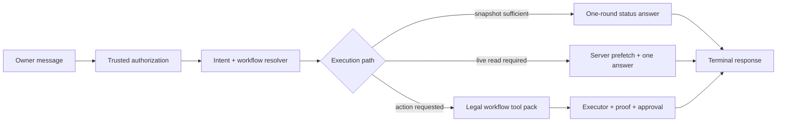

# ALMA Agent Post-Phase-7 Behavior and Cost Remediation Roadmap

**Status:** Required post-architecture remediation

**Audit date:** 2026-07-14 (Asia/Dhaka)

**Audit base:** `main` at `7bf165767e0012bcbb83a940dd3e00aa90d8a3a8`

**Master architecture:** [agent-grok-architecture-roadmap.md](./agent-grok-architecture-roadmap.md)

**Implementation record:** [agent-grok-roadmap-audit.md](./agent-grok-roadmap-audit.md)

## Purpose and relationship to the architecture roadmap

The original architecture roadmap remains the master design. Its Phase 0 through Phase 7 code is merged. This document does **not** create another architecture program and must not rebuild work already completed in Phase 6 or Phase 7.

This roadmap exists because a live production audit after the Phase 7 deployment proved that the architecture's rollout and acceptance targets have not yet been achieved on ordinary owner turns. It contains only the remaining behavior, rollout and cost work.

The distinction is important:

- **Architecture implementation:** complete in code.
- **Production rollout and acceptance:** incomplete.
- **Cost and behavior remediation:** still required.

## Executive verdict

ALMA's new foundation is materially stronger: strict tool contracts, workflow state, guards, one turn engine, modular prompts, router canaries, kill switches and permanent CI gates are present. The system should keep that foundation.

However, the production control plane still allows a simple information question to fall through to the legacy broad-tool path, repeat large model requests, repeat the owner-facing answer and perform an unrequested memory write. A cheap auto-routed model can hide the dollar amount, but it does not remove the wasted tokens or wrong behavior.

The permanent correction is:

> Complete the Phase 7 rollout, add a deterministic one-round status path, and make information-only authorization terminally read-only—including against verifier-induced writes.

Strong models remain available. Cost is reduced by editing their attention and execution contract, not by making them less capable.

## Completed foundation — do not rebuild

The following work is accepted as implemented and is outside this roadmap's construction scope:

- central strict tool validation and capability classification;
- state-aware capability router with a 24-tool hard limit;
- canonical `WorkflowRun`, workflow templates, guards and execution leases;
- provider-neutral owner turn engine with provider adapters;
- modular/versioned prompt compiler and conflict linter;
- deterministic prompt/context ordering;
- prompt token budgets for routed requests;
- owner-intent authorization gate;
- state-router shadow/canary modes and component kill switches;
- permanent agent CI gate.

In particular, do **not** rebuild the Phase 6 prompt compiler, the Phase 6 one-turn engine, or the Phase 7 canary infrastructure.

## Verified production evidence

### Deployment and code verification

| Check | Result |
|---|---:|
| Phase 7 merge on `main` | `7bf16576` |
| Production deployment | Ready |
| GitHub Agent PR Gate | Passed |
| Clean agent test run | 88 files / 856 tests passed |
| Clean TypeScript check | Passed |
| Production `AGENT_STATE_ROUTER` env | Unset → source default `shadow` |
| Phase 0 real replay set | 100–200 reviewed fixtures still incomplete |

### Live production: cheap Auto route

A Phase 7 shadow-mode status turn correctly answered the pending-approval count and cost only `$0.0089`, but still consumed 109.8k total tokens and two provider rounds.

This is not structural optimization. It is a cheap model absorbing an oversized request.

### Live production: exact Grok reproduction

A brand-new production conversation explicitly pinned to `Grok 4.20 (OpenRouter)` received exactly:

```text
Ajker office kemon jacche?
```

| Metric | Live result |
|---|---:|
| Provider/model rows | 4 |
| Total tokens shown | **234.1k** |
| New input | 114.8k |
| Cache read | 115.8k |
| Output/reasoning | 3.54k |
| Actual cost | **$0.1755** |
| Read tool | `get_shift_handover` |
| Unexpected write tool | **`save_memory`** |
| Owner-facing status answer | Repeated twice |
| Requested task/proposal/memory action | None |

The first answer added an unrequested future decision: increase simple reels task volume in the next proposal. It also said “মনে রাখলাম”. The server claim verifier then required `save_memory`, cleared the first final text, started another model/tool cycle, wrote the invented plan to memory and produced a second version of the same answer.

This single trace fails the architecture acceptance targets for one-round status handling, normal request size, cost, exact owner intent and duplicate response prevention.

## Root causes

### RC-1 — Phase 7 is in shadow, not live routing

`AGENT_STATE_ROUTER` is unset in production. The code default is `shadow`: the state router predicts and logs, but the legacy selector still executes. Therefore the narrow ≤24-tool path is not yet the production default.

Phase 7's code is complete; its 48-hour rollout ladder is not.

### RC-2 — The exact owner wording still misses the state router

The `staff_read` intent pattern recognizes explicit staff, attendance, handover and task-status wording. It does not recognize the generic Banglish office-status forms used by the owner, including:

- `office kemon jacche`
- `office kemon cholche`
- `ajker office`
- equivalent Bangla spelling and common typing errors

No confident state-router match means fail-open to the broad legacy path—even after full rollout—unless this coverage gap is fixed.

### RC-3 — Information-only authorization still exposes direct memory writes

`save_memory` and `update_memory` are in `OWNER_SERVICE_TOOLS`, so they remain exposed even when authorization is `information_only`. The reason was to preserve memory-first behavior and avoid breaking service flows.

The live incident proves this exception is too broad. A question must not become a durable preference, task policy or future plan merely because the model narrated one.

The pair-code incident no longer justifies this memory exception: current Banglish imperative detection already recognizes explicit `daw/dao/generate` actions.

### RC-4 — The verifier corrects a claim by performing an unrequested action

The memory claim verifier correctly notices that “মনে রাখলাম” is unsupported. Its remediation instruction is unsafe for an information-only turn: it tells the model to call `save_memory` immediately.

The correct remediation depends on authorization:

- when the owner explicitly asked to remember: call and verify `save_memory`;
- when the owner did not ask: remove the memory claim and finish without mutation.

Honesty verification must never expand authorization.

### RC-5 — Verification retry resets final text and repeats the answer

On a claim violation, the turn loop clears `finalText`, appends a verifier reminder and continues. This is appropriate when an authorized action needs proof. It is wrong when the initial claim itself was unauthorized or unnecessary.

For information-only replies, the system needs a terminal sanitize/rewrite path that cannot call tools and cannot restart business work.

### RC-6 — Large context is resent across avoidable rounds

The Phase 6 compiler reduces a narrow routed request to the architecture target, but the legacy production path and broad volatile context remain large. Every read, verifier retry or tool-result continuation sends another expensive model request.

Caching reduced part of the later bill, but the live cold/new input was still 114.8k across the turn. Cache is an optimization, not an acceptance criterion.

### RC-7 — CI covers deterministic components, not enough real owner language

All 856 agent tests passed while the exact production incident still occurred. The missing 100–200 reviewed real-conversation replay set is therefore a release-quality gap, not optional documentation work.

## Locked decisions and non-goals

1. Do not replace or weaken the Phase 0–7 architecture.
2. Do not delete capabilities merely to reduce a single request. Capabilities stay reachable through routing, workflows, prefetch and specialists.
3. Do not silently downgrade an explicitly selected model.
4. Do not depend on cache hits to meet a cold-request budget.
5. Do not reintroduce a second owner turn engine.
6. Do not fix this with prompt wording alone. Authorization and terminal behavior must be code-enforced.
7. Keep the owner-facing default head on Gemini 3.1 Pro while the locked owner decision remains active.
8. Keep routine non-critical ops, marketing and content workers on DeepSeek; keep customer service on Qwen; keep Gemini fallback behavior as already defined.
9. Preserve approval, workflow, idempotency, proof and whole-taka money rules.

## Target execution contract



Every owner turn must resolve a server-owned contract before the model runs:

```ts
type TurnExecutionContract = {
  authorization: 'information_only' | 'explicit_action' | 'recordable_fact' | 'workflow_continuation'
  path: 'snapshot_answer' | 'prefetch_read' | 'model_tool_loop' | 'browser_long'
  capabilityPack: string[]
  contextSources: string[]
  reasoningEffort: 'none' | 'low' | 'medium' | 'high'
  maxProviderRounds: number
  allowMemoryWrite: boolean
  softCostBudgetUsd: number
}
```

The model may reason inside this contract. A prompt rule, verifier or fallback may not expand it.

## Implementation roadmap

### R0 — Information-turn safety and exactly-once terminal behavior (2–3 engineering days)

**Goal:** Close the live incident before optimizing broader cost.

**Work**

- Remove `save_memory` and `update_memory` from information-only capability sets.
- Allow memory writes only for:
  - an explicit remember/save/correction directive;
  - a trusted recordable preference/fact policy approved by the existing authorization contract;
  - an active workflow whose legal next step explicitly requires it.
- Make claim-verifier remediation authorization-aware.
- For an unauthorized memory/reminder/write claim, run a text-only sanitize/rewrite pass or deterministic phrase removal; never expose the missing write tool.
- Add a terminal-once guard: after a valid information answer, no verifier, fallback or nudge may restart tool work unless the answer contains an authorized factual error that requires a read verification.
- Prevent prompt-generated future plans such as “পরের proposal-এ…” from being persisted without owner instruction.
- Record and remove the exact test-created `shift_handover_2026-07-14...` memory after preserving its incident fixture.

**Primary files**

- `src/agent/lib/turn-authorization.ts`
- `src/agent/lib/claim-verifier.ts`
- `src/agent/lib/models/run-owner-turn.ts`
- the native-loop kill-switch parity path while it remains available
- authorization, verifier and end-to-end replay tests

**Exit gates**

- Exact office-status fixture: zero write/stage tools and zero new memory/task/card.
- Unsupported “মনে রাখলাম” is removed; it never authorizes `save_memory`.
- Exactly one owner-facing final answer is persisted and rendered.
- Explicit “এটা মনে রাখো” still saves and verifies memory correctly.
- Explicit pair-code/browser/service requests still retain their required tools.

### R1 — One-round status and trusted prefetch fast lane (3–5 engineering days)

**Goal:** Make routine information requests cheap by construction.

**Work**

- Add high-confidence status intents for office, staff, sales, orders, approvals, salah and active workflow state.
- If the already-loaded trusted snapshot/pulse is fresh and sufficient, compile a compact no-tool request with `tool_choice:none`.
- If one live read is necessary, call the reviewed read handler server-side before the model request and provide a compact verified projection.
- Keep the model tool loop for ambiguous drill-down, exploration and actions.
- Add a deterministic Bangla renderer for very small count/time/status responses when explanation is unnecessary.
- Include source and freshness in the response contract; stale data must never be presented as live.

**Exit gates**

- `Ajker office kemon jacche?`: one provider round, no model-selected tool and no write.
- `এই মুহূর্তের live handover দেখাও`: one server prefetch plus one provider answer round.
- Pending-approval count, current sales and order-count fixtures finish in one answer round.
- No loss of explanation quality when the owner asks “কেন” or requests detail.

### R2 — Router language coverage and completion of the Phase 7 rollout (3–5 engineering days plus canary time)

**Goal:** Make the narrow router the real production path.

**Work**

- Extend normalized Bangla/Banglish office-status coverage, including common owner spelling variants and typos.
- Add the exact production incident and other real owner phrases to router golden tests.
- Score shadow predictions against actual tool use, owner feedback and failure outcomes.
- Fix false negatives and capability-starvation cases before changing traffic.
- Advance the existing ladder only when green:
  - `shadow` → `canary:10`;
  - 48 hours → `canary:25`;
  - 48 hours → `canary:50`;
  - 48 hours → `true`.
- Retain `false` as the immediate kill switch.

**Exit gates**

- Reviewed replay tool-selection recall ≥98% and precision ≥90%.
- Exact office-status wording selects `staff_read` or the status fast lane; no legacy fallback.
- Exposed head tools p95 ≤16 and hard max 24.
- No increase in `unknown_tool`, `workflow_blocked`, owner “wrong tool”, or lost-progress feedback.
- Full router remains green for 48 hours.

### R3 — Per-turn cost, context and reasoning budgets (4–6 engineering days)

**Goal:** Bound cold cost across strong and cheap models.

**Work**

- Add component-level token attribution for stable prompt, policy capsules, schemas, volatile context, history, tool results, output/reasoning and cache fields.
- Deduplicate office pulse, business snapshot, active-task summaries and overlapping memory/context blocks.
- Give every execution path a context-source priority and token budget.
- Keep workflow state, authorization and proof requirements highest priority.
- Dynamically size recalled memories and cross-surface history; inject them only when relevant.
- Resolve reasoning effort per task:
  - deterministic/snapshot status: none or low;
  - single live read: low;
  - planning/diagnosis: medium;
  - high-risk financial or large-money decision: high under the existing gate.
- Make normal information paths hard-stop after one provider round; browser and real workflow paths use separate bounded contracts.
- Add CI snapshots so prompt/schema/context growth cannot silently exceed a fixture budget.

**Exit gates**

- Normal cold initial request ≤15k tokens.
- Normal volatile context ≤4k tokens.
- Exact Grok status fixture ≤$0.020 cold.
- Auto-routed routine status fixture ≤$0.005.
- Routine information turns do not use medium reasoning.
- Complex workflow and specialist quality is unchanged or better on replay scoring.

### R4 — Real replay completion and production acceptance (5–7 engineering days plus 48-hour gates)

**Goal:** Prove the result with owner language, not only component tests.

**Work**

- Complete the original Phase 0 requirement: export, anonymize, manually review and label 100–200 real production conversations.
- Include incidents for:
  - duplicate answers and self-restarts;
  - information questions causing memories/tasks/cards;
  - `continue` resuming the wrong job;
  - Banglish intent and typo variants;
  - staff approval and dispatch;
  - marketing/content workflows;
  - browser and Companion flows;
  - finance, salah and emotional/listen turns.
- Run the suite across Auto, Gemini head, explicit Grok and the provider adapters relevant to each surface.
- Publish a daily scorecard for cost, rounds, tokens, tool count, wrong-tool feedback, duplicate responses, unauthorized actions, false claims and task success.
- Keep every remediation behind its existing or dedicated kill switch through canary.

**Exit gates**

- 100–200 reviewed production replay fixtures pass.
- End-to-end task success ≥95% after tuning.
- Correct tool-selection recall ≥98%; wrong-tool rate <2%.
- Duplicate final responses, unauthorized memory/task/card creation and unapproved writes: 0.
- Follow-up exact-resume rate ≥99%; restart-from-zero <1%.
- Cost and behavior targets remain green for 48 hours at 100% production routing.

## Required verification matrix

| Fixture | Expected path | Provider rounds | Allowed mutations |
|---|---|---:|---:|
| `Ajker office kemon jacche?` | snapshot/status | 1 | 0 |
| `আজ অফিস কেমন চলছে?` | snapshot/status | 1 | 0 |
| `এই মুহূর্তের live handover দেখাও` | server prefetch | 1 answer round | 0 |
| `pending approval কয়টা?` | snapshot/read | 1 | 0 |
| `আজকের sales কত?` | snapshot or one prefetch | 1 | 0 |
| `এই preference-টা মনে রাখো` | explicit memory write | bounded | 1 verified memory |
| `Eyafi-কে তিনটা task দাও` | staff workflow | bounded | staged until approval |
| `continue` with an active run | exact workflow resume | bounded | legal next step only |
| emotional/listen message | listen | 1 | 0 |
| explicit browser audit | browser workflow | workflow-bounded | proof/approval rules |

For every fixture record:

- authorization reason and execution path;
- selected pack, exposed tools and fallback reason;
- initial/cumulative input, output/reasoning, cache and actual cost;
- provider rounds and tool calls;
- state transition and created memory/task/card rows;
- number of persisted owner-facing final answers;
- Bangla quality and factual correctness.

## Release targets

| Metric | Verified current | Required target |
|---|---:|---:|
| Exact Grok office-status cost | $0.1755 | **≤$0.020** |
| Exact Grok provider rounds | 4 | **1** |
| Exact Grok total tokens shown | 234.1k | **normal cold initial ≤15k** |
| Auto shadow status cost | $0.0089 | **≤$0.005** |
| Auto shadow status total tokens | 109.8k | **normal cold initial ≤15k** |
| Duplicate owner-facing answer | 2 in exact trace | **0** |
| Unauthorized memory write | 1 in exact trace | **0** |
| Head tools p95 / max | rollout not accepted | **≤16 / 24** |
| Tool-selection recall | full real replay not measured | **≥98%** |
| End-to-end success | full real replay not measured | **≥95%** |

## Delivery order and scope control

1. R0 ships first; it is a behavior/safety incident closure.
2. R1 removes the common duplicate-round bill.
3. R2 completes the Phase 7 production rollout using existing infrastructure.
4. R3 optimizes the remaining cold request across every model.
5. R4 is the acceptance gate and cannot be waived because unit tests are green.

Each workstream must use its own scoped branch/session, pass pre-flight checks, preserve unrelated ERP code, receive a Vercel preview and obtain live browser proof before owner approval. Production rollout follows the existing owner-controlled merge and canary rules.

Estimated engineering effort: 17–26 focused engineering days, plus the calendar time required for the 48-hour canary gates. R0 and R1 should close the visible duplicate/write incident and deliver the first major cost reduction before the broader rollout completes.

## Definition of done

This remediation is complete only when all of the following are true:

- the exact office-status message produces one answer, one provider round and no write;
- Grok costs ≤$0.02 cold for that fixture and Auto costs ≤$0.005;
- a status answer cannot trigger `save_memory`, a task, a proposal or an approval card without owner intent;
- an explicit memory instruction still works and is truthfully verified;
- normal cold initial requests are ≤15k tokens;
- head tool exposure is p95 ≤16 and max 24;
- the state router is live at 100% and green for 48 hours;
- 100–200 reviewed real-conversation fixtures pass;
- complex marketing, content, finance, browser and workflow capabilities retain their legal reachability;
- explicit model pins remain honest; and
- duplicate responses, unauthorized actions and false completion claims remain zero.

## Final decision

Phase 0–7 should not be rebuilt. The foundation is sound, but its production acceptance is not complete.

The required next work is a focused post-Phase-7 remediation: make information turns terminally read-only, route routine status through one compact round, finish the narrow-router rollout, enforce cold cost budgets and prove the result on real owner language.
