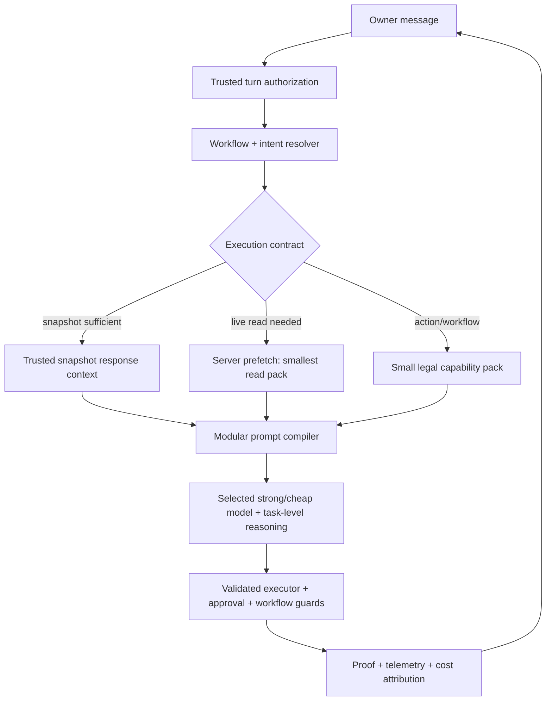

# ALMA Agent Capability-Preserving Cost Optimization Roadmap

**Status:** Current implementation roadmap

**Audit date:** 2026-07-14 (Asia/Dhaka)

**Audit base:** `main` at `9e5dc14b82f6cd7544297ef8526a1a6538ece323`

**Scope:** Owner-facing agent turns across Gemini, Grok/OpenRouter, Qwen, DeepSeek and the native Anthropic-compatible path

**Constraint:** Reduce cost without weakening tool reachability, workflow reliability, Bangla quality, approval safety, or the owner's ability to select a model.

This document refines the remaining work in [agent-grok-architecture-roadmap.md](./agent-grok-architecture-roadmap.md) and its [codebase audit](./agent-grok-roadmap-audit.md). Architecture Phases 0–5 are substantially implemented. The work below starts from the real system that exists now, not from the original pre-Phase-0 design.

## Executive verdict

The expensive model is not the primary bug. The control plane sends too much material to the model, then often sends almost the same material again after a read tool.

The permanent design is:

> Keep the strong model for judgment; make ALMA code decide the smallest legal context, capability pack and execution path before the model runs.

For routine status questions, ALMA should pre-resolve trusted data and make one compact model call—or no model call when a deterministic Bangla response is sufficient. For complex work, the model keeps full capability through state-selected packs, workflow templates and specialist delegation. Capability is preserved by reachability, not by exposing every schema and every operating manual on every turn.

Expected outcome after the full roadmap:

- 70–85% reduction in owner-head spend at the current workload mix.
- Normal status turns: one model round, no mutation tools, and no second full-context bill.
- Strong models remain available for complex reasoning, marketing quality and high-risk decisions.
- No silent model downgrade when the owner explicitly pins a model.
- Existing authorization, approval, idempotency, workflow and proof gates remain hard server-side boundaries.

## Evidence: the exact live incident reproduction

The final preview was tested with a brand-new conversation and the exact owner message:

```text
Ajker office kemon jacche?
```

Model: `or-grok-4.20` (`x-ai/grok-4.20`). The same commit was then deployed to `main`.

| Metric | Measured result |
|---|---:|
| Conversation history before the turn | 0 prior messages |
| Persisted messages after the turn | 2 |
| API rounds | 2 |
| Read tools called | 1 (`get_shift_handover`) |
| Write/stage tools called | 0 |
| Input tokens, summed across rounds | 88,641 |
| Output/reasoning tokens | 2,693 |
| Cache-read tokens reported | 256 |
| Actual OpenRouter cost | **$0.117585** |
| Round costs | $0.059293 + $0.058292 |
| New task / proposal / approval card from the turn | 0 |
| Turn authorization | `information_only` |

Cost decomposition at the registry price of $1.25/M input and $2.50/M output:

- Input: approximately **$0.1108** (about 94% of the bill).
- Output/reasoning: approximately **$0.0067** (about 6%).
- The two near-identical round costs show that the full request prefix was billed twice.

The conversation row had no tail summary and only two tiny persisted messages (53 and 475 JSON characters). Therefore, conversation history was **not** the cause of this fresh-turn bill.

## Evidence: measured payload before live context

Local measurement uses the same repository functions and token estimator used by the agent.

| Component | Current measured size |
|---|---:|
| Static lifestyle prompt, empty live context, active groups `base+erp+staff+finance` | 66,342 chars ≈ **16,586 tokens** |
| Exact prompt's preview fallback tools after read-only authorization | 77 tools, 46,926 chars ≈ **11,732 tokens** |
| Source-default production stable tools after read-only authorization | 95 tools, 55,955 chars ≈ **13,989 tokens** |
| Proposed `staff_read` state pack after read-only authorization | 12 tools, 6,657 chars ≈ **1,665 tokens** |

The exact live turn averaged about 44.3k input tokens per API round. Static prompt plus tool schemas explain about 28.3k. The remaining roughly 16k per round is live business context, office pulse/snapshot, memories, task blocks, wrappers and—on round two—the tool result.

The static prompt barely shrinks when the active groups change:

| Active groups | Static prompt estimate |
|---|---:|
| `base+erp+staff+finance` | 16,586 tokens |
| `base+staff` | 16,463 tokens |
| `staff` only | 16,463 tokens |
| `base` only | 16,463 tokens |

This proves that tool-group routing alone cannot meet the cost target. Most policy text is in the always-on prompt head/tail, including detailed browser, SEO, computer-use, staff, operations and planning runbooks that are irrelevant to a simple office-status question.

## Evidence: recent real spend distribution

Read-only aggregation of 93 paid assistant messages since 2026-07-13:

| Metric | Result |
|---|---:|
| Total recorded cost | **$12.062241** |
| Median turn | **$0.104081** |
| p90 turn | **$0.284466** |
| Maximum turn | **$0.614318** |
| Turns ≥ $0.05 | 56 / 93 |
| Turns ≥ $0.10 | 47 / 93 |
| Median input tokens | 72,601 |
| p90 input tokens | 156,818 |
| Maximum input tokens | 293,854 |

Model-level observations (different task mixes, so these are operational—not quality-normalized—comparisons):

| Model | Turns | Average input | Average API rounds | Average cost | Total cost |
|---|---:|---:|---:|---:|---:|
| Grok 4.20 | 43 | 98,096 | 2.72 | **$0.21054** | **$9.053215** |
| Qwen 3 Max | 12 | 78,068 | 1.08 | $0.14684 | $1.762045 |
| DeepSeek V4 Flash | 32 | 75,761 | 1.56 | $0.01027 | $0.328530 |
| Gemini 3.1 Pro | 4 | 95,818 | 3.00 | $0.22132 | $0.885269 |

The expensive heads are receiving roughly the same oversized input as the cheap worker. Model routing can reduce spend, but prompt/context reduction must happen first so every provider benefits.

Recent route telemetry also showed 18 instrumented turns with more than 100 exposed tools and one turn with 77; none were at or below 60. The implemented 24-tool state router is not yet covering the ordinary ambiguous/status path in this incident.

## Root causes

### RC-1 — The prompt is a monolithic operating manual

The static lifestyle prompt is about 16.6k tokens before live context. Largest directly measured blocks include:

- `SYSTEM_CORE`: ~4,036 estimated tokens.
- `LIVE_BROWSER_RULE`: ~1,845.
- `COMPUTER_CAPABILITIES_RULE`: ~1,253.
- `STAFF_CARE_RULE`: ~950.
- `HONESTY_ACCOUNTABILITY_RULE`: ~872.
- `STAFF_AND_APPROVALS_RULE`: ~734.
- `OPERATIONS_RULE`: ~631.

Many of these rules are valuable, but they do not all belong in every request. A short office-status turn does not need the full browser/SEO/client-audit runbook, health/document role prompts, content pipeline instructions, or multi-step campaign guidance.

### RC-2 — The exact Banglish office intent misses the state router

`matchIntentPacks()` recognizes several staff phrases but not the general Banglish pattern “office kemon jacche?”. With no structured workflow state and no keyword hit, `selectStateRoutedTools()` returns `null`. The preview then falls back to the dynamic legacy selector, which widens an ambiguous query to `base+erp+staff+finance`.

Result: 177 definitions before authorization and 77 read definitions after authorization, instead of the 12 read tools in the existing `staff_read` pack.

### RC-3 — Production-safe features are preview-default, not production-default

`AGENT_STATE_ROUTER` and `AGENT_DYNAMIC_TOOLSET` default on only in Vercel preview. In source-default production behavior, the slim stable owner set still exposes 201 definitions before the read/write gate and 95 read definitions for this information-only query. Environment overrides may change a deployment, so rollout must be verified from route telemetry—not assumed from source.

### RC-4 — A fresh office pulse exists, but prompt rules still induce a tool round

The per-turn office pulse explicitly says to answer general office/staff questions from the fresh pulse and call a tool only for explicit live/deep detail. A separate always-on staff rule says office summary/handover should use `get_shift_handover`. Grok followed the stricter tool instruction.

The model's first reasoning already contained enough pulse/snapshot data to answer. It then called `get_shift_handover`, causing a second full-context request. This is a control-plane conflict, not a model intelligence failure.

### RC-5 — Every tool round resends the large prefix

The provider-neutral loop calls `adapter.streamTurn()` again with the full system prompt, history and tool definitions after each tool result. The result itself is capped, but the dominant system/tool/live context is still resent. In the exact trace, each round cost about $0.059.

### RC-6 — Medium reasoning is enabled for every Grok/Qwen/DeepSeek “level” turn

The OpenRouter adapter maps any model with `thinking: 'level'` to `reasoning: { enabled: true, effort: 'medium' }`. A simple status read therefore receives the same reasoning effort class as a multi-domain plan. Output cost is smaller than input cost, but this increases latency and produced 2,693 output/reasoning tokens for a short answer.

### RC-7 — Live context is assembled broadly and without a hard component budget

The alternate head loads, often in parallel:

- pinned and relevant memories;
- recalled old turns and recent other conversations;
- salah context;
- playbook, outcomes, owner decisions and conflict signals;
- business context;
- owner and staff active-task blocks;
- business snapshot and office pulse;
- workflow/checkpoint/ask-card notes.

Each source is individually useful. There is no deterministic per-intent token budget, deduplication contract, or priority-based truncation across the combined volatile block.

### RC-8 — Cache behavior cannot be the primary safety net

The exact Grok trace reported only 256 cache-read tokens against 88,641 input tokens. Provider cache semantics vary, and the current prefix contains changing tool lists and large volatile data. Cost safety must work on a cold request; cache hits should be treated as a bonus.

### RC-9 — History compaction is useful but is not the first fix

Tail compaction is already implemented with a 10-turn/20k trigger and 6-turn keep window. It remains necessary for long-lived conversations. The fresh-conversation proof shows that optimizing history first would leave most of the current bill untouched.

## Target architecture



The key object is a server-generated `TurnExecutionContract`:

```ts
type TurnExecutionContract = {
  intent: string
  workflowRunId?: string
  authorization: 'read_only' | 'mutating'
  path: 'snapshot_answer' | 'prefetch_read' | 'model_tool_loop' | 'browser_long'
  capabilityPack: string[]
  policyCapsules: string[]
  contextSources: string[]
  reasoningEffort: 'none' | 'low' | 'medium' | 'high'
  maxApiRounds: number
  softCostBudgetUsd: number
}
```

The model may reason within that contract. It must not expand its own permissions, tool universe or cost budget.

## Non-negotiable design principles

1. **Do not remove capability.** Route it through packs, workflows, prefetch or specialists.
2. **Cold-request budgets must pass.** Never depend on prompt-cache hits to meet the target.
3. **The executor remains the authority.** Authorization, approvals, idempotency and workflow guards stay server-side.
4. **No silent model downgrade.** Explicit model pins are honored or fail visibly.
5. **Expensive models buy judgment, not data plumbing.** Code fetches structured facts; the model interprets them.
6. **One phase per session/PR.** Every phase has a kill switch, replay tests and measurable exit gates.
7. **No prompt-only behavior fix.** Every rule must map to code, a workflow guard, a policy capsule or a replay case.

## Roadmap

### Phase C0 — Cost attribution and budget contract (2–3 engineering days)

**Goal:** Make every dollar explainable before changing behavior.

**Work**

- Add a per-round cost span containing estimated/actual tokens for:
  - tool schemas;
  - stable prompt;
  - volatile business context;
  - history/tail summary;
  - tool results;
  - input/output/reasoning/cache fields;
  - retry attempts and provider-reported actual cost.
- Normalize provider usage semantics; do not calculate cache percentages from fields whose inclusion rules differ.
- Record `executionPath`, intent, selected packs, policy capsules, tool count, API round, reasoning effort and cost budget.
- Add a read-only report grouped by intent, model, tool-count bin and API-round count.
- Add CI token snapshots for representative prompts so a prompt/schema PR cannot silently add 10k tokens.

**Primary files**

- `src/agent/lib/models/run-owner-turn.ts`
- `src/agent/lib/core.ts`
- `src/agent/lib/models/types.ts`
- `src/agent/lib/tool-telemetry.ts`
- new `src/agent/lib/cost-budget.ts`
- cost/replay tests and the baseline report script

**Exit gates**

- The exact live turn's input is attributable by component within ±5% of provider usage.
- Every provider retry is visible and costed as a separate round.
- CI fails when a normal status fixture exceeds its token budget by more than 10%.
- No runtime behavior change in this phase.

### Phase C1 — One-round read/status fast lane (3–5 engineering days)

**Goal:** Stop paying a second full-context bill for routine status questions.

**Work**

- Introduce `TurnExecutionContract.path`.
- Add deterministic high-confidence intents for office status, sales summary, pending approvals, order status, salah status and staff task status.
- If a fresh trusted snapshot/pulse fully answers a general question, use `snapshot_answer`, send no tools, and set `tool_choice: none`.
- If live data is required, prefetch the smallest read-only handler set server-side before the model call. The model receives compact verified data and answers once.
- Preserve the normal tool loop when the request is ambiguous, asks for deep drill-down, or needs interactive exploration.
- Remove the conflicting “always call handover” instruction from the snapshot-sufficient path; encode freshness/depth rules in code.
- Add a deterministic Bangla renderer for very small numeric/status replies, with the model optional for explanation.

**Exit gates**

- `Ajker office kemon jacche?`: one model round, zero model-selected tools, zero writes.
- Explicit “এই মুহূর্তের live handover দেখাও”: one server prefetch + one model round.
- Snapshot freshness and source are shown; stale data never masquerades as live.
- Phase target before prompt compilation: ≤35k input and ≤$0.045 on Grok for the exact status case.
- No reduction in answer correctness on office/sales/order/salah replay cases.

### Phase C2 — State router production coverage and small capability packs (3–5 engineering days)

**Goal:** Make ≤24 tools the normal production path, not a preview-only exception.

**Work**

- Extend `matchIntentPacks()` with Bangla/Banglish normalization and office-status patterns (`office kemon/jacche/cholche`, `ajker office`, etc.).
- Build a reviewed multilingual golden set from real owner wording and misspellings.
- Route read-only turns with read-only core capabilities before pack assembly, so mutation schemas never enter the request.
- Use the existing `staff_read` pack for the exact incident: 12 read schemas / ~1.7k estimated tokens.
- Shadow-run the state router in production: log new decision while the old route executes.
- Compare recall/precision and only then enable 10% → 25% → 50% → 100%.
- Keep deterministic packs as the cross-provider foundation. Native deferred tool search may supplement Anthropic-compatible providers but must not be required for Grok/Gemini correctness.

**Exit gates**

- Tool-selection recall ≥98%, precision ≥90% on the reviewed replay suite.
- Head exposed tools: p95 ≤16, hard max 24.
- Exact office-status case exposes ≤12 read tools when a tool loop is needed.
- State/continuation workflows retain exact legal next tools.
- Production kill switch tested.

### Phase C3 — Modular prompt compiler and conflict linter (5–8 engineering days)

**Goal:** Reduce the 16.6k-token static manual without deleting capability.

**Work**

- Split prompt material into:
  - immutable core identity/integrity/Bangla style;
  - authorization and verification summary;
  - domain policy capsules;
  - workflow-step runbooks;
  - specialist-only instructions;
  - volatile evidence.
- Load a policy capsule only when its capability pack/workflow is selected.
- Move the full browser/SEO/client-audit/computer-use manuals out of normal business turns and into their workflow/skill-pack capsules.
- Stop loading owner-todo, bills, health, documents and unrelated base-role manuals on every business turn; expose a short capability index instead.
- Replace prompt rules already enforced by authorization, Ajv, workflow guards, claim verification or approvals with one short statement referencing the enforced contract.
- Add a prompt conflict linter for pairs such as “answer from pulse” versus “tool mandatory”.
- Version compiled prompt capsules and record them in route telemetry.

**Exit gates**

- Immutable stable core ≤5k tokens.
- Normal single-domain prompt (core + capsule + live context, excluding schemas) ≤8k tokens.
- Normal initial head request ≤15k tokens.
- Browser/SEO/marketing replay capability is unchanged because its capsule loads on demand.
- Prompt conflict and unreferenced-capability tests pass in CI.

### Phase C4 — One provider-neutral turn engine (5–8 engineering days)

**Goal:** Remove duplicated orchestration behavior and make every provider obey the same budget/control contract.

**Work**

- Merge the native `core.ts` loop and alternate `run-owner-turn.ts` loop behind one orchestrator.
- Keep provider-specific request shaping only inside adapters.
- Centralize authorization, workflow resolution, prefetch, tool execution, verification, persistence, cancellation, retry and fallback policy.
- Store full tool results durably; send only a result projection sized for the next decision.
- Make optional provider retries explicit and budget-aware; never perform a hidden full-cost retry loop.
- Evaluate provider-native response continuation IDs only as an optional optimization after privacy and reliability review. Correctness must remain stateless and database-backed.

**Exit gates**

- One loop owns all owner-turn providers.
- Identical replay outcomes across Gemini, Grok/OpenRouter and Anthropic-compatible adapters.
- No duplicated nudge, verification or fallback policy.
- Tool result projections stay within per-intent budgets without losing proof fields.

### Phase C5 — Task-level model and reasoning policy (3–5 engineering days)

**Goal:** Use expensive intelligence where it changes the outcome.

**Work**

- Replace the registry's coarse `thinking: 'level'` behavior with per-turn `reasoningEffort`.
- Suggested policy:
  - deterministic/snapshot status: `none` or `low`;
  - single live read/explanation: `low`;
  - multi-domain planning and diagnosis: `medium`;
  - high-risk finance/large-money/critical verification: `high`, with the existing Opus gate where applicable;
  - browser long-running work: adaptive but bounded per workflow.
- Keep Gemini 3.1 Pro as the configured owner-facing default while that owner decision remains active.
- Keep Qwen for customer-facing Bangla/marketing paths and DeepSeek for routine non-critical workers, as already locked in project architecture.
- An explicitly pinned Grok/Gemini/Claude conversation must not silently switch models. Offer an owner-tunable “optimize routine replies” preference if automatic cheap rendering is desired.
- Record resolved model, reason, effort and estimated budget before the request.

**Exit gates**

- Routine status answers do not use medium reasoning.
- Complex-plan quality is equal or better on replay/judge scoring.
- Explicit model identity is never silently changed.
- Model-policy decisions are owner-tunable through `agent_kv_settings` without redeploy.

### Phase C6 — Volatile context and memory budgeting (4–6 engineering days)

**Goal:** Bound the ~16k live-context remainder while preserving relevant facts.

**Work**

- Add a priority-based context budget per execution contract.
- Deduplicate overlapping office pulse, business snapshot, business context and active-task summaries.
- Inject cross-surface conversations only when the owner references another thread/topic or retrieval confidence passes a threshold.
- Dynamically size memory `topK`; pinned rules remain available but are deduplicated against project/policy text.
- Keep workflow state, current authorization and proof requirements highest priority; trim low-confidence context first.
- Retain tail compaction for long conversations, but add telemetry for compaction failures and summary contribution.
- Use compact structured data instead of verbose repeated prose for counts/statuses.

**Exit gates**

- Normal volatile context ≤4k tokens.
- Normal total initial request ≤15k tokens cold.
- Long-conversation recall quality stays ≥95% on targeted replay cases.
- No workflow state, approval requirement or current user constraint is dropped by trimming.

### Phase C7 — Cost/quality canary and permanent release discipline (ongoing; initial 5–7 days)

**Goal:** Prove savings without discovering regressions in production.

**Work**

- Build a cost-quality replay matrix across:
  - office/sales/order information;
  - explicit staff-task mutation;
  - approval/continue workflow replies;
  - finance and salah recordable facts;
  - marketing/creative specialist work;
  - browser long tasks;
  - emotional/listen turns.
- Shadow → 10% → 25% → 50% → 100%, with 48-hour gates at each meaningful step.
- Add alerts for unexpectedly expensive turns and repeated rounds; do not hard-abort legitimate browser/high-risk workflows solely because they cost more.
- Keep component kill switches: fast lane, prefetch, state router, prompt compiler, reasoning policy and context budget.
- Publish a daily scorecard: cost, rounds, tokens, tool count, wrong-tool feedback, duplicate actions, false claims and task success.

**Release targets**

| Metric | Current measured | Target |
|---|---:|---:|
| Paid-turn p50 | $0.104 | **≤$0.020** |
| Paid-turn p90 | $0.284 | **≤$0.080** |
| Grok average in observed sample | $0.211 | **≤$0.050** |
| Normal status API rounds | 2 in exact test | **1** |
| Normal initial input | ~44k/round exact | **≤15k** |
| Head tools p95 / max | mostly 77–201 observed/source paths | **≤16 / 24** |
| Duplicate mutating actions/cards | historical incident | **0** |
| Unapproved write | 0 after authorization gate | **0** |
| Tool-selection recall | not yet production-measured | **≥98%** |
| End-to-end task success | baseline required | **≥95% after tuning** |

## Verification matrix

Every phase must run the existing unit/integration suites plus these end-to-end fixtures:

| Fixture | Expected execution path | Tools | Rounds | Writes |
|---|---|---:|---:|---:|
| `Ajker office kemon jacche?` | fresh pulse → snapshot answer | 0 model-selected | 1 | 0 |
| `এই মুহূর্তের live shift handover দেখাও` | server prefetch | `get_shift_handover` prefetch | 1 model round | 0 |
| `Ajke Eyafi-ke 3টা নতুন task দাও` | staff workflow | ≤24 legal pack | bounded 2–3 | staged only until approve |
| `continue` on staff approval | workflow resume | exact next tools | bounded | no restart |
| `আজকের sales কত?` | snapshot or sales prefetch | 0/1 read | 1 | 0 |
| `মাগরিব পড়েছি` | recordable fact | exact salah pack | bounded | 1 idempotent write |
| `একটা FB campaign plan করো` | marketing head/specialist | marketing pack | task-dependent | approval-gated |
| `আমার Chrome-এ site audit করো` | browser workflow | browser pack | long-turn exemption | approval/proof rules |
| emotional/listen message | listen | 0 business tools | 1 | 0 |

For each fixture record:

- selected intent/path/pack/policy capsules;
- cold input, output/reasoning and actual cost;
- API rounds and tool-result sizes;
- correct tool recall and irrelevant-tool precision;
- state transition, approval and proof;
- owner-facing Bangla quality score;
- comparison against the current behavior artifact version.

## What not to do

1. Do not call this solved by switching every turn to DeepSeek. That lowers cost but can lower owner-facing judgment/quality and ignores the structural waste.
2. Do not delete tools. A tool absent from one turn must remain reachable through deterministic routing, workflow state or a specialist.
3. Do not depend on Grok's large context window. Capacity is not a reason to pay for irrelevant context.
4. Do not depend on cache hits. The cold path must meet budget.
5. Do not lower `MAX_TOOL_ITERATIONS` globally. Browser and real multi-step workflows need a different contract, not an arbitrary shared cap.
6. Do not make the model choose whether a snapshot is trusted, whether a write is allowed, or whether a budget can be exceeded. Code owns those decisions.
7. Do not enable every preview flag at once in production. Shadow and canary each control-plane component.

## Recommended implementation order

1. **C0 cost attribution** — makes every later claim measurable.
2. **C1 read/status fast lane** — immediately removes the duplicate context bill from the most common cheap questions.
3. **C2 state router production rollout** — reduces tool payload without capability loss.
4. **C3 prompt compiler** — largest cold-input reduction.
5. **C4 one turn engine** — prevents provider-path drift and duplicated retries.
6. **C5 model/reasoning policy** — uses model spend deliberately after payload is fixed.
7. **C6 context budget** — bounds long-lived growth and removes volatile duplication.
8. **C7 canary discipline** — runs throughout, becomes permanent release policy.

Estimated total: 25–40 focused engineering days, one scoped phase per session/PR. C0–C2 should deliver visible savings in the first 8–13 days; C3–C6 produce the durable architecture.

## Definition of done

This roadmap is complete only when:

- the exact office-status fixture costs ≤$0.02 on Grok cold and finishes in one round;
- normal auto-routed status replies cost ≤$0.005 while preserving Bangla correctness;
- normal initial input is ≤15k tokens;
- p95 exposed tools is ≤16 and max is 24;
- complex marketing, finance, browser and workflow tasks retain their legal capabilities;
- explicit model pins remain honest;
- duplicate writes/cards, unauthorized writes and false completion claims remain zero;
- 48-hour production canary scorecards pass at 100%; and
- every future prompt/tool/context expansion must pass a token budget and replay-quality gate.

## Final architectural decision

ALMA should not make a powerful model weak to save money. It should stop making a powerful model repeatedly read irrelevant manuals, schemas and duplicated state.

**The model remains the reasoning partner. ALMA's deterministic control plane becomes the editor of attention, permissions, state and cost.**
