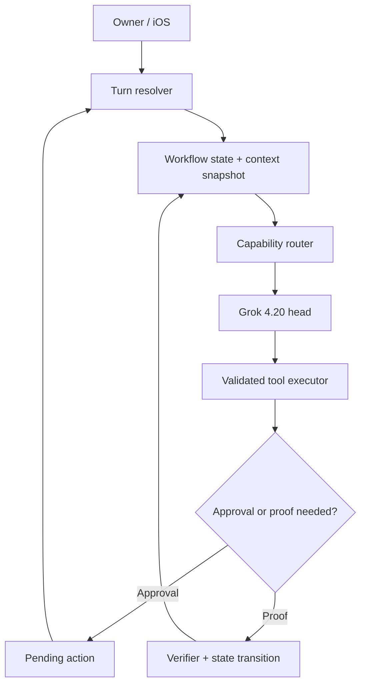
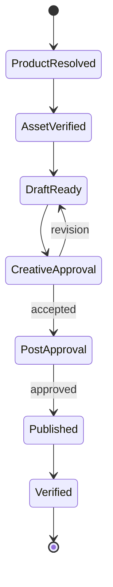

# Alma ERP — Grok 4.20 Permanent Agent Architecture Roadmap

**Audit base:** `almatraderscom-byte/alma-erp`, commit `cb48cecb229e469d3c623e072e27fda6d831efa1` (2026-07-14)  
**Constraint:** Grok 4.20 remains the owner-facing head model.  
**Goal:** Stop recurring prompt hotfixes, make tool use reliable, preserve progress across replies/approvals, and make behavior improve through tests and telemetry instead of daily manual correction.

## Executive decision

Alma should not replace Grok 4.20. It should replace the current **“large prompt + huge tool list + model decides everything”** control model with:

> **Grok 4.20 as conversational intelligence, Alma as deterministic control plane.**

Grok should understand intent, talk naturally in Bangla/Banglish, create plans, and choose among a *small set of legal next actions*. Alma code should own workflow state, tool availability, schema validation, approvals, idempotency, retries, and completion proof.

The permanent architecture is:



## What the repository already does well

- Durable `AgentTurn`/event persistence, SSE replay, queue handoff, and iOS background continuation.
- `AgentPendingAction` approval records with server-side execution.
- Checkpoints and open-task chips for interrupted work.
- Plan Driver with attempts, cost caps, blocked/escalated states, and a completion gate.
- Long-term pgvector memory with expiry, recency, and importance reranking.
- OpenRouter actual billed-cost capture.

These should be retained. The roadmap consolidates them behind one state machine instead of replacing them.

## Root-cause findings

### 1. Grok sees far too many tools

The default Grok path begins with roughly **201 tool definitions**. `base` alone contains **97 tools**. The runtime then applies xAI's observed 200-tool cap by keeping the first 200 and dropping the tail. That means tool availability is based on array order, not the current task.

Measured payload before history and tool results:

- Tool schemas: ~38k tokens
- Stable system prompt: ~17k tokens
- Total: ~55k tokens

This creates tool confusion, weak attention to instructions, higher latency, and a large cost on every tool round.

Relevant code: [`select-tools.ts`](https://github.com/almatraderscom-byte/alma-erp/blob/main/src/agent/tools/select-tools.ts), [`run-owner-turn.ts`](https://github.com/almatraderscom-byte/alma-erp/blob/main/src/agent/lib/models/run-owner-turn.ts).

### 2. Tool contracts are not strict enough

Audit of the 244 executable owner tools:

| Contract metric | Current |
|---|---:|
| Unique tools | 244 |
| `additionalProperties: false` | 0 |
| Schemas with properties but no `required` | 73 |
| Parameters without descriptions | 183 / 695 |
| Tools belonging to multiple groups | 95 |
| Executable but ungrouped tools | 3 |

`executeTool()` finds the tool and passes model-generated arguments directly to its handler. There is no central authoritative JSON Schema validation before execution. Provider-side validation must never be the ERP's security or correctness boundary.

Relevant code: [`registry.ts`](https://github.com/almatraderscom-byte/alma-erp/blob/main/src/agent/tools/registry.ts).

### 3. Prompt instructions conflict

The system prompt contains incident-specific patches. One rule says the post/content pipeline must be completed by the head and delegation is forbidden; a later rule says content/marketing work must be delegated. The prompt currently contains dozens of `HARD RULE`, `NEVER`, `ALWAYS`, and Bangla prohibition statements.

This is prompt archaeology: each incident adds another instruction, but the model must resolve contradictions at runtime. A permanent rule cannot live only in prose.

Relevant code: [`system-prompt.ts`](https://github.com/almatraderscom-byte/alma-erp/blob/main/src/agent/lib/system-prompt.ts).

### 4. The router reads the latest message, not the active job

Tool-group selection is primarily driven by the latest user text. A reply such as “হ্যাঁ”, “ঠিক আছে”, or “continue” does not describe the domain. The real intent is stored in an ask card, pending approval, checkpoint, plan, or open task.

The selector therefore needs this input:

```text
latest message
+ reply-to card/action id
+ active WorkflowRun kind/state
+ next plan step
+ pending approval
+ current business and permissions
```

Without this, follow-ups can load the wrong tools and restart work.

### 5. Parallel/mutating phases are not controlled

OpenRouter/xAI parallel tool calling is enabled by default. Alma does not currently send a phase-specific `parallel_tool_calls` or `tool_choice`. Grok may emit several tool calls in one response; Alma executes them sequentially, but they were chosen without seeing one another's results.

That is unsafe for confirm cards, writes, navigation, and dependent actions. It explains multi-card and tool-spree incidents. Parallel calls should be allowed only for independent read-only tools.

### 6. Tool telemetry cannot explain wrong behavior

`AgentToolEvent` records tool name, generic success/failure, latency, and a `verified` flag. Normal execution does not capture:

- selected capability pack;
- intended workflow step;
- expected tool versus chosen tool;
- validated/rejected arguments;
- stable error code and retryability;
- owner correction;
- idempotency key;
- completion proof.

The dashboard can say a handler failed, but not why the agent selected the wrong handler. `verified` is almost never set by normal execution.

Relevant code: [`tool-telemetry.ts`](https://github.com/almatraderscom-byte/alma-erp/blob/main/src/agent/lib/tool-telemetry.ts).

### 7. State exists in several overlapping systems

`AgentPlan`, `AgentPlanStep`, `AgentOpenTask`, checkpoint JSON, `AgentPendingAction`, conversation messages, and turn rows all carry part of the task state. `conversationId` and prose `resumeNote` loosely connect them.

The pieces are individually useful, but there is no single canonical record answering:

> “What exact outcome is being pursued, what state is it in, and what actions are legal next?”

This is the main reason the agent loses progress or re-navigates.

### 8. Grok request shaping is provider-generic

The OpenRouter adapter sends Anthropic-style per-block `cache_control`, even though Grok caching is automatic. It retries full → no reasoning → bare request, then the turn engine can silently fall back to DeepSeek if Grok fails before text output.

Therefore an owner-pinned Grok conversation may not actually be answered by Grok. A pinned head should use same-model provider retry and visible failure policy, not a silent cross-model switch.

## Target architecture

### A. Canonical `WorkflowRun`

Introduce one canonical task record. Existing plans, open tasks, checkpoints, and pending actions should link to it.

```ts
type WorkflowRun = {
  id: string
  conversationId: string
  businessId: string
  kind: string
  goal: string
  status: 'active' | 'waiting_owner' | 'waiting_worker' | 'done' | 'failed' | 'cancelled'
  state: string
  stateVersion: number
  inputs: Json
  facts: Json
  artifacts: Json
  nextAllowedTools: string[]
  pendingActionId?: string
  lastProof?: Json
  retryCount: number
  leaseUntil?: Date
}
```

Every user reply first resolves against `WorkflowRun`. Chat history becomes supporting context, not task state.

### B. Single-source capability manifest

Replace manually synchronized registry/group/prompt rules with one manifest per tool:

```ts
type Capability = {
  name: string
  domain: string
  intents: string[]
  mode: 'read' | 'stage' | 'write'
  allowedWorkflowStates: string[]
  inputSchema: JsonSchema
  outputSchema: JsonSchema
  risk: 'low' | 'medium' | 'high'
  approval: 'none' | 'before_execute'
  concurrency: 'parallel_read' | 'sequential'
  idempotency: 'required' | 'optional'
  proof: 'none' | 'record' | 'external'
  handler: ToolHandler
}
```

Generate from this manifest:

- Grok tool definitions;
- executable registry;
- domain packs;
- approval policy;
- telemetry labels;
- coverage and schema tests;
- short prompt documentation.

This prevents the current `get_marketing_history`-style group drift.

### C. State-aware capability router

Do not ask the router for “all possibly relevant tools.” Ask it for the smallest legal pack.

Routing order:

1. Structured reply link: ask-card/action/workflow ID.
2. Active workflow state.
3. Pending approval or blocked plan.
4. Deterministic high-confidence intent rules.
5. Grok structured intent classification when ambiguous.
6. Safe clarification when confidence remains low.

Targets:

- Normal chat: 0–4 tools.
- Single-domain task: 5–12 tools.
- Complex active workflow: 8–20 tools.
- Never exceed 24 tools in a head call.

### D. Phase-controlled Grok calls

Keep Grok 4.20 for every head phase, but give each call one job:

| Phase | Grok configuration |
|---|---|
| Intent/route | strict JSON Schema; no business tools |
| Plan | strict `TaskPlan` schema; no writes |
| Read/action decision | small state-specific tool pack |
| Mutating step | `parallel_tool_calls:false`; named/required tool when deterministic |
| Final answer | `tool_choice:none`; summarize verified state only |

Allow `parallel_tool_calls:true` only for independent read operations. Never parallelize confirm cards, writes, browser actions, or tools with dependencies.

### E. Validated executor

Before every handler:

1. Resolve capability from the manifest.
2. Verify business/user permission.
3. Verify current workflow state and `stateVersion`.
4. Validate JSON arguments with Draft 7/Ajv or an equivalent strict validator.
5. Reject unknown fields.
6. Enforce approval and risk policy.
7. Acquire idempotency key/lease.
8. Execute once.
9. Validate result contract.
10. Store proof and transition the workflow atomically.

Recommended result envelope:

```ts
type ToolEnvelope<T> = {
  ok: boolean
  status: 'completed' | 'pending_approval' | 'blocked' | 'retryable' | 'failed'
  data?: T
  errorCode?: string
  messageBn?: string
  retryable: boolean
  nextAllowedActions: string[]
  proof?: { kind: string; ref: string; verifiedAt: string }
  idempotencyKey?: string
}
```

Grok should never infer whether a failure is retryable from a free-form error string.

### F. Workflow templates for repeated business jobs

High-frequency work should be code-defined state machines, not prompt paragraphs.

Example Facebook/product campaign:



Each state exposes only legal next tools. For example, before `CreativeApproval` is accepted, publishing tools are physically unavailable. This replaces “HARD RULE: do not post yet” with an enforceable invariant.

Initial workflow templates:

1. Product Facebook/Instagram post.
2. Full ad campaign setup.
3. Audience creation/lookalike flow.
4. Staff task proposal → approval → dispatch → verification/correction.
5. Expense/payroll/finance approval.
6. Browser-based external setup with durable session checkpoint.
7. Document/invoice extraction and ERP writeback.

### G. Prompt compiler

Split the current monolith into versioned modules:

1. `core_identity`: Boss address, Bangla/Banglish tone, honesty.
2. `global_safety`: no false completion, approval boundaries.
3. `business_context`: only relevant business facts.
4. `workflow_policy`: generated from current workflow state.
5. `memory_context`: retrieved facts with source/confidence/expiry.
6. `response_style`: concise owner-facing response.

Target stable core: **3–5k tokens**. Target full first-round input before history: **under 15k tokens**.

Add a prompt linter that rejects:

- contradictory tool rules;
- duplicate incident rules;
- references to unavailable tools;
- temporary rule without expiry/incident ID;
- prompt-only enforcement of a write/approval invariant.

### H. Browser/navigation state

Store a `BrowserSessionState` inside the workflow:

- active tab/session ID;
- current URL and page fingerprint;
- last successful action;
- expected next screen;
- completed steps;
- allowed domains;
- last screenshot/artifact;
- no-op/repeated-action counter.

Rules enforced in code:

- Never navigate to an already active target when current fingerprint is valid.
- Mutating browser action requires an observed page fingerprint.
- A repeated identical action without state change is blocked after one retry.
- Resume begins with `look` on the existing tab, not navigation to the home page.
- Final success requires a visible/recorded proof state.

## Skill Engine V2 — making Alma progressively capable

Alma already has a useful first version in `src/agent/lib/skill-packs`: five fixed packs (`research`, `seo`, `marketing`, `website`, `client_seo`), ordered steps, tool-name coverage tests, evidence checklists, artifact proof, and fail-safe checkpoints. Keep this completion-gate design.

However, the current packs are still hard-coded TypeScript protocols fetched through `start_skill_pack`. They are not yet a general skill platform: there is no metadata-only discovery, dynamic activation, versioned installation, permission manifest, dependency/supply-chain review, or per-skill eval/lifecycle.

### Keep the layers separate

| Layer | Responsibility | Must not own |
|---|---|---|
| Grok head | Understand intent, communicate, make contextual judgments | Security or execution truth |
| Skill | Teach a reusable procedure and domain knowledge | Direct unrestricted API/database access |
| Workflow | Persist state and legal transitions | Natural conversation |
| Tool | Perform one bounded capability | Multi-step task policy |
| Executor/policy | Validate, authorize, approve, dedupe, record proof | Business creativity |

A skill makes the agent more competent; it does not grant a capability. A skill can instruct “read campaign metrics, compare objectives, draft actions,” but only approved Alma tools may read or mutate Meta data.

### Progressive-disclosure runtime

Follow the open Agent Skills pattern:

1. **Discovery:** Load only skill name, description, version, risk, and required capability names.
2. **Selection:** Resolve active workflow first, then hybrid keyword/vector routing; choose at most 1–3 skills.
3. **Activation:** Load selected `SKILL.md` and only the references needed for this task.
4. **Compile:** Convert the skill into a workflow instance, allowed tool pack, checklist, approval plan, and done criteria.
5. **Execute:** Grok chooses only among legal next tools; executor validates and transitions state.
6. **Evaluate:** Store outcome, proof, correction, cost, and skill version; replay the case in CI.

Do not place every skill body in the system prompt. The open specification recommends metadata at discovery, a concise activated instruction body, and scripts/references only on demand.

### Alma skill package

```text
alma-product-social-post/
├── SKILL.md
├── manifest.json
├── workflow.json
├── references/
│   ├── brand-policy.md
│   └── meta-fields.md
├── scripts/
│   └── validate-brief.ts
└── evals/
    ├── cases.jsonl
    └── rubric.json
```

Recommended manifest fields:

- `name`, `description`, `version`, `publisher`, `license`, `sourceCommit`, `contentHash`;
- `businessScopes`, `riskTier`, `requiredCapabilities`, `requiredSecrets` (names only);
- `allowedDomains`, `networkPolicy`, `writePolicy`, `approvalPolicy`;
- `entryWorkflow`, `maxTools`, `maxSteps`, `maxCostTaka`;
- `evalSuite`, `minimumPassRate`, `status` (`draft|reviewed|canary|active|retired`).

### What should and should not become a skill

**Good skills:** marketing strategy, product-post preparation, SEO audit/reporting, product listing, catalog cleanup, staff dispatch procedure, finance analysis, invoice-to-ERP extraction, customer-support response policy, owner daily briefing, browser recipes, incident diagnosis.

**Keep in code, never in a downloadable skill:** authentication, tenant isolation, memory ACL, approval enforcement, payroll/spend limits, idempotency, schema validation, workflow locking, secret handling, destructive-action permissions, and completion-proof enforcement.

### First Alma-native skills

Build these from real owner tasks, in this order:

1. `alma-product-social-post`
2. `alma-meta-campaign-launch`
3. `alma-audience-builder`
4. `alma-product-listing`
5. `alma-seo-audit`
6. `alma-staff-dispatch`
7. `alma-finance-brief`
8. `alma-invoice-to-erp`
9. `alma-owner-daily-briefing`
10. `alma-browser-operator`
11. `alma-customer-support`
12. `alma-agent-incident-diagnosis`

The existing five skill packs should be migrated into this format first; do not delete their deterministic completion gate.

### GitHub skill import policy

GitHub skills can accelerate Alma, but they are untrusted executable guidance. Never auto-install and expose them to production tools.

Import flow:

1. Pin the exact repository commit; never track an unpinned branch.
2. Verify publisher, license, maintenance history, and declared dependencies.
3. Scan `SKILL.md`/references for prompt injection, secret requests, policy overrides, and hidden external instructions.
4. Scan scripts for shell execution, filesystem escape, network destinations, credential access, package installation, and destructive commands.
5. Translate external tool names to Alma capability names; no skill may call arbitrary handlers.
6. Run in a no-secrets/no-network sandbox with synthetic data.
7. Generate at least 10 positive, 5 ambiguity, and 5 adversarial eval cases.
8. Human review, then shadow → canary → active.
9. Record source commit/hash and require explicit review for upgrades.
10. One-click retire/rollback must preserve running workflow versions.

Prefer official sources and the open specification. The old `openai/skills` catalog is deprecated in favor of OpenAI's current plugin examples; Anthropic's official skills repository is useful for patterns, not direct production installation. GitHub itself warns that silently changing skills are a supply-chain risk, so version pinning is mandatory.

### Skill-selection acceptance gates

- Correct skill recall ≥98%, precision ≥90%.
- No more than three activated skills per turn; normally one.
- Skill metadata budget under ~100 tokens each; activated `SKILL.md` under 5k tokens and preferably much smaller.
- A skill cannot expand permissions beyond the user's current role/workflow.
- A skill cannot add a mutating tool after an approval was issued.
- 100% active skills have evals, source hash, owner/reviewer, rollback version, and last-reviewed date.
- Owner corrections are linked to the exact skill and version that influenced the turn.

## Implementation roadmap

### Phase 0 — Freeze and baseline (2 days)

**Work**

- Freeze new behavior instructions except critical security fixes.
- Add `promptVersion`, `toolManifestVersion`, `routerVersion`, and `workflowVersion` to every turn event.
- Export 100–200 anonymized real Alma conversations containing corrections, wrong tools, restarts, multi-card incidents, and browser detours.
- Convert each into a replay case with expected intent, tools, workflow transition, approval, and final outcome.
- Fix the existing marketing-head test failure.

**Exit gate**

- Baseline report exists for completion rate, wrong-tool rate, duplicate actions, restarts, cost, and p95 latency.
- Every future behavior fix must add or update a replay case first.

### Phase 1 — Observability and correction loop (3–4 days)

**Work**

- Expand `AgentToolEvent` into turn → route → tool-call → approval → proof spans.
- Record selected/eligible tools, workflow state, expected action, stable error code, argument validation result, idempotency key, and proof.
- Add owner feedback: `wrong tool`, `lost progress`, `unnecessary navigation`, `wrong answer`, `too many questions`.
- Link approval-card revision feedback to the originating tool call and workflow step.
- Build a daily dashboard and weekly regression report.

Use OpenTelemetry GenAI naming where practical so traces remain portable.

**Exit gate**

- Any wrong outcome can be traced to router, prompt, schema, handler, workflow, or provider in under 10 minutes.
- `verified` is set from proof logic, not model confidence.

### Phase 2 — Tool Contract V2 (5–7 days)

**Work**

- Create the single-source capability manifest.
- Introduce strict runtime validation.
- Add `additionalProperties:false`, required fields, enums, examples, and parameter descriptions.
- Replace generic handler errors with stable error codes and retry policy.
- Classify every tool by read/stage/write, risk, approval, concurrency, and proof.
- Generate registry/group coverage tests from the manifest.
- Migrate the top 30 most-used tools first, then the remaining long tail.

**Exit gate**

- 100% tool inputs validated before execution.
- 0 exposed-but-unexecutable and 0 executable-but-unroutable tools.
- Invalid arguments never reach a handler.
- Duplicate writes are prevented by idempotency keys.

### Phase 3 — Grok request controller and capability router (5–7 days)

**Work**

- Add phase-specific `tool_choice` and `parallel_tool_calls` to the provider adapter.
- Remove explicit Anthropic cache blocks from Grok requests; rely on Grok's automatic prefix caching.
- Replace first-200 truncation with intent/state-selected packs.
- Make reply/action/workflow metadata precede text routing.
- Set a hard head-tool limit of 24, with CI failure if exceeded.
- Disable silent Grok → DeepSeek fallback for explicitly pinned Grok conversations. Keep same-model provider retry and show a clear incident if Grok cannot answer.
- Run a capability probe in CI/staging instead of discovering rejected parameters during a live owner turn.

**Exit gate**

- p95 exposed tools ≤16; max ≤24.
- Tool-selection recall ≥98% and precision ≥90% on the replay suite.
- Mutating phases produce at most one call/card.
- Grok identity never changes silently.

### Phase 4 — Unified workflow state (7–10 days)

**Work**

- Add `WorkflowRun` and event/transition tables.
- Link `AgentPlan`, `AgentOpenTask`, checkpoint, and `AgentPendingAction` to `workflowRunId`.
- Make ask-card and approval replies carry structured `workflowRunId`, `stepId`, and `replyToId` from iOS/web to the server.
- Resolve every turn against workflow state before model routing.
- Implement optimistic `stateVersion` transitions and execution leases.
- Auto-checkpoint every non-terminal turn; do not rely on Grok calling `track_open_task` correctly.
- Auto-close open tasks from workflow terminal state; do not rely on Grok calling `resolve_open_task`.

**Exit gate**

- “হ্যাঁ/continue/change it” resumes the exact blocked step in ≥99% replay cases.
- Restart-from-zero rate <1%.
- Stale open-task chip rate <1%.
- No action executes against an outdated workflow version.

### Phase 5 — High-value workflow templates (7–10 days)

**Work**

- Implement the seven workflow templates listed above.
- Encode legal transitions, required facts, approval points, and completion proof.
- Move marketing and staff incident rules out of the system prompt into workflow guards.
- For browser workflows, persist tab/session/fingerprint and add repeated-navigation protection.

**Exit gate**

- Product-post and campaign jobs complete end-to-end without prompt-specific intervention.
- Duplicate confirmation cards: 0.
- Publish/spend/payroll execution without approval: 0.
- Unverified “done” claim: 0.
- Unnecessary navigation decreases by at least 80% from baseline.

### Phase 6 — Prompt architecture and one turn engine (5–7 days)

**Work**

- Build the modular prompt compiler and conflict linter.
- Remove dated incident patches after their workflow/test equivalents are live.
- Merge the duplicated Anthropic and alternate-provider loops into one provider-neutral orchestrator with provider adapters.
- Preserve Grok-specific request shaping in its adapter.
- Make context assembly deterministic: core → workflow snapshot → scoped memory → compact history → latest turn.

**Exit gate**

- Stable core prompt ≤5k tokens.
- Initial head request ≤15k tokens for normal work.
- One orchestration loop owns state, tool execution, verification, persistence, and fallback policy.
- Prompt conflict test passes in CI.

### Phase 7 — Canary and permanent release discipline (7 days, then ongoing)

**Rollout**

1. Shadow mode: new router predicts but old path executes.
2. 10% owner/test traffic.
3. 25%, then 50%, then 100% only after gates pass for 48 hours.
4. Per-component kill switches: router, manifest V2, workflow type, prompt version.

**Permanent PR gate**

- Typecheck and current agent tests.
- Tool schema/manifest compile.
- Router golden cases.
- Workflow transition/property tests.
- Approval and idempotency tests.
- 100–200 conversation replay suite.
- Cost/token budget check.
- Prompt conflict/reference linter.

No behavior change ships from a prompt edit alone. Every behavior change needs an incident/replay case and a measurable acceptance criterion.

## Required scorecard

| Metric | Release target |
|---|---:|
| End-to-end task success | ≥90% initially, ≥95% after tuning |
| Correct tool-selection recall | ≥98% |
| Wrong-tool rate | <2% |
| Invalid-schema calls reaching handlers | 0 |
| Duplicate mutating actions/cards | 0 |
| Unapproved high-risk writes | 0 |
| False “done” with no proof | 0 |
| Follow-up exact-resume rate | ≥99% |
| Restart-from-zero | <1% |
| Unnecessary browser navigation | ≥80% below baseline |
| Head tools exposed p95 / max | ≤16 / 24 |
| Normal initial input | ≤15k tokens |
| Owner behavior corrections | <3% of agentic jobs |

## Grok 4.20-specific operating policy

- Keep `x-ai/grok-4.20` as the head alias, but store the resolved provider/model snapshot in every turn.
- Grok caching is automatic; maintain a stable short prefix instead of Anthropic-style explicit breakpoints.
- Use strict structured outputs for routing and planning.
- Disable parallel tool calls for mutating/dependent phases.
- Use medium reasoning for normal orchestration; increase effort only for plans/high-risk verification.
- Do not use context-window size as memory. Durable ERP state remains in Alma's database.
- OpenRouter's Responses API is currently stateless. Native xAI Responses supports `previous_response_id` and compaction, but stores server-side conversation state by default. Evaluate privacy/compliance before adopting it. It is optional and not required for this roadmap.
- Official xAI currently lists Grok 4.20 at a 1M context window, while OpenRouter's model page advertises 2M. Read the live OpenRouter model metadata at startup and enforce a conservative internal context budget instead of hard-coding assumptions.

## Cost effect without changing the model

At Grok's listed $1.25/M input and $2.50/M output:

- Current approximate 55k input + 1k output: **$0.071/round uncached**.
- Target 13k input + 1k output: **$0.019/round uncached**.
- At the listed $0.20/M cached-input rate, the same target is roughly **$0.005/round** when the prefix hits cache.

This is before savings from fewer mistaken calls, retries, and duplicated cards. The architecture change should reduce both direct token cost and owner correction time.

## First ten tickets to create

1. `AGENT-ARCH-001`: Add prompt/tool/router/workflow version fields to turn telemetry.
2. `AGENT-EVAL-001`: Build the first 100 real-conversation replay fixtures.
3. `AGENT-TOOL-001`: Capability manifest and generated registry proof of concept.
4. `AGENT-TOOL-002`: Central Draft 7 validation + strict result envelope.
5. `AGENT-ROUTER-001`: State-aware router input and 24-tool hard limit.
6. `AGENT-GROK-001`: `tool_choice`, `parallel_tool_calls`, provider capability probe, and no silent cross-model fallback.
7. `AGENT-STATE-001`: `WorkflowRun` schema and transition service.
8. `AGENT-IOS-001`: Structured reply metadata for ask/approval/continue actions.
9. `AGENT-WF-001`: Product social-post workflow state machine.
10. `AGENT-PROMPT-001`: Modular compiler, conflict linter, and removal plan for dated incident patches.

## Research basis

- [xAI Grok 4.20 model card](https://docs.x.ai/developers/models/grok-4.20): function calling, structured outputs, reasoning, pricing, and context information.
- [xAI function calling](https://docs.x.ai/developers/tools/function-calling): parallel calls are enabled by default and can be disabled per request.
- [xAI context compaction](https://docs.x.ai/developers/advanced-api-usage/context-compaction): compact long agent loops and verbose tool history.
- [xAI Responses vs Chat Completions](https://docs.x.ai/developers/model-capabilities/text/comparison): stateful `previous_response_id` and API trade-offs.
- [OpenRouter tool calling](https://openrouter.ai/docs/guides/features/tool-calling): clear schemas, context preservation, error handling, tool choice, and parallel-call controls.
- [OpenRouter prompt caching](https://openrouter.ai/docs/guides/best-practices/prompt-caching): Grok caching is automatic.
- [OpenRouter structured outputs](https://openrouter.ai/docs/guides/features/structured-outputs): strict JSON Schema response format.
- [OpenRouter Auto Exacto](https://openrouter.ai/docs/guides/routing/auto-exacto): provider ordering uses observed tool-call validity and performance.
- [OpenTelemetry GenAI conventions](https://opentelemetry.io/docs/specs/semconv/registry/attributes/gen-ai/): portable conversation, tool-call, evaluation, usage, and latency telemetry fields.

## Final principle

**Grok should decide what the owner means; Alma should decide what is legally and technically possible next.**

When a mistake occurs, the permanent fix order is:

1. Create a replay case.
2. Identify router, state, schema, handler, or prompt ownership.
3. Enforce the invariant in code/workflow.
4. Add telemetry and acceptance gate.
5. Remove the temporary prompt patch.

Following this order is what stops Alma from needing daily behavior fixes.
