# Creative Studio Enterprise — Workstream A: Advanced product/model fidelity

Status: implementation workstream, stacked after CSE7
Branch: `codex/cs-advanced-model-fidelity`
Baseline: `agent-phase-cse7` at `b399ba9b47433a5d0dcfd0d5e862b21a600456d1`
Pre-work tag: `pre-codex-cs-advanced-model-fidelity`
Production deployment: forbidden for this workstream

## 1. Problem and non-negotiable contract

Advanced single-image generation currently lets the owner select a product and
a saved model/person, but those selections are not a reliable end-to-end
contract. In particular:

1. xAI Product→Model transports both images, but the deterministic prompt
   describes only reference image 1 (the product). Reference image 2 is not
   identified as the selected person and has no explicit identity lock.
2. Fal FASHN v1.6 appears in the Product→Model picker even though its endpoint
   supports Try-On only. The server then misses the Fal-only branch and silently
   runs direct FASHN Product→Model instead.
3. Direct FASHN Product→Model sends the selected person as `model_image`.
   Product→Model accepts `face_reference`, not `model_image`; the latter belongs
   to Try-On. The selected person can therefore be ignored or rejected.
4. The generic image path downloads references on the worker with a fail-open
   `null`. A failed product or person download can silently become a paid
   one-reference edit.
5. The generic picker is labelled Gemini, but the owner can configure Gemini,
   GPT Image, or Seedream behind it. The worker re-reads that setting at
   execution time and persists no actual model/provider in the result, so the
   queued engine and Gallery lineage are not immutable or truthful.
6. Project recipes are snapshotted for Content OS history, but the Advanced run
   request does not consume recipe controls. A recipe must not be presented as
   governing aspect, scene, fidelity, QC, or spend until those mappings exist.

The workstream contract is:

> Every selected required reference is resolved server-side, snapshotted with
> its role and identity, transported to the exact selected capable engine,
> acknowledged by the adapter, and recorded with the result. If an engine or
> mode cannot accept that reference, the run is blocked before queueing and
> before spend. No adapter may silently drop, relabel, or substitute a required
> reference.

“Honored” means transported and bound to an explicit provider input or ordered
prompt role. It does not mean a general generative model can guarantee pixel-
exact identity. The UI must distinguish purpose-built preservation from
identity-guided generation.

## 2. Provider × Advanced-mode × input-capability matrix

Legend:

- **P** — purpose-built provider field / strongest available contract.
- **G** — general multi-image guidance; reference is transported and explicitly
  bound, but exact preservation is not guaranteed.
- **—** — unsupported; block before queueing.
- Product→Model with an optional selected person means “generate a new shot
  guided by this identity.” Exact pose/background preservation belongs to
  Try-On.

| Actual engine/model | Generate | Product→Model | Try-On | Model Swap | Face→Model | Edit | Reference/input limit and fidelity truth |
|---|---:|---:|---:|---:|---:|---:|---|
| FASHN `product-to-model` | — | product **P**, person identity **P** through `face_reference` | — | — | — | — | Product required; face reference optional. Generates a new model/shot. It does not preserve a selected full pose/background. |
| FASHN `tryon-max` | — | — | product + person **P** | — | — | — | Exact `product_image` + `model_image`; purpose-built single-person VTON. |
| FASHN `model-swap` | — | — | — | source + target person **P** | — | — | Purpose-built model replacement. Server must map source/target to the endpoint’s named fields, never a generic `model_image` collision. |
| FASHN `face-to-model` | — | — | — | — | face **P** | — | Purpose-built identity-guided model generation. |
| FASHN `edit` | — | — | — | — | — | source **P**, prompt | Structured edit; only provider-supported options may be sent. |
| Fal FASHN v1.6 | — | — | product + person **P** | — | — | — | `garment_image` + `model_image`; single-person Try-On only. Must never appear or silently fall through for Product→Model. |
| Fal Cat-VTON / IDM | — | — | product + person **P** | — | — | — | `garment_image_url` + `human_image_url`; single-person research-only Try-On. Existing warning/owner opt-in remains mandatory. |
| Fal FLUX Pro Fill | — | — | — | — | — | source + mask **P**, prompt | Masked precision edit only; no product/person identity contract unless the source already contains them. |
| xAI `grok-imagine-image-quality` | text | product **G**, selected person **G** | product + person **G** | source + target person **G** | face/person **G** | source + optional guide **G** | Maximum 3 ordered edit references. Every image must be numbered and role-bound in the deterministic scaffold. xAI is general generation/editing, not a dedicated VTON guarantee. |
| Gemini 3.1 Flash Image | text | product + person **G** | product + person **G** | source + person **G** | person **G** | source + guides **G** | Current app contract intentionally caps at 2 required references. Multi-image edit is general generation, not purpose-built VTON. |
| Gemini 3 Pro Image | text | product + person **G** | product + person **G** | source + person **G** | person **G** | source + guides **G** | Current app contract caps at 2 despite a larger upstream allowance, for deterministic parity with GPT/Seedream. |
| OpenAI GPT Image 2 | text | product + person **G** | product + person **G** | source + person **G** | person **G** | source + guides **G** | Multipart `image[]`; current app contract caps at 2 and requires all selected references to download. |
| Seedream 5 Pro via Fal | text | product + person **G** | product + person **G** | source + person **G** | person **G** | source + guides **G** | `/edit` `image_urls`; current app contract caps at 2 and requires all selected references to download. |
| Veo 3.1 | — | — | — | — | — | — | Image→Video only: one source still image. It cannot consume an additional selected product/person fidelity pair in the current flow. |

Primary provider references used for this matrix:

- xAI Imagine overview and multi-image editing:
  <https://docs.x.ai/developers/model-capabilities/imagine> and
  <https://docs.x.ai/developers/model-capabilities/images/multi-image-editing>
- FASHN Product→Model and Try-On Max:
  <https://docs.fashn.ai/api-reference/product-to-model> and
  <https://docs.fashn.ai/api-reference/tryon-max>
- Fal FASHN v1.6, Cat-VTON, and FLUX Fill:
  <https://fal.ai/models/fal-ai/fashn/tryon/v1.6/api>,
  <https://fal.ai/models/fal-ai/cat-vton/api>, and
  <https://fal.ai/models/fal-ai/flux-pro/v1/fill/api>
- Gemini image generation and Veo:
  <https://ai.google.dev/gemini-api/docs/image-generation> and
  <https://ai.google.dev/gemini-api/docs/veo>

## 3. Advanced control matrix

“Mapped” means the adapter has a real provider input. “Prompt” means the
provider lacks that control and the value is explicit text guidance. “Blocked”
means the UI/server refuses a value the engine cannot honestly support.

| Control | Direct FASHN | Fal VTON | xAI Imagine | Generic Gemini/GPT/Seedream | FLUX Fill | Veo |
|---|---|---|---|---|---|---|
| Product | Named endpoint field | Named endpoint field | Ordered `garment` reference + numbered scaffold | Ordered required reference + numbered scaffold | Not a separate input | Source still only |
| Saved model/person | P2M `face_reference`; Try-On `model_image`; mode-specific fields elsewhere | Human/model image for Try-On | Ordered `person` reference + numbered identity lock | Ordered required reference + numbered identity lock | Not a separate input | Not supported as second identity input |
| Saved model ID | Resolve server-side to canonical/avatar path; snapshot ID + path | Same | Same; identity sheet only if capacity remains | Same | N/A | N/A |
| Style/prompt | Provider prompt where supported | Provider-dependent prompt; never claim unsupported style fidelity | Prompt | Prompt | Fill prompt | Video prompt |
| Background | P2M prompt; Try-On rescue chain where enabled | Prompt only; no false “exact” claim | Prompt | Prompt | Mask + prompt is exact edit region | Prompt |
| Aspect | App/result contract; provider limitations surfaced | Adapter/provider mapping | Native xAI aspect mapping | Provider-specific mapping | Inherited from source/mask | `9:16`/`16:9` |
| Resolution | Native `1k/2k/4k` where supported | Provider-specific/economical plan | Native `1k/2k`; requested `4k` explicitly maps to `2k` | Provider-specific size mapping; actual model/size persisted | Source dimensions/cost rounding | Provider-specific |
| Generation mode | Native FASHN mode | Adapter mapping where supported | Unsupported as a provider field; UI says “not used” | Maps to configured quality tier | Unsupported | N/A |
| Number of images | App creates independent idempotent jobs, 1–4 | Same | Same | Same | One precision edit per action | One video action/chain |
| Seed | Only where the endpoint supports it | Supported by current Fal adapters | Unsupported; never imply reproducibility | Not part of current cross-provider contract | Fal seed supported | Provider-dependent |
| Garment class / cloth type | FASHN category where supported | Explicit/auto cloth mapping | Prompt hint only | Prompt hint only | N/A | N/A |
| Recipe | Audit snapshot only until explicit field mappings are implemented | Same | Same | Same | Same | Same |
| QC mode | Existing Preview/Production bounded plan | Existing bounded plan | Existing bounded plan | Existing bounded plan | Existing precision-edit checks | Existing source/reel gates |

## 4. End-to-end selection and lineage map

```mermaid
flowchart LR
  UI["Advanced UI\nmode + engine + controls"] --> SER["studio-api serialization"]
  SER --> API["owner-authenticated run API"]
  API --> RESOLVE["server reference resolution\nsaved model ID → canonical immutable path"]
  RESOLVE --> CAP["capability validation\nengine × mode × inputs × controls"]
  CAP -->|"unsupported"| STOP["422 before queue/spend\nexplicit owner-facing reason"]
  CAP --> SNAP["reference contract snapshot\nrole + source kind + stable ID/path"]
  SNAP --> ORCH["orchestration\nexact engine/model snapshot + cost cap"]
  ORCH --> PROMPT["mode-specific prompt\nnumbered reference bindings"]
  PROMPT --> ADAPTER["provider adapter\nfail-closed required reference transport"]
  ADAPTER --> RECEIPT["adapter receipt\nrequested/prepared/sent roles + actual model"]
  RECEIPT --> RESULT["result persistence\nprovider/model/control mappings/QC/cost"]
  RESULT --> GALLERY["Gallery/download\ntruthful engine + fidelity receipt"]
```

### 4.1 UI

`StudioWorkspaceView` owns the current Advanced controls. Engine choices must
come from the capability registry for the active mode and family shape. An
unsupported engine is not merely hidden: a stale or crafted request is rejected
again by the API.

Before Run, the UI presents:

- selected product and person reference status;
- fidelity class: purpose-built, identity-guided, or unsupported;
- exact limitations such as xAI 4K→2K and Product→Model face guidance versus
  Try-On pose/background preservation;
- actual generic model family when available, never an unconditional “Gemini”;
- maximum estimated paid generations already controlled by Preview/Production.

### 4.2 Serialization and API validation

`studio-api.ts` transports stable IDs plus owner-selected controls. Paths remain
server-validated implementation details. The run route resolves a saved
`modelId` to the canonical/avatar reference, creates the reference contract,
validates it against the selected engine/mode, and passes only normalized input
to orchestration.

Client-supplied paths can never upgrade capability or choose an arbitrary Fal,
FASHN, xAI, Gemini, OpenAI, or Seedream model.

### 4.3 Orchestration and prompts

`create-run.ts` must:

- reject engine/mode mismatches before any pending action is created;
- map each reference to the provider’s exact named field;
- snapshot the actual generic model at queue time so a later settings change
  cannot mutate an already approved job;
- persist the immutable reference contract and control mapping in every action;
- keep current owner authorization, brand/role boundaries, kill switches,
  readiness gates, idempotency, cost estimates, Preview/Production caps, and
  review policy intact.

For general multi-image engines, prompts must name every ordered reference.
Product→Model with a person becomes:

1. reference 1 = exact product;
2. reference 2 = selected person whose face, age, skin tone, hair, and identity
   must be preserved in the newly composed shot;
3. optional reference 3 = identity sheet for the same person.

### 4.4 Worker transport and provider adapters

Required references are fail-closed:

- a missing storage object, failed download, or failed data-URI conversion
  fails the job before the provider request;
- preprocessing may fall back to the original image only when that original
  image is still transported;
- the adapter verifies `expected reference count === transmitted count`;
- no truncation may remove a required reference; optional identity sheets are
  admitted only when capacity remains;
- adapter results include the actual provider/model, operation, ordered roles,
  count, preparation outcome, resolution/aspect mapping, cost, and request ID
  where available.

### 4.5 Persistence, Gallery, and download

`AgentPendingAction.payload` is the approved request audit record;
`AgentPendingAction.result` is the provider receipt. Existing job-result
idempotency remains authoritative. Gallery and download render the stored
artifact only after current review/QC policy and must expose truthful actual
engine/model plus a compact “product sent / person sent” fidelity receipt.

No schema migration is required for this workstream: the versioned JSON payload
and result envelopes are forward-compatible. If a later reporting query needs
indexed reference lineage, that is a separately reviewed migration.

## 5. Reproduction without paid calls

The failure is reproducible with deterministic fixtures and contract tests:

1. Build an xAI Product→Model brief with `productImagePath` and
   `modelImagePath`.
2. Observe two reference paths and roles `[garment, person]`.
3. Observe the pre-fix scaffold only names “Reference image 1”; it contains no
   binding or preservation instruction for image 2.
4. Compare Try-On, whose scaffold names reference images 1 and 2 and explicitly
   locks face/body/identity and garment.
5. Submit Product→Model with `vtonEngine=fal_fashn_v16`. The pre-fix Fal branch
   requires `mode=try_on`, so execution falls into direct FASHN.
6. Inspect the direct FASHN payload: it contains
   `fashnModel=product-to-model` plus `fashnInputs.model_image`; the supported
   person field for that model is `face_reference`.
7. Simulate a storage miss on either generic reference. The pre-fix adapter
   drops the `null` part and continues with the paid provider request.

All reproduction and regression coverage must mock network/provider calls. No
paid image generation is authorized by this document.

## 6. Implementation gates

### Capability and transport

- [x] One shared engine/mode/reference/control contract covers every Advanced
      image mode and every currently reachable exact provider model.
- [x] UI filters capability choices and explains fidelity class/limitations.
- [x] API rejects stale/crafted unsupported combinations before queueing.
- [x] xAI Product→Model explicitly binds the selected person and exact product.
- [x] Direct FASHN Product→Model maps selected identity to `face_reference`.
- [x] Fal Try-On engines never silently serve Product→Model.
- [x] Generic references fail closed and the actual model is snapshotted.
- [x] Request and result carry an auditable reference contract/receipt.
- [x] Gallery shows truthful engine/model and sent-reference status.

### Compatibility and controls

- [x] Try-On, family chains, Auto, masked edit, Image→Video, Content OS project
      linking, approval/review, brand isolation, kill switches, and downloads
      retain CSE1–CSE7 behavior.
- [x] Product, person, prompt/style, background, aspect, resolution, generation
      mode, count, cloth type, seed, recipe, QC mode, and cost behavior are
      asserted for supported/unsupported engines.
- [x] Every silent downgrade is replaced with an explicit mapping or a block.

### Verification and release

- [x] Targeted TypeScript and worker contract tests pass incrementally.
- [x] Full app and worker suites pass.
- [x] Lint, typecheck, schema validation, and production build pass.
- [x] Exact diff/scope gate passes; the final clean-worktree check follows the
      evidence commit.
- [x] No paid provider call occurred.
- [ ] Branch commit is pushed.
- [ ] Exact-SHA Vercel preview reaches READY and stable branch alias resolves to
      the same deployment.
- [ ] Owner-authenticated Chrome $0 UI/API/runtime flow is verified without
      touching the ElevenLabs audit tab; screenshots and console/network proof
      are captured.
- [ ] Stop on this branch. Do not merge `main` and do not deploy production.

### Local verification record

- TypeScript: `tsc --noEmit` passed.
- Focused app contracts: 33/33 passed in the final run; the broader incremental
  Creative Studio set passed 53/53.
- Worker contracts: 13/13 passed in the final dependency-free run; the complete
  worker suite passed 126/126.
- Application suite: all 4,539 tests passed across the complete non-browser
  run (4,537) and an isolated browser/PDF run (2). A later monolithic rerun
  reproduced a local Chromium resource-launch failure only; it did not produce
  an application assertion failure.
- Lint: full repository lint passed with pre-existing warnings only; the final
  changed TypeScript/TSX set passed with no output.
- Prisma: schema validation passed with a non-connecting placeholder
  `DATABASE_URL`; no schema or migration changed. Migration status requires the
  deployment database and is therefore delegated to the preview build.
- Production build: `next build` passed. Static generation emitted only the
  existing local no-database warnings.
- Scope: `git diff --check` passed. No dependency manifest or lockfile changed.
- Spend: provider calls were not executed; all image-provider coverage used
  request fixtures, mocked adapters, and contract tests.

## 7. Integration notes

This workstream owns Advanced request capability, reference fidelity contracts,
adapter receipts, and Gallery lineage. It intentionally does not redesign the
whole Studio shell or resolve visual redesign conflicts. When consolidated with
the resolution and Studio redesign workstreams, preserve this workstream’s
server-side capability guards and immutable payload/result fields even if the
UI components are replaced.
