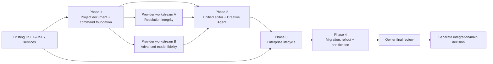

# Creative Studio Enterprise — outcome roadmap

**Status:** proposed; blocked on owner approval of the audit and live demo
**Planning principle:** a phase must deliver architecture, implementation, migration, automated tests, and live verification together. This roadmap intentionally avoids small UI-only phases.

## Target outcome

Deliver one enterprise Studio in which an ALMA project can move from ERP product and brand recipe through image/video/voice/music/SFX authoring, timeline editing, review, guarded distribution, and performance learning without losing provenance, cost control, or role boundaries.

The current CSE7 Studio remains the production fallback until the final phase passes parity and rollback certification.

## Dependency map

The two provider streams may continue independently from the common CSE7 base:

- `codex/cs-resolution-integrity`
- `codex/cs-advanced-model-fidelity`

They should not directly implement editor state. They should expose provider-neutral capability and result contracts that Phase 2 consumes.

## Phase 1 — Project document, command foundation, and enterprise shell

### Outcome

A feature-flagged production-quality editor shell can open an existing project, show its project/library assets, represent an editable composition, and record local `$0` edits through a typed, auditable command model. No provider generation or external distribution needs to move yet.

### Architecture and implementation

- Define a versioned `CreativeCompositionDocument`:
  - project, brand, ERP product, recipe, folder, and source pins;
  - canvases/deliverables with aspect, resolution, duration, and safe zones;
  - stable nodes for video, image/overlay, text/caption, voice, music, and SFX;
  - tracks, clips, time ranges, transforms, volumes, and derived-asset references;
  - current document version and optimistic concurrency token.
- Define `CreativeEditOperation` and `CreativeOperationBatch`:
  - deterministic operation type and validated payload;
  - actor, role, document/version target, selection/time range;
  - before/after projection and inverse;
  - `$0`, paid, destructive, or external-effect classification;
  - estimate, confirmation fingerprint, provider/job linkage, and audit timestamp.
- Introduce one server command validator used by UI and Agent adapters.
- Build the original ALMA editor shell:
  - global project bar;
  - tool rail and project/assets/library panel;
  - central stage/player;
  - multi-track timeline;
  - inspector/review/activity workbench;
  - Jobs and enterprise drawers.
- Adapt existing CSE3 project/asset/version data into read-only document nodes.
- Add keyboard command registry, focus management, screen-reader announcements, reduced-motion support, and responsive focus modes.

### Data and API work

Proposed additive migrations:

- `CreativeComposition`
- `CreativeCompositionVersion`
- `CreativeCompositionNode`
- `CreativeEditOperation`
- `CreativeOperationBatch`
- `CreativeRollbackPoint`

Prefer a normalized composition/version header with a validated JSON document payload initially. High-value indexed relations—project, asset version, actor, job, review, delivery—remain relational.

Proposed APIs:

- `GET/POST /api/assistant/creative-studio/compositions`
- `GET /api/assistant/creative-studio/compositions/:id`
- `POST /api/assistant/creative-studio/compositions/:id/plan`
- `POST /api/assistant/creative-studio/compositions/:id/operations/validate`
- `POST /api/assistant/creative-studio/compositions/:id/operations/apply`
- `POST /api/assistant/creative-studio/compositions/:id/undo`
- `POST /api/assistant/creative-studio/compositions/:id/redo`
- `POST /api/assistant/creative-studio/compositions/:id/rollback`

All mutations authenticate in the route/service, require brand access, validate expected document version, and append an audit record in the same transaction.

### Acceptance criteria

- An authorized owner/creator can open an existing CSE project in the new shell without changing the legacy project or asset.
- Project, brand, ERP product, recipe version, folder, assets, and lineage match the current Studio.
- A local clip/caption/transform edit produces a typed operation, new document version, inverse, audit entry, undo, and redo.
- Stale document versions are rejected with a resolvable conflict; no last-write-wins loss.
- Reviewer and unauthorized roles cannot perform disallowed commands, including by direct API call.
- The editor is keyboard-operable and passes the project’s accessibility checks at desktop, tablet, and mobile focus modes.
- Existing Studio behavior and APIs remain green and the feature flag can remove the new editor without data loss.

### Verification

- Schema/command unit and property tests.
- API auth, role, stale-version, validation, idempotency, undo, and rollback integration tests.
- Browser tests for selection synchronization, timeline operations, keyboard commands, focus, responsive modes, and reload continuity.
- Live preview against migrated non-sensitive owner data in read-only mode.
- Exact version/audit inspection after a controlled `$0` edit.

## Phase 2 — Unified media authoring and deterministic Creative Agent

### Outcome

Image, video, voice, music, SFX, text/captions, reels, and long-form authoring operate in the same composition. The Creative Agent can translate natural language into a reviewable deterministic edit plan, but cannot silently spend money, generate media, publish, or bypass permissions.

### Architecture and implementation

- Connect existing image capabilities:
  - Advanced, Auto, Campaign Pack;
  - product-to-model, try-on, model swap, face-to-model, image edit;
  - mask/repair, finishing, lifestyle layouts, cover selection;
  - saved models, avatar angles, family presets, and brand recipe.
- Connect existing video capabilities:
  - gallery-image reels and 6/16/24-second presets;
  - owned-video 15/30/60-second recipes;
  - trim, reorder, split, crop, focus, safe zones, cover, templates, and partial rerender.
- Connect existing audio capabilities:
  - voiceover, dubbing, music, wish song, owner voice, voice changer, clean voice, and SFX;
  - caption/voice transcript timing;
  - original/music/voice/SFX mixer tracks.
- Introduce provider-neutral `CreativeGenerationRequest` and `CreativeArtifactResult` contracts:
  - requested and delivered dimensions/duration;
  - provider/model/version and capability flags;
  - estimate, actual cost, seed/request ID, latency, warnings;
  - storage artifact, QC result, and parent lineage.
- Integrate the resolution-integrity stream through dimension/QC/result adapters.
- Integrate the advanced-model-fidelity stream through engine capability manifests and request adapters.
- Build Creative Agent orchestration:
  - parse instruction into document targets and typed operations;
  - ask only for missing scope that materially changes the result;
  - show plan, diff, cost, permissions, and effect class;
  - require owner review of the exact fingerprint;
  - apply `$0` operations through the shared command service;
  - create separately confirmed pending actions for paid generation;
  - poll/verify provider jobs and link artifacts before claiming success;
  - create rollback points around multi-operation batches.

### Worker integration

- Existing `image_gen`, `video_gen`, `video_edit`, `audio_gen`, and `video_finish` workers accept the provider-neutral request contract through compatibility adapters.
- Campaign Pack remains a durable staged workflow with manifest, two drafts, owner selection, isolated lineage, stage retry, idempotency, and hard cap.
- Workers append progress and verified results to the operation/job link; they never mutate a composition silently.
- Provider kill switches, balances, timeout/retry policy, and research-only flags remain authoritative.

### Security and cost gates

- Local edit plans can be approved as a batch only when every operation is `$0` and reversible.
- Any paid operation displays estimate, currency, provider/model, maximum cap, and destination before a separate confirmation.
- A changed payload, provider, target asset/version, or estimate invalidates confirmation.
- Voice generation references only active, owner-consented immutable voice versions.
- External publish operations are invalid in the authoring apply endpoint.
- Agent completions require a verified document version or executed job with artifact; queued is never reported as done.

### Acceptance criteria

- Every current image/video/audio/library capability in the parity matrix has a reachable new-editor home or an explicit legacy handoff with preserved context.
- A mixed composition supports video/image, captions, voice, music, and SFX tracks with synchronized canvas/player state.
- Agent plans show stable operation IDs and before/after values, and apply only the approved fingerprint.
- Undo restores the exact pre-plan version for a local batch.
- Paid generation cannot start without server-verified confirmation and hard cap.
- A failed or ambiguous provider result remains failed/needs review, preserves diagnostics, and does not create a false artifact.
- Provider workstream changes merge through adapters without redefining editor nodes or command semantics.

### Verification

- Operation compiler golden tests for common Bengali and English instructions.
- Adversarial tests for prompt injection, role bypass, stale targets, changed estimates, revoked voice, provider disablement, and external-publish requests.
- Contract tests across every provider adapter and worker result.
- Timeline/render snapshot tests and real `$0` local renders.
- Controlled paid-provider staging tests only under separately approved budget; not part of this demo phase.
- Desktop/mobile live workflows for reels and long-form compositions.

## Phase 3 — Review, distribution, performance, and operational lifecycle

### Outcome

The unified composition moves through enterprise review, export, guarded delivery, performance attribution, archive, and restoration without losing the exact version or operation history that produced it.

### Architecture and implementation

- Place comments, requested changes, review state, and immutable activity beside the selected composition/version.
- Approval pins the exact composition and artifact versions; a subsequent edit invalidates approval with a visible reason.
- Add render/export jobs as distinct from preview share and external publish.
- Adapt CSE7 distribution to a composition deliverable:
  - `$0` dry run;
  - pinned asset/review/pack/version/fingerprint;
  - explicit owner confirmation;
  - schedule/publish-now;
  - live Meta switch off by default;
  - delivery receipt, cancel, safe retry, and ambiguous-effect quarantine.
- Link performance metrics to the exact delivery and composition/artifact version.
- Surface deterministic feedback weights as suggestions or recipe inputs, never silent creative mutation.
- Extend retention/archive/fetch-back to composition documents, operation history, proxy media, originals, and render artifacts.
- Unify Jobs, provider health, worker heartbeat, balances, kill switches, golden evaluation, and cache health in owner operations.

### API and worker work

- Extend review service to accept composition/version targets while retaining asset review compatibility.
- Add render service/worker with idempotent render fingerprint and truthful progress.
- Extend publish preview/schedule validation to pin composition deliverable versions.
- Extend attribution rows with composition/version/operation-batch identifiers.
- Extend archive manifests to include the composition graph and verified checksums.

### Acceptance criteria

- Creator, reviewer, and owner journeys match the CSE6 capability matrix at UI and API level.
- Approved version changes are detected before render or distribution.
- Share preview, export, schedule, and external publish are visually and technically distinct.
- Dry run costs `$0` and makes no external mutation.
- Live publish remains off by default and cannot execute without owner role and confirmation.
- An ambiguous external result is never automatically retried.
- Performance metrics resolve to the exact delivered version.
- Archive and fetch-back restore a composition with lineage, reviews, operations, and playable proxies.

### Verification

- Role/capability matrix tests across UI, APIs, and workers.
- Review invalidation, render idempotency, dry-run, publish confirmation, cancel, retry, and ambiguous-outcome integration tests.
- Append-only attribution and deterministic-weight tests.
- Archive checksum/fetch-back disaster-recovery drill.
- Live owner verification with external publishing still disabled; any real platform test requires a later explicit authorization.

## Phase 4 — Parity migration, controlled rollout, and certification

### Outcome

The new Studio is demonstrably at or above CSE7 parity, can be enabled gradually, and can be rolled back without losing edits, jobs, reviews, or delivery truth.

### Migration

1. Inventory all existing projects, folders, assets, recipes, timeline edits, reviews, publish deliveries, metrics, and archive manifests.
2. Backfill read-only composition projections from existing source records.
3. Validate counts, ownership, brand scope, product linkage, versions, costs, QC, and review/publish state.
4. Enable dual-read comparison for owners; legacy remains the write path.
5. Enable new-editor writes for internal fixtures and selected `$0` projects.
6. Dual-write only through explicit compatibility services; compare document and legacy projections.
7. Migrate eligible projects in resumable batches with checkpoints and immutable reports.
8. Make the new editor default only after parity certification and owner sign-off.

### Rollout

- Flags by owner, brand, project, role, and capability.
- Canary order: owner fixture → internal project → selected brand/project → owner default.
- Provider generation, voice, render, and external publish are independently gated.
- Monitoring covers error rate, rejected commands, stale conflicts, queue latency, provider spend, artifact verification, review invalidation, and publish outcomes.

### Rollback

- UI rollback switches routing to CSE7 without schema rollback.
- New compositions remain readable and exportable as an audit package.
- Compatibility adapters preserve legacy asset/version references.
- Pending paid/external jobs are not duplicated during rollback.
- Migration checkpoints are append-only; data deletion is excluded from rollback.

### Certification criteria

- 100% of the feature-parity matrix is pass, explicitly deferred with owner approval, or retained through a context-preserving legacy handoff.
- Automated regression, typecheck, lint, build, accessibility, responsive, and browser suites pass.
- No critical/high security findings; role and cost bypass suites pass.
- Reconciled project/asset/version/review/delivery/metric counts meet the migration thresholds.
- Worker and provider failures produce truthful, recoverable states.
- The current Studio can be restored with one flag and no data rewrite.
- Owner completes a final live review and explicitly authorizes any integration/main merge and production rollout.

## Cross-phase non-negotiables

- No silent paid generation.
- No silent voice use, export, schedule, or external publish.
- No success claim for a queued job.
- No approval carried across a changed version, payload, target, provider, or cost.
- No provider-specific fields in the core composition schema.
- No loss of ERP product, source, recipe, request, seed, cost, QC, review, or delivery lineage.
- No production replacement until owner certification.

## Integration conflict ledger

| Area | Likely owners | Conflict | Resolution |
| --- | --- | --- | --- |
| `StudioWorkspaceView`, generation forms | redesign + advanced-model stream | engine controls and payload shape | Capability manifest feeds the new inspector; provider branch owns adapter, redesign owns presentation |
| Gallery metadata/viewer | redesign + resolution stream | displayed/requested dimensions and QC | Resolution stream owns normalized result fields; redesign consumes them |
| `studio-api.ts` | all three | route clients and types | Add domain modules; avoid expanding the monolithic client for new commands |
| Worker dispatch/payloads | provider streams + Phase 2 | incompatible job contracts | Compatibility adapter at dispatch; version all new contracts |
| Prisma migrations | all three | migration numbering/order | Reserve migration prefixes during integration; rebase migrations, never rewrite applied production migrations |
| Project/asset version lineage | redesign + both providers | duplicated source-of-truth | Composition references canonical asset versions; provider outputs create versions through one service |
| Cost/QC status | all three | optimistic or divergent labels | Server result contract is authoritative; UI derives from it |

## Approval gates

1. **Current gate — owner demo approval:** audit, parity matrix, IA, roadmap, and `$0` live prototype. Production redesign work must not begin before explicit approval.
2. **Post-Phase 1 architecture gate:** schemas, commands, migration dry run, and security model.
3. **Post-Phase 2 paid-provider gate:** controlled test budget and provider staging authorization.
4. **Post-Phase 3 external-effect gate:** any real publish test.
5. **Final integration gate:** consolidation of the three workstreams.
6. **Production gate:** main merge/deploy only after final owner review.
