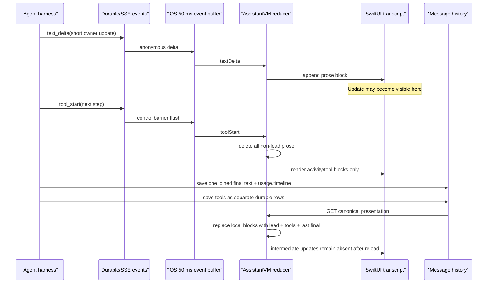

# iOS Agent Reply Persistence — Deep Diagnosis and Cloud Handoff

- **Date:** 2026-08-22 (Asia/Dhaka)
- **Scope:** diagnosis and implementation handoff only; no product code was changed
- **Primary target:** repository state at the build-number-113 marker and current `origin/main`
- **Build-113 marker revision:** [`d8629a6e`](https://github.com/almatraderscom-byte/alma-erp/commit/d8629a6ebbf05c3ebcef7d1c8a3bf25e5a0027da)
- **Artifact provenance:** the exact uploaded/installed TestFlight binary SHA was not available; `d8629a6e` proves the git build-number bump, not binary installation
- **Latest inspected revision:** [`21df2bf0`](https://github.com/almatraderscom-byte/alma-erp/commit/21df2bf01aa23d2830b8264f80454f08daf70e83)
- **Handoff branch:** `codex/ios-agent-reply-persistence-diagnosis`
- **Confidence:** root cause confirmed by deterministic source transitions, git provenance, and canonical-contract tests

## Boss summary (Bangla)

সমস্যাটা network glitch, SwiftUI redraw, অথবা model reply না দেওয়ার সমস্যা নয়। Standard owner-turn runner-এর default cadence-এ দুইটি silent tool step পার হলে—terminal, budget, এবং nudge-cap gate সাপেক্ষে—Server short owner update চায় এবং stream করে; environment override ও native Anthropic loop-এ cadence আলাদা হতে পারে। কিন্তু short update-এর পরের `tool_start` এলেই iOS আগের সব non-opening prose মুছে দেয়। যদি text এবং tool একই 50 ms UI batch-এ আসে, text কোনো frame-এই দেখা যায় না; আলাদা batch হলে text আগে দেখা যায়, তারপর অদৃশ্য হয়।

Turn শেষ বা reload হলে canonical presentation raw stored text delete না করেও সব intermediate prose-কে visible history থেকে “audit-only” হিসেবে filter করে; শুধু opening line এবং last final reply রাখে। Tool call আলাদা durable database row-এ থাকে, তাই reply না দেখালেও tool card থাকে। এই কারণেই ঠিক reported symptom হয়: **reply আসে → গায়েব হয় → শুধু tool call থাকে**।

এটি পুরোনো “one settled reply per turn” policy এবং নতুন “প্রতি দুই step-এর পর short reply” policy-র সরাসরি conflict। শুধু iOS-এর একটি line বদলালে safe fix হবে না; negotiated server event semantics, authoritative canonical history, iOS/web v2 reducers, এবং live/poll/cold cross-layer tests একই focused incident fix-এ ঠিক করতে হবে। Replay/worker hardening আলাদা reliability epic হবে।

## Executive finding

The exact symptom is deterministic:

```text
text_delta("short progress update")
  -> iOS appends visible prose

next tool_start
  -> iOS resets text to the pinned opening line or ""
  -> iOS removes every other prose block
  -> iOS appends the tool block

result
  -> the update either flashes and disappears, or never reaches a rendered frame
  -> the tool remains
```

The persistence path then makes the loss stable across polling, background recovery, and cold reload by projecting only one settled prose block. This is a cross-layer product-contract contradiction, not an intermittent renderer defect.

## Revisions and workspace safety

The original workspace was deliberately not modified because it contained many unrelated uncommitted owner changes. Diagnosis compared three states:

| State | Revision | Relevance |
|---|---|---|
| Git build-number marker | Build 113 bump, `d8629a6e` | Source tree contains the primary tool-start wipe, canonical collapse, and iOS atomic verifier fix; it does not prove the uploaded binary SHA |
| Current remote main | `21df2bf0` | Cloud implementation base; the primary iOS/presentation/replay files are unchanged from the build-113 marker revision |
| Original local checkout | `codex/chatios` at `8c3ef25f`, build 109, dirty | Used only to identify version-specific/uncommitted work; none of it is included in this handoff commit |

The following relevant files are byte-identical between the build-113 marker revision and the inspected latest main:

- `ios/App/App/AssistantSwiftUI.swift`
- `ios/App/App/AssistantTransport.swift`
- `src/agent/lib/presentation/build-presentation.ts`
- `src/app/api/assistant/conversations/[id]/messages/route.ts`
- `src/agent/lib/turn-events.ts`
- `src/app/api/assistant/turn/[id]/stream/route.ts`
- `worker/src/turn/run-streamed-turn.mjs`

`run-owner-turn.ts` has continued to evolve after the build-113 marker, but both revisions contain progress-update behavior and the same incompatible client/history contract.

## Evidence standard

Findings below are labeled as:

- **Confirmed incident mechanism:** directly produces the reported UI behavior with no external failure required.
- **Confirmed code defect / incident linkage unproven:** the defect is deterministic in source, but production logs were not available to prove that it occurred in the owner’s exact turn.
- **Intentional conditional behavior:** code does exactly what it says, but only under a specific control path.

No production database rows, Vercel logs, Redis logs, or device telemetry were available in this read-only diagnosis. Runtime frequency therefore remains unmeasured. The live `textDelta -> toolStart` removal is explicit in source but lacks an after-tool regression assertion; the settled canonical collapse is explicitly locked by tests.

## End-to-end failure sequence



There are two visible variants of the same reducer behavior:

1. **Flash then disappear.** The 50 ms cadence flushes the prose first. SwiftUI renders it. A later `tool_start` batch deletes it.
2. **Only tools, no visible reply.** A control event drains pending prose and places prose plus `tool_start` in one batch. The MainActor reducer applies both synchronously; SwiftUI observes only the final tool-only state.

This timing is guaranteed by the buffer’s control barrier, not by out-of-order SSE:

- [`AgentTurnEvent.isControl` and `AgentEventBuffer`](https://github.com/almatraderscom-byte/alma-erp/blob/21df2bf01aa23d2830b8264f80454f08daf70e83/ios/App/App/AssistantTransport.swift#L892-L918)
- [Control events drain prose and flush immediately](https://github.com/almatraderscom-byte/alma-erp/blob/21df2bf01aa23d2830b8264f80454f08daf70e83/ios/App/App/AssistantTransport.swift#L1045-L1119)
- [One synchronous MainActor reducer loop](https://github.com/almatraderscom-byte/alma-erp/blob/21df2bf01aa23d2830b8264f80454f08daf70e83/ios/App/App/AssistantSwiftUI.swift#L8156-L8173)

## Ranked findings

### F-01 — P0 — iOS `toolStart` destructively deletes committed-looking prose

**Status:** confirmed incident mechanism

The iOS reducer first appends each `text_delta` to `message.text` and a `.prose` block:

- [Text delta reducer](https://github.com/almatraderscom-byte/alma-erp/blob/21df2bf01aa23d2830b8264f80454f08daf70e83/ios/App/App/AssistantSwiftUI.swift#L8253-L8305)

On the next tool start it deliberately:

- clears a suppressed raw-tool buffer;
- sets `message.text` to only the pinned lead, or `""`;
- removes every prose block whose ID is not the lead;
- keeps/appends activity and tool state.

Evidence:

- [Destructive `toolStart` reducer](https://github.com/almatraderscom-byte/alma-erp/blob/21df2bf01aa23d2830b8264f80454f08daf70e83/ios/App/App/AssistantSwiftUI.swift#L8323-L8355)
- [Only `preamble` pins one prose block](https://github.com/almatraderscom-byte/alma-erp/blob/21df2bf01aa23d2830b8264f80454f08daf70e83/ios/App/App/AssistantSwiftUI.swift#L8467-L8477)

Ordinary intermediate updates are not pinned. The live text path also does not add ordinary prose to the local timeline, so the block removal is real in-memory deletion rather than a temporary view filter.

The web client implements the same destructive rule:

- [Web `tool_start` resets `text: ''`](https://github.com/almatraderscom-byte/alma-erp/blob/21df2bf01aa23d2830b8264f80454f08daf70e83/src/agent/components/AgentApp.tsx#L1294-L1317)

### F-02 — P0 — The standard runner emits updates that the clients classify as disposable

**Status:** confirmed design contradiction on the standard runner path

The standard owner-facing runner requires short updates after silent work, subject to an environment-overridable default of two steps, terminal/budget/nudge-cap gates, and the alternate native Anthropic loop:

- [`PROGRESS_UPDATE_EVERY` defaults to two](https://github.com/almatraderscom-byte/alma-erp/blob/21df2bf01aa23d2830b8264f80454f08daf70e83/src/agent/config.ts#L78-L83)
- [The harness counts individual tool steps and escalates ignored nudges](https://github.com/almatraderscom-byte/alma-erp/blob/21df2bf01aa23d2830b8264f80454f08daf70e83/src/agent/lib/models/run-owner-turn.ts#L2235-L2253)
- [Provider prose streams immediately as `text_delta`](https://github.com/almatraderscom-byte/alma-erp/blob/21df2bf01aa23d2830b8264f80454f08daf70e83/src/agent/lib/models/run-owner-turn.ts#L2911-L2964)
- [Every round’s visible text is appended to the in-memory timeline](https://github.com/almatraderscom-byte/alma-erp/blob/21df2bf01aa23d2830b8264f80454f08daf70e83/src/agent/lib/models/run-owner-turn.ts#L3054-L3066); [terminal persistence later keeps only its first 60 entries](https://github.com/almatraderscom-byte/alma-erp/blob/21df2bf01aa23d2830b8264f80454f08daf70e83/src/agent/lib/models/run-owner-turn.ts#L5258-L5275)
- [Forced update is validated, appended to `finalText`, streamed, and work resumes](https://github.com/almatraderscom-byte/alma-erp/blob/21df2bf01aa23d2830b8264f80454f08daf70e83/src/agent/lib/models/run-owner-turn.ts#L3151-L3197)
- [Model-authored text alongside tools also resets the progress clock](https://github.com/almatraderscom-byte/alma-erp/blob/21df2bf01aa23d2830b8264f80454f08daf70e83/src/agent/lib/models/run-owner-turn.ts#L3214-L3238)
- [Two-step cadence and forced tool-free update round](https://github.com/almatraderscom-byte/alma-erp/blob/21df2bf01aa23d2830b8264f80454f08daf70e83/src/agent/lib/models/run-owner-turn.ts#L4461-L4572)
- [`AGENT_NATIVE_ANTHROPIC_LOOP=true` bypasses this runner](https://github.com/almatraderscom-byte/alma-erp/blob/21df2bf01aa23d2830b8264f80454f08daf70e83/src/agent/lib/models/run-owner-turn.ts#L6198-L6212)

The server comment says tool-round narration should remain in live and reload views, while the clients and canonical builder remove it. This is the core contract collision.

### F-03 — P0 — Canonical history intentionally filters every intermediate update from owner-visible blocks

**Status:** confirmed incident mechanism

At turn completion, the server saves one assistant row whose first content block is the accumulated `finalText`, and places the first 60 entries of the ordered round timeline in `usage.timeline`:

- [Single final message persistence](https://github.com/almatraderscom-byte/alma-erp/blob/21df2bf01aa23d2830b8264f80454f08daf70e83/src/agent/lib/models/run-owner-turn.ts#L5238-L5277)

The canonical presentation then deliberately selects only the last non-superseded timeline text. If the joined stored text ends with that last text—which is the normal accumulated progress + final shape—it collapses the owner-visible presentation text to only the last text without rewriting the raw database field:

- [`selectSettledProse`](https://github.com/almatraderscom-byte/alma-erp/blob/21df2bf01aa23d2830b8264f80454f08daf70e83/src/agent/lib/presentation/build-presentation.ts#L118-L154)
- [Every timeline prose entry is audit/progress except explicit lead](https://github.com/almatraderscom-byte/alma-erp/blob/21df2bf01aa23d2830b8264f80454f08daf70e83/src/agent/lib/presentation/build-presentation.ts#L161-L188)
- [Only one settled final prose block is appended](https://github.com/almatraderscom-byte/alma-erp/blob/21df2bf01aa23d2830b8264f80454f08daf70e83/src/agent/lib/presentation/build-presentation.ts#L252-L261)

The messages route always attaches that projection:

- [GET passes timeline/tools/content into `buildAgentPresentationV1`](https://github.com/almatraderscom-byte/alma-erp/blob/21df2bf01aa23d2830b8264f80454f08daf70e83/src/app/api/assistant/conversations/%5Bid%5D/messages/route.ts#L405-L484)

iOS first rebuilds a legacy projection, then replaces it with the canonical blocks:

- [Cold decode prefers canonical presentation](https://github.com/almatraderscom-byte/alma-erp/blob/21df2bf01aa23d2830b8264f80454f08daf70e83/ios/App/App/AssistantSwiftUI.swift#L1895-L1913)
- [Only `nil`/`final` prose is accepted and `message.blocks` is replaced](https://github.com/almatraderscom-byte/alma-erp/blob/21df2bf01aa23d2830b8264f80454f08daf70e83/ios/App/App/AssistantSwiftUI.swift#L1917-L1972)
- [Legacy fallback also retains guessed lead plus last settled text](https://github.com/almatraderscom-byte/alma-erp/blob/21df2bf01aa23d2830b8264f80454f08daf70e83/ios/App/App/AssistantSwiftUI.swift#L1984-L2059)

The behavior is locked as expected by tests:

- [“progress prose stays audit-only and one final remains visible”](https://github.com/almatraderscom-byte/alma-erp/blob/21df2bf01aa23d2830b8264f80454f08daf70e83/src/agent/lib/presentation/__tests__/build-presentation.test.ts#L86-L103)
- [Accumulated stored progress still projects only final](https://github.com/almatraderscom-byte/alma-erp/blob/21df2bf01aa23d2830b8264f80454f08daf70e83/src/agent/lib/presentation/__tests__/build-presentation.test.ts#L222-L239)
- [Unmarked first/progress text remains audit-only](https://github.com/almatraderscom-byte/alma-erp/blob/21df2bf01aa23d2830b8264f80454f08daf70e83/src/agent/lib/presentation/__tests__/build-presentation.test.ts#L308-L315)

This means a poll or cold reload cannot restore the update even when its raw text still exists in the database JSON.

### F-04 — P0 — Tool persistence is first-class; progress prose is anonymous and filtered

**Status:** confirmed explanation for “only tool calls remain”

The database is asymmetric:

- One `AgentMessage.content` JSON field stores the whole assistant turn; there are no durable prose-segment IDs: [schema](https://github.com/almatraderscom-byte/alma-erp/blob/21df2bf01aa23d2830b8264f80454f08daf70e83/prisma/schema.prisma#L2125-L2149).
- Every tool call gets its own durable row with ID and `messageId`: [`AgentToolCall`](https://github.com/almatraderscom-byte/alma-erp/blob/21df2bf01aa23d2830b8264f80454f08daf70e83/prisma/schema.prisma#L2553-L2566).
- The final save writes all tool records separately: [tool-row persistence](https://github.com/almatraderscom-byte/alma-erp/blob/21df2bf01aa23d2830b8264f80454f08daf70e83/src/agent/lib/models/run-owner-turn.ts#L5421-L5433).
- GET reconstructs tool activity from those rows: [tool reconstruction](https://github.com/almatraderscom-byte/alma-erp/blob/21df2bf01aa23d2830b8264f80454f08daf70e83/src/app/api/assistant/conversations/%5Bid%5D/messages/route.ts#L330-L347).

When canonical blocks contain tool/verification activity but no prose, they are still non-empty. iOS therefore uses the block renderer and does not fall back to `message.text`:

- [Block renderer wins whenever blocks exist](https://github.com/almatraderscom-byte/alma-erp/blob/21df2bf01aa23d2830b8264f80454f08daf70e83/ios/App/App/AssistantSwiftUI.swift#L14769-L14814)
- [The renderer faithfully renders prose when it exists](https://github.com/almatraderscom-byte/alma-erp/blob/21df2bf01aa23d2830b8264f80454f08daf70e83/ios/App/App/AssistantSwiftUI.swift#L18466-L18535)

A locked test explicitly accepts activity with zero prose after a superseded draft has no replacement:

- [Activity-only canonical projection](https://github.com/almatraderscom-byte/alma-erp/blob/21df2bf01aa23d2830b8264f80454f08daf70e83/src/agent/lib/presentation/__tests__/build-presentation.test.ts#L208-L220)

### F-05 — P1 — Canonical merge replaces richer live blocks with the thinner settled projection

**Status:** confirmed reinforcing mechanism

During history reconciliation, local text/timeline/blocks are preserved only when the incoming server equivalents are empty. A canonical activity + final array is non-empty even when it omitted every progress prose block, so it wins and the richer local sequence is lost:

- [Canonical merge rule](https://github.com/almatraderscom-byte/alma-erp/blob/21df2bf01aa23d2830b8264f80454f08daf70e83/ios/App/App/AssistantSwiftUI.swift#L5428-L5446)

An unpaired streaming tail is retained only when `tail.text` is non-empty. `toolStart` can empty the text while leaving tools/blocks, so a poll during that state can also discard a tool-only local tail:

- [Unpaired tail condition](https://github.com/almatraderscom-byte/alma-erp/blob/21df2bf01aa23d2830b8264f80454f08daf70e83/ios/App/App/AssistantSwiftUI.swift#L5486-L5494)

### F-06 — P1 — Long turns evict old prose at 24 blocks and the recovery sheet cannot show it

**Status:** confirmed independent visibility loss

The transcript mounts only the last 24 blocks. Older files/cards/owner messages are pinned, but prose is not:

- [24-block window and pin rules](https://github.com/almatraderscom-byte/alma-erp/blob/21df2bf01aa23d2830b8264f80454f08daf70e83/ios/App/App/AssistantSwiftUI.swift#L18255-L18300)

The chat shows an “older steps” row, but the activity summary is built around activity/tool data and does not recover the evicted prose. Thus even after the primary reducer/projection fix, early short updates can still disappear inline in long tool-heavy turns unless prose retention is handled separately.

### F-07 — P1 — `verification_retry` is an overloaded, anonymous destructive reset

**Status:** confirmed protocol defect; iOS impact is version-specific

The public protocol carries anonymous `text_delta { delta }` with no block ID, semantic kind, revision, or commit state:

- [Protocol `text_delta`](https://github.com/almatraderscom-byte/alma-erp/blob/21df2bf01aa23d2830b8264f80454f08daf70e83/src/agent/protocol/agent-event.schema.json#L211-L224)
- [Provider-neutral event also has no identity](https://github.com/almatraderscom-byte/alma-erp/blob/21df2bf01aa23d2830b8264f80454f08daf70e83/src/agent/lib/models/types.ts#L23-L27)

`verification_retry` also has no `draftId`, `replacementId`, action, or reason. It is used not only by the factual verifier but as a generic “remove whatever the client thinks the current draft is” control during reconciliation and multiple corrective paths:

- [Protocol shape](https://github.com/almatraderscom-byte/alma-erp/blob/21df2bf01aa23d2830b8264f80454f08daf70e83/src/agent/protocol/agent-event.schema.json#L1210-L1239)
- [Generic supersede and replacement emission](https://github.com/almatraderscom-byte/alma-erp/blob/21df2bf01aa23d2830b8264f80454f08daf70e83/src/agent/lib/models/run-owner-turn.ts#L3067-L3123)

Consequences:

- Clients must guess which prose to clear from chronology.
- Repeated retry events can target the wrong visible block.
- A lost retry or text event corrupts all following append/replace semantics.
- A tool boundary is incorrectly used as an implicit prose lifecycle boundary.

Version matrix:

- The old local build-109 HEAD clears the full non-lead answer immediately on every verifier retry.
- Build 113/current main contains [`c5de5888`](https://github.com/almatraderscom-byte/alma-erp/commit/c5de58889d42345bb0e7f9f68f85ebaffdc2e3c6), which buffers the iOS replacement off-screen and atomically swaps it on `done`: [iOS implementation](https://github.com/almatraderscom-byte/alma-erp/blob/21df2bf01aa23d2830b8264f80454f08daf70e83/ios/App/App/AssistantSwiftUI.swift#L8478-L8505) and [commit on terminal](https://github.com/almatraderscom-byte/alma-erp/blob/21df2bf01aa23d2830b8264f80454f08daf70e83/ios/App/App/AssistantSwiftUI.swift#L8542-L8563).
- The web reducer still globally resets `text` and `toolActivity` on retry: [web retry reducer](https://github.com/almatraderscom-byte/alma-erp/blob/21df2bf01aa23d2830b8264f80454f08daf70e83/src/agent/components/AgentApp.tsx#L1433-L1461).

The iOS atomic verifier fix does **not** change the primary `toolStart` wipe.

### F-08 — P1 — Replay has a replay-before-subscribe race and no gap detection

**Status:** confirmed code defect; linkage to the reported turn is unproven

The durability contract is “write row, then publish ephemeral Redis event.” But the stream endpoint does the inverse acquisition order on the read side:

1. Query/replay durable rows.
2. Only after replay finishes, install the Redis subscription.

Evidence:

- [Durable publisher ordering](https://github.com/almatraderscom-byte/alma-erp/blob/21df2bf01aa23d2830b8264f80454f08daf70e83/src/agent/lib/turn-events.ts#L77-L88)
- [Replay first, subscribe second](https://github.com/almatraderscom-byte/alma-erp/blob/21df2bf01aa23d2830b8264f80454f08daf70e83/src/app/api/assistant/turn/%5Bid%5D/stream/route.ts#L83-L119)
- [Redis subscription becomes active only after `await sub.subscribe`](https://github.com/almatraderscom-byte/alma-erp/blob/21df2bf01aa23d2830b8264f80454f08daf70e83/src/agent/lib/turn-events.ts#L249-L282)

An event written and published after the replay query but before subscription is absent from this connection. `createSeqDeduper` accepts any greater sequence, not the next contiguous sequence, so receiving `n+2` silently advances over missing `n+1`:

- [Non-contiguous deduper](https://github.com/almatraderscom-byte/alma-erp/blob/21df2bf01aa23d2830b8264f80454f08daf70e83/src/agent/lib/turn-events.ts#L31-L46)

The current test covers overlap/duplicate delivery but never the gap window:

- [Overlap-only test](https://github.com/almatraderscom-byte/alma-erp/blob/21df2bf01aa23d2830b8264f80454f08daf70e83/src/agent/lib/__tests__/turn-events.test.ts#L59-L85)

A missed `text_delta` followed by a received `tool_start` is another route to tool-only state. A reconnect can recover the row if durable storage succeeded, but the current UI may already have reset or merged thinner state.

### F-09 — P1 — Durable writes fail open while sequence and live delivery continue

**Status:** confirmed integrity defect; production occurrence unproven

The inline publisher catches a failed event-row write, still publishes live, then still advances `AgentTurn.lastSeq`:

- [Fail-open write/publish/lastSeq path](https://github.com/almatraderscom-byte/alma-erp/blob/21df2bf01aa23d2830b8264f80454f08daf70e83/src/agent/lib/turn-events.ts#L124-L149)
- [`finish()` reports only final numeric seq, not durability holes](https://github.com/almatraderscom-byte/alma-erp/blob/21df2bf01aa23d2830b8264f80454f08daf70e83/src/agent/lib/turn-events.ts#L153-L188)
- [`getReplayEvents` converts database failure to `[]`](https://github.com/almatraderscom-byte/alma-erp/blob/21df2bf01aa23d2830b8264f80454f08daf70e83/src/agent/lib/turn-events.ts#L54-L74)
- [The fail-open replay behavior is explicitly tested](https://github.com/almatraderscom-byte/alma-erp/blob/21df2bf01aa23d2830b8264f80454f08daf70e83/src/agent/lib/__tests__/turn-event-publisher.test.ts#L92-L107)

iOS full recovery waits for a `turn_snapshot`, then wipes the entire local streaming tail before replay rebuilds it:

- [Full-replay reset contract](https://github.com/almatraderscom-byte/alma-erp/blob/21df2bf01aa23d2830b8264f80454f08daf70e83/ios/App/App/AssistantSwiftUI.swift#L8118-L8154)
- [Snapshot triggers destructive reset](https://github.com/almatraderscom-byte/alma-erp/blob/21df2bf01aa23d2830b8264f80454f08daf70e83/ios/App/App/AssistantSwiftUI.swift#L8590-L8602)

If the live event existed but its durable row did not, reconnect replaces the visible copy with a replay that can never reproduce it.

### F-10 — P1 — Worker turns never update `AgentTurn.lastSeq`

**Status:** confirmed code defect

The worker writes each event and publishes it, but never updates the turn row’s `lastSeq`:

- [Worker publisher](https://github.com/almatraderscom-byte/alma-erp/blob/21df2bf01aa23d2830b8264f80454f08daf70e83/worker/src/turn/run-streamed-turn.mjs#L39-L67)

The worker also uses Supabase `upsert` without inspecting the returned `{ error }` and without `.throwOnError()`. A PostgREST error can therefore be treated as success; the event is still published and `seq` advances.

This breaks two consumers:

1. A duplicate `/turn` request declares any running turn with `lastSeq < 0` older than 15 seconds stale, cancels it, and dispatches a replacement: [stale redispatch gate](https://github.com/almatraderscom-byte/alma-erp/blob/21df2bf01aa23d2830b8264f80454f08daf70e83/src/app/api/assistant/turn/route.ts#L85-L129). A healthy worker can therefore look dead.
2. Replay is capped at 5,000 rows and only emits `replay_continue` when snapshot `lastSeq` proves more rows exist: [page continuation gate](https://github.com/almatraderscom-byte/alma-erp/blob/21df2bf01aa23d2830b8264f80454f08daf70e83/src/app/api/assistant/turn/%5Bid%5D/stream/route.ts#L97-L112). With worker `lastSeq == -1`, already-written rows after page 1 can be skipped.

No focused worker event-log failure/lastSeq test was found.

### F-11 — P1 — Worker can synthesize false success without a durable assistant message

**Status:** confirmed conditional defect

If the upstream stream closes without `done` or `error`, the worker emits `{ type: 'done', synthetic: true }` with no `messageId`:

- [Synthetic done](https://github.com/almatraderscom-byte/alma-erp/blob/21df2bf01aa23d2830b8264f80454f08daf70e83/worker/src/turn/run-streamed-turn.mjs#L85-L116)

The public protocol requires `done.messageId`:

- [Done schema](https://github.com/almatraderscom-byte/alma-erp/blob/21df2bf01aa23d2830b8264f80454f08daf70e83/src/agent/protocol/agent-event.schema.json#L1262-L1303)

Cancellation is a concrete normal way for both execution loops to return without a terminal event:

- [Alternate runner cancellation return](https://github.com/almatraderscom-byte/alma-erp/blob/21df2bf01aa23d2830b8264f80454f08daf70e83/src/agent/lib/models/run-owner-turn.ts#L4759-L4768)
- [Native runner cancellation return](https://github.com/almatraderscom-byte/alma-erp/blob/21df2bf01aa23d2830b8264f80454f08daf70e83/src/agent/lib/core.ts#L2674-L2684)

The client can therefore receive a successful terminal signal for a canceled/partial turn that has no final persisted assistant row.

### F-12 — P1 — The server provides exact assistant IDs, but iOS discards them and pairs positionally

**Status:** confirmed structural defect; incident linkage unproven

The server exposes the exact persisted assistant row through:

- `done.messageId` and turn linkage: [chat route](https://github.com/almatraderscom-byte/alma-erp/blob/21df2bf01aa23d2830b8264f80454f08daf70e83/src/app/api/assistant/chat/route.ts#L1100-L1106)
- `turn_snapshot.assistantMessageId`: [stream snapshot](https://github.com/almatraderscom-byte/alma-erp/blob/21df2bf01aa23d2830b8264f80454f08daf70e83/src/app/api/assistant/turn/%5Bid%5D/stream/route.ts#L83-L95)
- turn-status `assistantMessageId` and `lastSeq`: [status route](https://github.com/almatraderscom-byte/alma-erp/blob/21df2bf01aa23d2830b8264f80454f08daf70e83/src/app/api/assistant/conversations/%5Bid%5D/turn-status/route.ts#L23-L40)

iOS has the raw DTO fields but drops them at typed boundaries:

- `TurnStatusResponse` omits both `assistantMessageId` and `lastSeq`: [DTO](https://github.com/almatraderscom-byte/alma-erp/blob/21df2bf01aa23d2830b8264f80454f08daf70e83/ios/App/App/AssistantTransport.swift#L69-L77).
- `AgentSSEEvent` has `assistantMessageId`, but typed `turnSnapshot` does not: [event definitions and decode](https://github.com/almatraderscom-byte/alma-erp/blob/21df2bf01aa23d2830b8264f80454f08daf70e83/ios/App/App/AssistantTransport.swift#L779-L793) and [snapshot conversion](https://github.com/almatraderscom-byte/alma-erp/blob/21df2bf01aa23d2830b8264f80454f08daf70e83/ios/App/App/AssistantTransport.swift#L986-L995).
- The `.done` reducer ignores its first `messageId` associated value with `_`: [done reducer](https://github.com/almatraderscom-byte/alma-erp/blob/21df2bf01aa23d2830b8264f80454f08daf70e83/ios/App/App/AssistantSwiftUI.swift#L8542-L8563).
- History reconciliation pairs the streaming tail with the last assistant row after the last user row: [positional pairing](https://github.com/almatraderscom-byte/alma-erp/blob/21df2bf01aa23d2830b8264f80454f08daf70e83/ios/App/App/AssistantSwiftUI.swift#L5399-L5426).

A continuation, background response, or concurrent assistant write can make iOS canonicalize the stream tail against the wrong row. No exact-ID reconciliation test was found.

### F-13 — P2 — The native Anthropic “act now” retry removes streamed prose without a reset event

**Status:** confirmed path-specific protocol omission

The native Anthropic path streams prose immediately. Its steering and verifier retry paths emit `verification_retry`, mark the timeline text superseded, and remove it from the persisted assistant turns. The announced-intent/no-action path only removes the assistant turn and retries; it emits no reset and does not mark the timeline entry superseded:

- [Immediate native streaming](https://github.com/almatraderscom-byte/alma-erp/blob/21df2bf01aa23d2830b8264f80454f08daf70e83/src/agent/lib/core.ts#L1643-L1671)
- [Steering retry has an explicit reset](https://github.com/almatraderscom-byte/alma-erp/blob/21df2bf01aa23d2830b8264f80454f08daf70e83/src/agent/lib/core.ts#L1729-L1767)
- [Verifier retry has an explicit reset](https://github.com/almatraderscom-byte/alma-erp/blob/21df2bf01aa23d2830b8264f80454f08daf70e83/src/agent/lib/core.ts#L1818-L1846)
- [Announced-intent retry silently pops the turn](https://github.com/almatraderscom-byte/alma-erp/blob/21df2bf01aa23d2830b8264f80454f08daf70e83/src/agent/lib/core.ts#L1849-L1881)

Cold persistence will omit that draft, while live clients can retain it until an unrelated tool start clears it. Typed block lifecycle events eliminate this mismatch.

### F-14 — P2 — Long history is truncated at 60 raw timeline entries

**Status:** confirmed long-turn consistency risk

Both runner paths persist only `timeline.slice(0, 60)`:

- [Alternate runner cap](https://github.com/almatraderscom-byte/alma-erp/blob/21df2bf01aa23d2830b8264f80454f08daf70e83/src/agent/lib/models/run-owner-turn.ts#L5258-L5275)
- [Native runner cap](https://github.com/almatraderscom-byte/alma-erp/blob/21df2bf01aa23d2830b8264f80454f08daf70e83/src/agent/lib/core.ts#L2805-L2815)

For long turns, the cap can omit late prose/final/activity from chronology. The canonical builder uses `toolCalls` as fallback only when the timeline is empty, so a non-empty truncated timeline is not repaired by later tool rows. A v2 persistence design must never truncate committed owner prose or the terminal block.

### F-15 — P2 — Prospective planning intentionally clears all prose

**Status:** intentional conditional behavior

The explicit `prospective_plan_start` path clears the lead, text, and every prose block before a forced plan:

- [Prospective-plan reset](https://github.com/almatraderscom-byte/alma-erp/blob/21df2bf01aa23d2830b8264f80454f08daf70e83/ios/App/App/AssistantSwiftUI.swift#L8307-L8322)
- [The behavior is explicitly tested](https://github.com/almatraderscom-byte/alma-erp/blob/21df2bf01aa23d2830b8264f80454f08daf70e83/ios/App/AppParityV2Tests/AssistantParityV2Tests.swift#L4108-L4133)

This is not the universal symptom, but the implementation must keep it as an explicit targeted supersede operation rather than a global prose reset.

## Git provenance: how the contradiction was introduced

The history is unusually strong evidence because the intent is named in commits and comments:

1. [`88c04149`](https://github.com/almatraderscom-byte/alma-erp/commit/88c0414905c252a0098ae63d1995a914a0885cfc), 2026-07-21, **“fix(agent): show one settled reply per turn”** introduced both the iOS/web pre-tool wipe and the canonical one-final projection.
2. [`5386b552`](https://github.com/almatraderscom-byte/alma-erp/commit/5386b552183e9b21ae52c31b570cbb4ffe8aab6c), 2026-07-26, **“feat(agent): speak every few steps, not once at the end”** added intermediate owner updates.
3. [`bb4d860e`](https://github.com/almatraderscom-byte/alma-erp/commit/bb4d860e8ae7b59511649cec8fb1b6ea353540f7), 2026-08-20, changed the cadence to two.
4. [`72125f61`](https://github.com/almatraderscom-byte/alma-erp/commit/72125f61b109ef87c2c25c273f78da7880734859), 2026-08-21, corrected the counter from model rounds to individual tool steps.
5. The later update commits changed the runner/arithmetic tests but did not revise iOS/web clearing or canonical presentation semantics.
6. [`c5de5888`](https://github.com/almatraderscom-byte/alma-erp/commit/c5de58889d42345bb0e7f9f68f85ebaffdc2e3c6), 2026-08-20, fixed iOS verifier flashing but did not touch the primary tool-start/canonical collapse.

`git blame` maps the destructive iOS lines and `selectSettledProse` directly to `88c04149`. A later lead-only exception was added after the owner reported that clearing the first line made the app feel silent; ordinary intermediate updates remained disposable.

## Why SwiftUI identity/rendering is not the root cause

The evidence contradicts a `ForEach`/identity/render invalidation theory:

- State mutation is on the MainActor and the reducer explicitly removes prose before rendering.
- `AgentMessageRow` selects `AgentTurnBlocksView` when blocks exist.
- `AgentTurnBlocksView` faithfully renders every prose block it receives.
- Activity clustering preserves prose as episode boundaries.
- Message IDs are stable enough for this specific state transition; the prose is already gone from the model array.

The renderer shows only tools because reducer and canonical projection supplied only tools—not because SwiftUI randomly failed to retain a view.

## Required target contract

The fix must make prose lifecycle explicit. `tool_start` must never decide whether prose is a draft, progress update, or final answer.

### Canonical block states

| Kind | Meaning | Visible live | Survives next tool | Survives reload | Can be superseded |
|---|---|---:|---:|---:|---:|
| `lead` | Spoken opening/preamble | Yes | Yes | Yes | Only by an explicit safety-targeted event |
| `progress` | Committed short owner update between phases | Yes | Yes | Yes | Only by explicit target ID |
| `draft` | Unverified/provider prose still being reconciled | Optional transient lane | Must not delete committed prose | No unless committed | Yes, by exact ID |
| `final` | Settled terminal answer | Yes | Yes | Yes | Only by atomic verified replacement |
| `activity` | Thinking/progress/tool/file/card facts | Yes | Yes | Yes | Status updates by exact ID |

### Protocol v2 recommendation

Use stable IDs and explicit lifecycle. This can be additive and backward compatible only when the protocol is negotiated per turn:

```ts
type OwnerProseKind = 'lead' | 'progress' | 'draft' | 'final'

type AgentEventV2 =
  | { type: 'prose_start'; blockId: string; kind: OwnerProseKind; revision: number }
  | { type: 'prose_delta'; blockId: string; delta: string; revision: number }
  | { type: 'prose_commit'; blockId: string; kind: Exclude<OwnerProseKind, 'draft'>; revision: number }
  | { type: 'prose_supersede'; blockId: string; replacementBlockId?: string; reason: string; revision: number }
```

Equivalent optional fields on `text_delta` are acceptable only if there is still an explicit commit/supersede operation. The minimum invariants are:

1. Every owner-visible prose segment has a stable `blockId`.
2. A committed progress block is never mutated by a later tool event.
3. Supersede targets exactly one block/revision.
4. The prior stable answer remains visible until a complete replacement commits atomically.
5. Live, durable replay, GET presentation, web, and iOS reduce the same fixture to the same ordered blocks.
6. As a reliability invariant, sequence gaps are detected and repaired before later events are applied.

### Protocol negotiation and mixed-version safety

Do not broadcast both v1 `text_delta`/`verification_retry` prose semantics and v2 prose events to the same turn. Add an explicit client capability to the turn/chat request, for example `agentProseProtocol: 2` plus accepted presentation versions, and persist the selected protocol for the life of that turn—for example in the existing `AgentTurn.versions` JSON as `versions.agentProseProtocol`, avoiding an immediate schema migration.

- A v1 client receives exactly the v1 event family and v1 presentation. Its existing destructive reducer remains scoped to v1 because untyped provider text can still be an unsafe draft.
- A v2-capable client talking to an old server detects the absence of negotiated v2 and deliberately falls back to the v1 reducer; it must not apply non-destructive v2 rules to anonymous v1 deltas.
- A v2 turn receives exactly the v2 prose event family. Old clients must not be allowed to start or resume it unless the server can serve a deliberate v1 projection.
- Roll out readers first: server storage/projection readers, then dual-capable iOS/web clients, then enable v2 emission only for clients that explicitly negotiate it.
- Dual-write v1 and v2 **presentations/storage projections** during the compatibility window if needed; never dual-emit both live prose event families to one client.
- Rollback must leave v2 rows readable. Test old client/new server, new client/old server, old stored rows/new readers, and v2 stored rows after server rollback.

### Persistence v2 recommendation

Define exactly one durable authority for a v2 settled transcript: `AgentMessage.usage.presentationV2` in the existing JSON field. It should be a self-contained immutable block document, written atomically with the terminal `AgentMessage` and its tool rows:

```ts
{
  version: 2,
  turnId: 'turn-...',
  messageId: 'msg-...',
  blocks: [
    { t: 'text', id: 'p-7', kind: 'progress', state: 'committed', revision: 1, text: '...', checksum: '...' }
  ]
}
```

For v2 turns, `AgentMessage.content[0].text` should mean terminal final text only; it must no longer be the ambiguous concatenation of progress plus final. `usage.timeline` remains raw audit material, not a second transcript authority. The messages route derives both presentation v2 and the compatibility v1 projection from `usage.presentationV2`, preserving the stored IDs and order. This prevents GET, replay, and final content from independently reinterpreting the same prose.

Each durable `prose_commit` should carry the full committed text (or an equivalent canonical snapshot) and checksum in addition to streamed deltas, so replay can self-heal a missed delta and verify identity. The terminal message write must atomically store the authoritative block document; publish `done(messageId)` only after that transaction succeeds.

This can use the existing JSON fields without an immediate database migration, but the storage key, schema version, size limit, transaction boundary, and authority must be treated as a formal contract. Do not reclassify old unmarked timeline text as progress; old records are ambiguous and may contain unsafe drafts. Backward compatibility should remain:

- `lead:true` -> `lead`
- `state:'superseded'` -> hidden legacy draft
- last non-superseded legacy text -> legacy final
- earlier untyped legacy text -> audit-only
- all new v2 text -> read only from the authoritative `presentationV2` document and obey explicit `kind/state/id/revision`

For long turns, compact activity details if necessary, but retain every committed owner prose block and the terminal block. Never use `slice(0, 60)` on the only canonical owner-visible sequence.

## Cloud implementation plan

### Scope split

The incident release is intentionally narrow and blocks on **F-01 through F-04**: negotiated typed prose lifecycle, one authoritative v2 settled document, non-destructive v2 iOS/web reducers, and exact live -> done -> GET -> cold parity for committed lead/progress/final blocks. F-05 through F-15 are confirmed defects, risks, or conditional behaviors that deserve a separate reliability epic and separate PRs unless a failing incident fixture proves one is required for the P0 path. Do not make the deterministic reply-retention fix wait for every replay/worker/retention hardening item.

### Phase 0 — Add the failing golden fixture first

Create one shared JSON fixture representing:

```text
lead L
tool A start/end
progress P1 commit
tool B start/end
progress P2 commit
verification draft D
supersede D -> final F
done(messageId M)
```

Assert expected visible prose after every event, after terminal merge, after GET decode, after reconnect, and after cold load:

```text
[L]
[L]
[L, P1]
[L, P1]
[L, P1, P2]
[L, P1, P2]             // draft/retry cannot blank stable prose
[L, P1, P2, F]
[L, P1, P2, F]
```

Add a second timing fixture where `P1` and the following `tool_start` are delivered in one reducer batch. It must produce the same state.

### Phase 1 — Introduce typed prose lifecycle in the server

Files:

- `src/agent/lib/core.ts`
- `src/agent/lib/models/run-owner-turn.ts`
- `src/agent/lib/models/types.ts`
- `src/agent/protocol/agent-event.schema.json`
- provider adapter contract tests

Actions:

1. Assign block IDs at the harness, not in clients.
2. Mark preamble as committed `lead`.
3. Mark validated forced/two-step updates as committed `progress`.
4. Treat raw streamed provider prose as `draft` until round sanitization/claim checks decide `progress` or `final`.
5. Replace overloaded `verification_retry` with targeted `prose_supersede` for negotiated v2 turns. Keep the old event family only for separately negotiated v1 turns; never send both families within one turn.
6. Make the native Anthropic act-now path explicitly supersede its draft.
7. Never emit a successful terminal event without a durable assistant `messageId`.

### Phase 2 — Build canonical presentation v2

Files:

- `src/agent/lib/presentation/build-presentation.ts`
- `src/agent/lib/presentation/__tests__/build-presentation.test.ts`
- `src/app/api/assistant/conversations/[id]/messages/route.ts`

Actions:

1. Project ordered committed `lead`, `progress`, and `final` prose.
2. Hide only explicit `draft/superseded` blocks.
3. Preserve stable server block IDs; do not regenerate ordinal IDs on every projection.
4. Preserve chronology between prose, activities, tools, files, cards, and owner steering.
5. Persist and read the authoritative `usage.presentationV2` block document; derive v1 compatibility output from it rather than from cumulative `contentText`.
6. Keep v1 for legacy messages; advertise `presentation.version = 2` only for typed data.
7. Replace the two existing “progress is audit-only” expectations with persistent-progress expectations while retaining the unsafe-draft tests.

### Phase 3 — Make iOS and web reducers non-destructive

Files:

- `ios/App/App/AssistantTransport.swift`
- `ios/App/App/AssistantSwiftUI.swift`
- `ios/App/AppParityV2Tests/AssistantParityV2Tests.swift`
- `ios/App/AppParityV2UITests/AssistantParityV2UITests.swift`
- `src/agent/components/AgentApp.tsx`
- `src/agent/components/AgentThread.tsx`
- shared web reducer tests

Actions:

1. For negotiated v2 turns, `toolStart` may append/update only the tool block. It must never mutate prose. Keep legacy v1 behavior isolated behind the v1 reducer until v1 is retired.
2. Maintain blocks by server `blockId` and revision.
3. Apply targeted supersede/commit operations.
4. Keep the complete stable answer visible while a replacement is buffered.
5. Select the v1 or v2 reducer only from the server-negotiated turn protocol; never infer it from individual events.

### Phase 4 — Separate reliability epic: replay, identity, retention, and worker invariants

This phase is not a blocker for the incident release unless the Phase 0 fixture demonstrates that an item is on the P0 path. Split it into focused PRs with independent rollback and gates.

Files:

- `src/agent/lib/turn-events.ts`
- `src/app/api/assistant/turn/[id]/stream/route.ts`
- `worker/src/turn/run-streamed-turn.mjs`
- turn/replay unit and integration tests

Actions:

1. Use the exact `done.messageId`, snapshot `assistantMessageId`, and turn-status `assistantMessageId` for reconciliation; retain local tails by identity, not `text.isEmpty`.
2. Change the 24-block policy to collapse activity only. Committed prose must remain inline or be accessible in an expandable transcript that includes its text.
3. Subscribe before replay and buffer live events, then replay and dedupe; or subscribe, replay, and run a second durable catch-up query before releasing the stream.
4. Track `expectedSeq`; on any gap, pause application and fetch the missing durable range.
5. Do not advance/publish past an unpersisted event. Retry durable writes or terminate loudly.
6. Inspect Supabase `{ error }` or use `.throwOnError()`.
7. Update `AgentTurn.lastSeq` for worker events with the same semantics as inline execution.
8. Start worker retry sequencing from durable max/lastSeq; never restart at zero and overwrite a generative prior run.
9. Replace synthetic success with `canceled`/`error`, or emit real `done` only after confirming the durable assistant row and message ID.
10. Stage full replay in a temporary state and atomically swap only after replay/catch-up is complete. On replay failure, keep the frozen visible tail.

### Phase 5 — Cross-layer parity and rollout

1. Run the same event fixture through server projection, web reducer, iOS debug reducer, and cold decode; run replay variants in the reliability epic.
2. Ship server v2 readers and dual-capable clients before enabling v2 writers.
3. Negotiate and persist one protocol version per turn. Enable v2 emission only when that client explicitly advertises support.
4. Dual-write v1 + v2 settled presentations during one release window if required; emit exactly one negotiated live prose event family.
5. Prove mixed-version and rollback fixtures before removing v1 destructive compatibility logic.
6. Observe parity fingerprints, then progressively enable v2 by client build.
7. Follow repository release rules: preview, Chrome `?native=1`, iOS simulator evidence, owner approval, then a clean main-current TestFlight build.

## Incident-release required tests

### Server and presentation

- Committed progress survives later tool starts.
- Multiple progress blocks survive final persistence and GET projection in order.
- Superseded drafts stay hidden.
- Lead + progress + final are not deduplicated unless they share the same block ID/revision.
- Native and alternate model runners emit equivalent lifecycle events.
- Native announced-intent retry emits an exact targeted supersede.
- Mixed-version matrix covers old client/new server, new client/old server, old stored rows/new readers, and v2 stored rows after rollback.
- A v2 turn emits one prose event family only; no duplicate v1/v2 live prose.

### iOS reducer and UI

- `text/progress -> toolStart` preserves progress.
- `[text/progress, toolStart]` in one buffer batch produces the same state.
- Repeated verification retries never blank stable prose.
- Poll merge cannot replace a richer v2 sequence with a thinner v1 projection.
- Force quit/background/reconnect reproduces the same blocks.
- UI test asserts the intermediate text **after** a later tool and after final settlement, not only before the tool.

### Web

- Same shared fixture and expected block sequence as iOS.
- Tool start never clears text blocks.
- Retry targets one draft and preserves tools/progress/final.
- Hot -> poll -> cold parity is exact.

## Follow-up reliability-epic tests

- `done.messageId` binds the exact server row.
- More than 24 activity blocks do not evict committed prose.
- Timeline compaction preserves all committed prose and the terminal block beyond 60 raw entries.
- Event published exactly between replay query and subscription is delivered once.
- Missing `n+1` followed by `n+2` triggers catch-up, not silent acceptance.
- Durable write failure prevents live publication/lastSeq advance.
- Supabase returned `{ error }` is treated as failure.
- Worker updates `lastSeq` on every durable append.
- Duplicate request after 15 seconds does not cancel a healthy worker.
- More than 5,000 worker events emits/handles replay continuation.
- BullMQ retry does not overwrite existing `(turnId, seq)` payloads.
- Cancellation cannot synthesize successful `done` without `messageId`.

## Acceptance matrix

The incident fix is not complete until this matrix passes for both iOS and web on a negotiated v2 turn:

| Checkpoint | Lead | Progress 1 | Progress 2 | Final | Tools | Expected |
|---|---:|---:|---:|---:|---:|---|
| Live after first update | Yes | Yes | — | — | Yes | PASS |
| Immediately after next tool start | Yes | Yes | — | — | Yes | PASS |
| Same-batch text + tool | Yes | Yes | — | — | Yes | PASS |
| After second update | Yes | Yes | Yes | — | Yes | PASS |
| During verifier retry | Yes | Yes | Yes | previous stable | Yes | PASS |
| After `done` | Yes | Yes | Yes | Yes | Yes | PASS |
| After message poll | Yes | Yes | Yes | Yes | Yes | PASS |
| After background reconnect | Yes | Yes | Yes | Yes | Yes | PASS |
| After force quit/cold launch | Yes | Yes | Yes | Yes | Yes | PASS |

Incident-release definition of done:

- Zero global `text = ''` mutations in v2 tool/retry handlers.
- Zero v2 prose deletion based on tool boundaries.
- One authoritative settled v2 block document and one live prose event family per turn.
- Mixed-version and rollback matrix passes without unsafe draft retention or duplicate prose.
- One shared golden transcript fingerprint across live, settled, poll, and cold states.

Reliability-epic gates are separate: zero successful `done` without a durable message ID, zero unhealed sequence gaps, correct >5,000-event continuation, and no committed prose loss from 24-block/60-entry caps.

## Observability required for rollout

Emit structured counters/logs keyed by `turnId`, `messageId`, `blockId`, and sequence:

- `agent.prose.started{kind}`
- `agent.prose.committed{kind}`
- `agent.prose.superseded{reason}`
- `agent.presentation.live_fingerprint`
- `agent.presentation.persisted_fingerprint`
- `agent.presentation.cold_fingerprint`
- `agent.presentation.parity_mismatch`
- `agent.turn_event.expected_seq`
- `agent.turn_event.gap_detected`
- `agent.turn_event.durable_write_failed`
- `agent.turn_event.replay_catchup`
- `agent.turn.worker_last_seq_lag`
- `agent.turn.done_without_message_id`

Fingerprint only ordered IDs/kinds/states, not owner prose content. Add a privacy-safe parity assertion such as:

```text
live IDs == persisted IDs == cold IDs
```

Recommended incident-release gate over a representative sample:

- 0 committed prose blocks lost at tool boundaries
- 0 live/cold block-ID mismatches
- 0 mixed-version duplicate prose or unsafe draft retention

Track these as separate reliability-epic gates:

- 0 unhealed sequence gaps
- 0 terminal success events without `messageId`
- 0 healthy worker false-stale redispatches

## Do not ship these tempting partial fixes

1. **Do not only remove `messages[i].text = ""`.** The block deletion and canonical projection will still erase the update.
2. **Do not blindly render every legacy timeline text.** Some entries are unsafe/superseded drafts. Introduce explicit typed state for new turns.
3. **Do not pin every text as a preamble.** Lead, progress, draft, and final have different safety and replacement semantics.
4. **Do not fix only iOS.** Web and cold history encode the same destructive contract.
5. **Do not use animation/delay to mask the flash.** The underlying data is deleted.
6. **Do not trust Redis overlap dedupe as gap protection.** `seq > lastSeq` is not contiguity.
7. **Do not keep `slice(0, 60)` as the canonical owner transcript.** Activity may be compacted; committed prose/final may not.
8. **Do not create a TestFlight build from the dirty original checkout.** Use a clean, pushed, main-current revision and the repository preflight.

## Existing tests: proof and blind spots

Focused shipped test files were run from the original dependency-installed workspace after confirming these three files match `origin/main` byte-for-byte:

```text
npx vitest run \
  src/agent/lib/presentation/__tests__/build-presentation.test.ts \
  src/agent/lib/__tests__/turn-events.test.ts \
  src/agent/lib/__tests__/turn-event-publisher.test.ts

Test Files  3 passed (3)
Tests      29 passed (29)
```

This is evidence of the contradiction, not evidence that the product is correct:

- Presentation tests positively require progress prose to disappear.
- Publisher tests positively require replay DB failure to fail open to an empty array.
- Replay tests cover duplicate overlap, not the replay/subscription gap.
- The iOS raw-envelope reducer test observes prose before `toolStart` but never asserts it remains after `toolStart`: [test](https://github.com/almatraderscom-byte/alma-erp/blob/21df2bf01aa23d2830b8264f80454f08daf70e83/ios/App/AppParityV2Tests/AssistantParityV2Tests.swift#L4047-L4075).
- The iOS canonical test expects only final prose: [test](https://github.com/almatraderscom-byte/alma-erp/blob/21df2bf01aa23d2830b8264f80454f08daf70e83/ios/App/AppParityV2Tests/AssistantParityV2Tests.swift#L1741-L1763).
- Existing rich UI fixtures manually insert prose blocks and bypass the destructive live reducer/canonical projection.

## Cloud execution checklist

Incident PR/release:

- [ ] Start from current clean `origin/main`.
- [ ] Add the failing cross-layer fixture before implementation.
- [ ] Define one authoritative `usage.presentationV2` document and terminal-only final text semantics.
- [ ] Add typed prose lifecycle, protocol schema, and per-turn capability negotiation.
- [ ] Ship v2 readers and dual-capable clients before enabling v2 writers.
- [ ] Add canonical presentation v2 with stable IDs and a derived v1 compatibility projection.
- [ ] Remove prose mutation from iOS/web **v2** tool handlers; keep v1 reducer behavior isolated.
- [ ] Preserve stable answer during targeted replacement.
- [ ] Prove the full mixed-version and rollback test matrix.
- [ ] Run server/web/iOS incident fixture and live -> done -> GET -> cold parity tests.
- [ ] Verify web on preview in Chrome with `?native=1`.
- [ ] Verify native flow in iPhone 17 Pro Max simulator, including poll and cold launch.
- [ ] Capture screenshots/video showing P1 still present after a later tool and after reload.
- [ ] Push a focused incident PR; do not merge/deploy/build TestFlight without owner approval.

Separate reliability epic/PRs:

- [ ] Consume exact assistant IDs in iOS reconciliation.
- [ ] Repair subscribe/replay ordering and sequence-gap handling.
- [ ] Repair worker durable error handling and `lastSeq`.
- [ ] Remove false synthetic success.
- [ ] Fix 24-block/60-entry prose retention.
- [ ] Run replay/worker/failure-injection tests and release each hardening change behind its own gate.

## Final diagnosis

The primary issue is not that the agent failed to reply. The reply exists and is streamed. The system then removes it from the owner-visible transcript in two distinct ways:

1. live, the iOS reducer deletes it from in-memory visible state when the next tool starts; and
2. settled/cold, canonical presentation filters it from owner-visible blocks while raw content/timeline can still retain it.

Tool calls survive because they have independent durable identity and reconstruction. Timing determines whether the owner sees the short update flash or never sees it at all. Replay, worker, identity, and retention defects can independently intensify the same symptom; ship the deterministic F-01–F-04 retention fix first, then close those secondary defects in a separately gated reliability epic unless a failing incident fixture proves one is blocking.

The correct incident solution is a negotiated, typed, ID-addressable prose lifecycle with one authoritative settled document shared by server, web, and iOS—with v2 tools prohibited from mutating prose and live/poll/cold parity proven before rollout.
