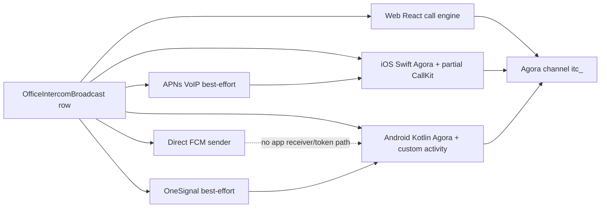

# AMR Office Calling — End-to-End Audit & WhatsApp-grade Roadmap

**Audit date:** 17 July 2026 (Asia/Dhaka)

**Audited source:** `origin/main` at `ffb329f2328692eb5b2988a2ce9de54893218c49`

**Surfaces:** Web, native iOS, native Android, API/database, Agora RTC, APNs PushKit/CallKit, FCM/OneSignal, UI/UX
**Purpose:** This is an audit and implementation roadmap, not a patch. No production data was changed and no real call was placed during the audit.

---

## 1. Executive verdict

The current implementation is **not yet a single calling system**. It is three partially overlapping call clients—web React, iOS Swift, Android Kotlin—connected to a lightweight database row and several best-effort push paths. Agora is being used as the audio transport, but the product lacks an authoritative call state machine, one owner for native call lifecycle, reliable push delivery accounting, reconnect semantics, and cross-device end/answer synchronization.

That architecture directly explains the reported symptoms:

- **iOS → iOS sometimes works and sometimes does not:** the iOS shell exposes a staff web “call owner” action while the web call UI is suppressed and the native engine does not own that outgoing call; native calls also end immediately on Agora `didOfflineOfUid`, outgoing calls are not registered with CallKit, and native decline/end/timeout is not written back to the server.
- **Android → Android does not work reliably:** the server has a direct FCM sender, but the Android app contains no `FirebaseMessagingService`, no FCM-token registration, and no direct-FCM receive path. It actually depends on OneSignal; OneSignal HTTP failures are not checked, and the call is still returned as successfully created. Android also has no server end synchronization, no native staff→owner outgoing path, no Android 14 full-screen-intent capability check, and no notification answer/decline actions.
- **Leaving the app drops the call:** iOS explicitly calls `leave()` from `IntercomView.onDisappear`; Android dismissing the intercom sheet calls `leave()`; web tears Agora down when the component unmounts. These are deterministic code paths, not random Agora failures.
- **Caller/callee disagree about the call:** the server only stores `endedAt` and `endedReason`. It does not store `ringing`, `accepted`, `connecting`, `connected`, per-device answer, or reconnect state. Most native actions never call the end API, and the first client that writes an end reason wins permanently.

**Bottom line:** do not try to stabilize this by adding more timers or more push fallbacks to the current flow. First make the server call session authoritative, then make exactly one native coordinator own every native call, then connect web to the same protocol. The ordered phases in this document are designed to do that without a risky big-bang rewrite.

---

## 2. What was verified and what was not

### Verified

- Frozen current `origin/main` source and dependency/config inventory.
- API authorization, database model, call creation/end/feed/token behavior.
- OneSignal, direct APNs VoIP and direct FCM send paths.
- Web Agora join/leave/polling/UI lifecycle.
- Native Swift Agora, PushKit, CallKit and SwiftUI lifecycle.
- Native Kotlin Agora, notification/full-screen UI, foreground service and Compose lifecycle.
- iOS/Android manifests, entitlements and pinned SDK versions.
- Runtime web UI in an authenticated Chrome preview: the Office group chat/calling UI was inspected without placing a call.
- An iOS 26.5 simulator was available. The installed app was build 76 with embedded commit `b6b4d36947`, which is not the audited `origin/main` SHA; it therefore cannot be treated as runtime proof of current main.
- No Android device/emulator was attached.
- No Office/Agora/VoIP-specific automated tests exist in the audited source.
- Exact snapshot dependencies were installed and Prisma Client generated before `npm run type-check`. The command failed with **640 TypeScript errors** already present in the audited baseline; seven are in `src/agent/lib/office-intercom.ts` (`TS7006` implicit-`any` errors at lines 105, 354–355, 374, 377 and 385). Therefore current main does not provide a clean static-quality gate for this feature.

### Not claimed as verified

- Real APNs VoIP delivery to a physical iPhone in development, TestFlight and production environments.
- Real FCM/OneSignal delivery in Android Doze, force-stopped, killed, locked and OEM battery-saver states.
- Two-device audio, Bluetooth, proximity sensor, GSM interruption, Wi-Fi↔cellular handoff, or long-call stability.
- The signing entitlements embedded in an App Store/TestFlight archive. The source entitlement says `aps-environment=development`; the signed distribution artifact must be inspected separately.
- The exact Git SHA deployed at the authenticated Vercel preview. Runtime UI observations are therefore supporting UX evidence, not proof that the preview and audited main are identical.

These items are deliberately converted into mandatory Claude verification gates later in the roadmap.

---

## 3. Current architecture and the split-brain problem



The media plane is Agora, but the control plane is a broadcast feed plus timers. There is no durable signaling protocol. Each client infers call truth from different signals:

- Web: feed poll + Agora `user-joined/user-left`.
- iOS: PushKit/CallKit or foreground poll + Agora delegate callbacks.
- Android: OneSignal extension/full-screen activity + Agora callbacks.
- Server: only “row exists” and “row ended”.

For WhatsApp-like behavior, the server must decide the canonical call state and every client must reconcile to it. Push is only a wake-up hint; Agora presence is only media presence. Neither should be the database of record.

---

## 4. Severity-ranked findings with evidence

Severity meaning:

- **P0 — release blocker:** can make calls fail, ring the wrong person, leave ghost/stuck calls, or allow unauthorized state changes.
- **P1 — major:** breaks WhatsApp-like background/recovery/audio behavior or makes failures unobservable.
- **P2 — quality:** UX, consistency, maintainability or edge-case gap.

### 4.1 Cross-platform/server findings

| ID | Severity | Finding | Evidence | Consequence |
|---|---:|---|---|---|
| S-01 | P0 | No authoritative call state machine | `prisma/schema.prisma:4334-4367` stores only broadcast metadata, `endedAt`, `endedReason`; no ringing/accepted/connected/device-leg state | Race conditions and caller/callee disagreement are unavoidable |
| S-02 | P0 | Any authenticated owner or staff in the business can end any call row | `src/app/api/assistant/office/intercom/end/route.ts:27-50`; `src/agent/lib/office-intercom.ts:254-264` never verifies actor is sender or target | Security/data-integrity flaw; unrelated staff can terminate calls |
| S-03 | P0 | Invalid/missing end reason silently becomes `completed` | `end/route.ts:39-49` | Broken clients can turn missed/declined calls into completed calls |
| S-04 | P0 | Push failures do not fail call creation and are not recorded | `office-intercom.ts:186-244` uses `Promise.allSettled`; returned results are discarded | API returns 201 even when no phone was reachable |
| S-05 | P0 | OneSignal HTTP 4xx/5xx is treated as success | `src/agent/lib/office-notify.ts:62-72` never checks `response.ok` | Wrong key/app/audience can silently break all Android wakeups |
| S-06 | P0 | No busy/concurrent-call invariant | `office-intercom.ts:131-184`; no active-call transaction/unique constraint in schema | Multiple callers/devices can create overlapping active calls |
| S-07 | P0 | Token endpoint is not bound to a call or participant | `call-token/route.ts:30-37,53-78` accepts any non-empty caller-supplied channel for any owner/active staff and always mints publisher UID 0 | Authenticated users can join arbitrary guessed channels; no 1:1 identity |
| S-08 | P0 | Staff→owner resolution is global, not business-scoped | `office-intercom.ts:118-128`; `intercom/route.ts:108-119` | The earliest active global SUPER_ADMIN can be rung for the wrong business |
| S-09 | P1 | First end writer wins despite absent accepted/connected state | `office-intercom.ts:247-265` | A timeout racing with answer can permanently mark a real call missed/cancelled |
| S-10 | P1 | Push token registry has no logout/deregister and no recency/device/session policy | `call-push.ts:25-82`; register API `:23-48` | Shared/reassigned devices can ring the previous user; stale tokens accumulate |
| S-11 | P1 | Feed is 24 hours/30 mixed records and is used as live signaling | `office-intercom.ts:86-88,317-330` | Busy PTT/chat traffic can evict an active call from client polling |
| S-12 | P1 | GET mutates delivery state | `office-intercom.ts:351-368` | Polling is mistaken for actual device delivery/ringing; evidence is misleading |
| S-13 | P1 | No call/push event ledger, delivery receipts, retry outbox or metrics | no model/API in schema or call libraries | Intermittent incidents cannot be reconstructed |
| S-14 | P1 | Direct APNs environment is controlled only by `APNS_PRODUCTION` | `src/agent/lib/apns-voip.ts` environment selection; source entitlement is development | TestFlight/production token-environment mismatch can cause intermittent BadDeviceToken |
| S-15 | P1 | Cancel is sent as another VoIP push | `office-intercom.ts:281-297` sends `event:'cancel'` through APNs VoIP | Apple says not to use additional VoIP pushes to cancel/update an established call; risks phantom CallKit behavior |
| S-16 | P1 | No token renewal or connection-state contract on any platform | token TTL is one hour at `call-token/route.ts:24`; handlers absent across web/Swift/Kotlin | Long calls and reconnection can fail abruptly |
| S-17 | P2 | Prisma migration/schema index drift | migration `20260916120000_intercom_call_lifecycle/migration.sql:13-14` adds target/time index; schema lacks matching `@@index` | Future migrations/introspection can remove or diverge from intended index |
| S-18 | P1 | Current `origin/main` has no clean TypeScript gate | exact dependency install + Prisma generation followed by `npm run type-check` produced 640 errors, including seven in `office-intercom.ts` | Calling regressions can merge without a trustworthy compile/test signal; establish a clean or scoped gate before implementation |

Apple’s official PushKit guidance says the server should use a unique call identifier, establish a server connection, and use that connection for later hang-up/failure updates rather than sending further VoIP pushes. It also requires incoming VoIP calls to be reported through CallKit. See [Responding to VoIP Notifications from PushKit](https://developer.apple.com/documentation/PushKit/responding-to-voip-notifications-from-pushkit?changes=_4) and [PKPushType.voIP](https://developer.apple.com/documentation/pushkit/pkpushtype/voip).

### 4.2 Web findings

| ID | Severity | Finding | Evidence | Consequence |
|---|---:|---|---|---|
| W-01 | P0 | iOS native shell still exposes staff web `callOwner()` while web call UI/auto-answer is disabled | `intercom.tsx:24-40,532`; `group-chat.tsx:338` | Ghost/split-brain outgoing call: web Agora may join but native CallKit/Swift UI does not own it |
| W-02 | P0 | Call lifetime is tied to React component lifetime | `useAgoraCall.ts:279-285` tears down on unmount | Route/drawer/app navigation drops media |
| W-03 | P1 | Asynchronous join has no generation/abort guard | `useAgoraCall.ts:138-249` fetches, imports, joins and publishes after teardown can have started | A stale join may recreate a zombie client after hang-up/unmount |
| W-04 | P1 | Hidden tabs stop polling | `intercom.tsx:179-192` skips load when `document.hidden` | Web cannot be promised reliable background incoming calls |
| W-05 | P1 | `user-left` becomes call completion after only a short grace | `useAgoraCall.ts:194-202`; parent auto-end logic `intercom.tsx:492-524` | Network handoff/reconnect can be recorded as completed/hung up |
| W-06 | P1 | End API is fire-and-forget | `intercom.tsx:366-373` | UI closes even if server remains active; no retry/idempotency |
| W-07 | P1 | No Agora connection-state, token-expiry, network-quality or device-change handlers | handlers absent in `useAgoraCall.ts`; only joined/left/published | No reconnect UX, renewal, diagnostics or route recovery |
| W-08 | P1 | Any remote UID counts as the peer | `useAgoraCall.ts:187-215` | No enforcement that only intended caller/callee joined the channel |
| W-09 | P2 | Ring timeout differs by surface and timer is client-authoritative | Web/iOS use ~60s; Android outgoing uses 45s | Cross-platform race and inconsistent call history |
| W-10 | P2 | Calling is buried in a narrow group-chat drawer with PTT/urgent/tel actions | authenticated desktop preview runtime observation | Poor discoverability, cramped controls, unclear separation of call types |

Agora exposes connection-state and token-expiry/renewal mechanisms; the current hook does not use them. See Agora’s official [token renewal example](https://prod.agora.io/en/blog/connecting-to-agora-with-tokens-on-web-react) and [token authentication guidance](https://docs-legacy.agora.io/en/video-call-4.x/token_server_android_ng?platform=macOS).

### 4.3 Native iOS findings

| ID | Severity | Finding | Evidence | Consequence |
|---|---:|---|---|---|
| I-01 | P0 | Dismissing/leaving the Intercom view always drops the call | `ios/App/App/IntercomUI.swift:54` | Cannot keep a call while navigating the app or moving UI away |
| I-02 | P0 | Native outgoing/decline/hang-up/timeout does not call server `/end` | `AgoraIntercom.swift:173-229`; `CallKitVoIP.swift:182-207` | Caller keeps ringing; other devices and history remain stale |
| I-03 | P0 | Outgoing calls are not registered with CallKit | `CallKitVoIP.swift` has no `CXStartCallAction` or outgoing reports | No reliable system call ownership, lock-screen/system audio/interrupt behavior |
| I-04 | P0 | `didOfflineOfUid` ends immediately | `AgoraIntercom.swift:544+` | Temporary Agora/network transition appears as a real hang-up—strong iOS intermittency cause |
| I-05 | P0 | Native UI only offers owner→staff; staff→owner native method/UI is absent | `IntercomUI.swift:100-126`; native manager only `ownerCall` at `AgoraIntercom.swift:173` | Native feature parity is incomplete; web fallback creates split brain |
| I-06 | P1 | CallKit answer performs network/token/Agora work before action completion and internal errors are swallowed | `CallKitVoIP.swift:187-196`; `AgoraIntercom.swift:148-171` | CallKit action deadline/failure state can be wrong |
| I-07 | P1 | Random UUID per push; no deterministic callId→UUID persistence/dedupe | `CallKitVoIP.swift:90-116` | Duplicate deliveries can create duplicate/phantom calls; process restart loses mapping |
| I-08 | P1 | Cancel VoIP push is represented as a new CallKit call then immediately ended | `CallKitVoIP.swift:145-166` | Phantom UI/call-log/compliance risk |
| I-09 | P1 | Push token registration is in-memory and invalidation does not deregister server token | `CallKitVoIP.swift:60-87,135-138` | User switch/reinstall/token rotation can ring wrong/stale device |
| I-10 | P1 | CallKit/provider reset and end are only local | `CallKitVoIP.swift:182-207` | Server and other device legs never learn the terminal state |
| I-11 | P1 | Speaker is forced; no user route picker, proximity/earpiece default, route-change/interruption state | `AgoraIntercom.swift:204,310-311,398,422-429` | Echo/privacy/Bluetooth and GSM interruption UX is below call-app standard |
| I-12 | P1 | Source entitlement is `aps-environment=development` | `ios/App/App/App.entitlements:5-6`; project uses it at `project.pbxproj:945,967` | Distribution correctness is unproven until archive entitlements are inspected |
| I-13 | P2 | Microphone permission text only mentions the AI assistant | `Info.plist:52-53` | Poor user/App Review clarity for Office calls |
| I-14 | P2 | “Confirm receipt” comments claim it stops other devices, but it only updates a receipt | `IntercomUI.swift:306,314`; `AgoraIntercom.swift:271+` | Misleading code contract encourages future bugs |

CallKit is intended to manage both incoming and outgoing interactions, system UI and telephony changes. Apple documents outgoing reporting and terminal reasons under [CXProvider reporting APIs](https://developer.apple.com/documentation/CallKit/CXProvider/reportNewIncomingCall%28with%3Aupdate%3Acompletion%3A%29).

### 4.4 Native Android findings

| ID | Severity | Finding | Evidence | Consequence |
|---|---:|---|---|---|
| A-01 | P0 | Direct FCM sender has no Android receiver or token registration | server expects `FirebaseMessagingService` in `fcm-call.ts:1-8`; repo has none; only iOS calls `/call-push/register` | Direct FCM target set remains empty; sender path is dead code |
| A-02 | P0 | Native decline/hang-up/timeout/sheet dismiss never posts server end | `IncomingCallActivity.kt:96-117,144-148,199-225`; `AgoraIntercom.kt:208+`; `IntercomUI.kt:134` | Remote keeps ringing; call row stays active/stale |
| A-03 | P0 | Native staff→owner outgoing UI/method is absent | `IntercomUI.kt:140-167` gates call picker behind `isOwner`; only `ownerCall` exists at `AgoraIntercom.kt:133` | Android↔Android scenario is incomplete for staff callers |
| A-04 | P0 | Compose sheet owns call lifetime and dismiss calls `leave()` | `IntercomUI.kt:81-102,134`; parent modal dismisses sheet | Navigating/dismissing drops active call |
| A-05 | P1 | OneSignal is the actual wake path but its delivery is unchecked server-side | `CallNotificationExtension.kt:19-45`; `office-notify.ts:62-72` | Android incoming calls can silently never appear |
| A-06 | P1 | Notification has no Answer/Decline action and does not use `CallStyle` | `CallNotifications.kt:65-76` | Unlocked banner is not WhatsApp-like and may require opening full activity |
| A-07 | P1 | Android 14 full-screen access is not checked or guided | manifest declares permission at `AndroidManifest.xml:103`; no `canUseFullScreenIntent` call | Play/device may revoke it; incoming call degrades or fails without diagnosis |
| A-08 | P1 | Immediate `onUserOffline` teardown | `AgoraIntercom.kt:347+` | Network transition becomes hang-up |
| A-09 | P1 | “connected” becomes true after local Agora join, before peer arrival | `AgoraIntercom.kt:336`; incoming UI reads it at `IncomingCallActivity.kt:123-152` | UI can show connected/timer before two-way media exists |
| A-10 | P1 | No Core-Telecom/Telecom integration | no `CallsManager`, `MANAGE_OWN_CALLS`, phone-call FGS or call control callbacks | Weak interoperability with GSM, Bluetooth, Wear/Auto, audio focus and system call controls |
| A-11 | P1 | Microphone foreground service start failures are swallowed | `IntercomForegroundService.kt:66-75`; Android 14 background restrictions apply | Background mic can fail while UI falsely claims call continues |
| A-12 | P1 | `BLUETOOTH_CONNECT` is declared but never runtime-requested | manifest `:100`; `MainActivity.java:28-47` requests only mic/notifications | Android 12+ Bluetooth call routing can fail |
| A-13 | P1 | One fixed notification ID and no per-call/action receiver/timeout/delete intent | `CallNotifications.kt:24-26,52-80` | Multi-call collisions and stuck ongoing notification |
| A-14 | P1 | Direct FCM cancel payload would not match OneSignal cancel logic | FCM uses `type=office_call,event=cancel` at `fcm-call.ts:102-120`; extension only checks `type=office_call_cancel` at `CallNotificationExtension.kt:24-34` | Even after adding a receiver, inconsistent payload contracts can leave ring active |
| A-15 | P2 | Outgoing ring timeout is 45s, incoming activity 60s | `AgoraIntercom.kt:388`; `IncomingCallActivity.kt:144` | Caller and callee make conflicting terminal decisions |
| A-16 | P2 | Ringtone/audio policy is custom rather than Telecom-managed | native ringtone/player and custom notification implementation | DND, focus, headset and other-call behavior is inconsistent across OEMs |

Firebase’s official Android documentation requires a `FirebaseMessagingService` to receive data messages in `onMessageReceived`, and warns that processing time is short. See [Receive messages in Android apps](https://firebase.google.com/docs/cloud-messaging/android/receive-messages) and [FCM high-priority message behavior](https://firebase.google.com/docs/cloud-messaging/android-message-priority).

For Android 14+, full-screen intent access must be checked with `canUseFullScreenIntent`; users may need the settings screen and Play can revoke default access. See [Android 14 behavior changes](https://developer.android.com/about/versions/14/behavior-changes-14?authuser=4&hl=en). Android’s recommended VoIP integration is [Core-Telecom](https://developer.android.com/develop/connectivity/telecom/voip-app/telecom), and Android 12+ provides [CallStyle notifications](https://developer.android.com/develop/ui/compose/notifications/call-style?hl=en) with required answer/decline/hang-up actions.

---

## 5. Required target architecture

### 5.1 One server-authoritative call session

Create a dedicated model rather than continuing to overload `OfficeIntercomBroadcast`.

Suggested core entities:

1. `OfficeCallSession`
   - `id` UUID; also use it to deterministically derive/store native call UUID.
   - `businessId`, `callerUserId`, `calleeUserId`, `mediaType` (`audio`, future `video`).
   - `channelName`, `state`, `version`/optimistic lock.
   - `createdAt`, `ringingAt`, `acceptedAt`, `connectingAt`, `connectedAt`, `endedAt`.
   - `endedByUserId`, strict terminal `endReason`.
   - `expiresAt`, `idempotencyKey`, `encryptionMode/keyVersion` if enabled.
2. `OfficeCallLeg`
   - One row per user/device/web session.
   - `deviceId`, `platform`, `pushProvider`, `state`, push/ring/answer/connect/end timestamps.
3. `OfficeCallEvent`
   - Append-only event ledger with actor, device, from/to state, reason, client/server timestamp, SDK error/network/audio-route metadata.
4. `OfficeCallOutbox`
   - Transactional push/state delivery jobs with provider response, attempts, next retry and terminal failure.
5. `CallPushDevice`
   - Explicit device/user/session ownership, token environment, app build, lastSeen, permission/capability flags, logout/revocation timestamp.

State machine:

```text
CREATED -> DISPATCHING -> RINGING -> ACCEPTED -> CONNECTING -> CONNECTED
                                               <-> RECONNECTING
Any non-terminal state -> ENDED
```

Strict terminal reasons:

`caller_cancelled`, `callee_declined`, `missed`, `busy`, `completed`, `network_failed`, `media_failed`, `permission_denied`, `push_unreachable`, `answered_elsewhere`, `replaced_by_other_call`, `server_expired`.

Rules:

- Only caller, callee, or an explicitly privileged system actor may transition a call.
- State transition uses expected version/state and is idempotent.
- Server alone decides timeout/missed; clients submit events but do not race to invent truth.
- One active call per user by default. A transactional lock returns `busy` for conflicts.
- Accept on one device marks other callee legs `answered_elsewhere` and sends a normal state update.
- Push wakes a device; after wake, the client fetches canonical call state over authenticated HTTPS/WebSocket/SSE.
- Agora token is minted only for an active call, exact participant, exact channel, stable unique UID, short TTL and role.
- Keep endpoints under `/api/assistant/office/calls/*`; do not repurpose protected `/api/agent/*` routes.

### 5.2 Exactly one native call owner per platform

Create a process-level `CallCoordinator` on iOS and Android. UI observes it; UI does not own it.

- Native shell detection must disable **all** web call creation, answer and call UI actions—not only the overlay.
- Web-to-native bridge or direct native API calls should send intent to the coordinator.
- Closing a sheet, navigating tabs, locking the phone or backgrounding the app must not call `leave()`.
- The coordinator persists active call ID/UUID, peer, direction, state and terminal sync queue.
- CallKit/Core-Telecom callbacks and server state transitions drive the same coordinator.
- Agora events update media state only; they do not directly declare the business call ended.

### 5.3 Push is wake-up, not truth

- **iOS:** PushKit only for a new incoming VoIP call. Immediately report the deterministic UUID to CallKit, then fetch authoritative state. Use the established server connection/regular notification mechanism for cancellation and updates; do not manufacture a new CallKit call for a cancel push.
- **Android:** choose one documented primary route. Recommended: direct FCM high-priority data → app `FirebaseMessagingService` → Core-Telecom + CallStyle notification. OneSignal can remain for ordinary ERP notifications, but should not be a second ambiguous call signaling owner.
- Persist provider response and per-device receipt. If no eligible device token exists or all sends fail, return/transition to `push_unreachable`, not false success.
- Logout must revoke the device binding. Token rotation must replace old token. Invalid-provider responses disable token synchronously through an auditable event.
- OneSignal identity, if retained, must call `login` after session restore and `logout` on sign-out as documented in [OneSignal’s mobile SDK reference](https://documentation.onesignal.com/docs/en/mobile-sdk-reference).

### 5.4 Web scope must be honest

Desktop web can provide excellent foreground/background-tab calling while the browser is alive, but it cannot promise the same killed-process semantics as PushKit/CallKit or Android Telecom. The product contract should be:

- Foreground web and supported installed PWA: incoming/outgoing calls while browser runtime is available.
- Native iOS/Android: reliable killed/locked/background calling.
- On web, navigation must not unmount the global call coordinator. Mount it at the portal/app shell.
- Use WebSocket/SSE for call state and Web Push/service worker as a wake hint where supported; polling remains fallback only.

---

## 6. WhatsApp-like feature definition of done

The word “WhatsApp-like” must become an executable checklist.

### Core reliability

- iOS↔iOS, Android↔Android, iOS↔Android, mobile↔web and web↔web both directions.
- Foreground, another in-app screen, background, locked screen and killed app.
- Caller cancel instantly stops all callee devices.
- Callee decline/answer instantly updates caller and all other callee devices.
- App navigation does not drop an active call.
- Wi-Fi↔cellular and temporary packet loss enter `reconnecting`, then recover without false completion.
- Server expiry cleans up abandoned calls and notifications.

### System integration

- iOS incoming and outgoing CallKit, lock-screen controls, mute/end, native call history behavior as selected by product.
- Android Core-Telecom, CallStyle answer/decline/hang-up, foreground call notification, Bluetooth/Wear/Auto/system audio focus.
- GSM/other VoIP interruption policy: busy, hold, audio focus loss and resume behavior.
- DND and notification/full-screen permissions are respected and diagnosable.

### In-call controls

- Mute/unmute with true state synchronization.
- Earpiece default for private calls, speaker toggle, wired headset and Bluetooth picker.
- Proximity sensor on iPhone/Android when using earpiece.
- Call duration begins only at server-confirmed/two-party connected state.
- Reconnecting banner, network-quality warning and clear failed-call reason.
- Minimized global call bar/bubble while navigating inside the app.
- Return-to-call action from system notification/Live Activity where appropriate.

### History and multi-device

- Incoming, outgoing, missed, declined, cancelled, busy and failed records.
- Start/answer/end/duration and peer identity from server timestamps.
- Ring all eligible devices, answer on one, stop all others.
- No old user receives a call after logout/account switch.
- Per-device diagnostics: last token registration, permissions, app build, last push result.

### Accessibility and UI

- A dedicated Calls entry/recent calls surface; calling is not buried inside a cramped chat drawer.
- One clear voice call action per staff/owner; separate labels for phone `tel:`, PTT voice clip, live walkie-talkie and Agora call.
- 44pt/48dp touch targets, screen-reader labels, Dynamic Type/font scaling, color-independent states, RTL/Bangla validation.
- Incoming/outgoing/reconnecting/ended screens share one design language across web and native.
- Permission denial screen tells the user exactly which setting prevents calls and provides a settings shortcut.

### Recommended additions not currently present

- Busy/call waiting policy and missed-call notification.
- Spam/rate limiting and owner/staff blocking policy.
- Abuse-safe call audit trail without recording media.
- Optional voice-call media encryption with reviewed key management. Do not market “end-to-end encrypted like WhatsApp” until an independent security review proves the exact cryptographic/key-distribution design; enabling transport encryption alone is not equivalent.
- Optional video calls only after audio SLOs pass. Then add camera permissions, speaker/video route behavior, background/PiP rules, bandwidth adaptation and the same state machine. Screen sharing/group calls should be separate later scopes, not mixed into the reliability rewrite.

---

## 7. Ordered implementation roadmap

## Mandatory rule for every phase

### Fixed execution goal (owner directive, 2026-07-17)

Codex/Claude must complete this entire roadmap as one continuing, non-stop goal. Phases 0–7 must be
implemented strictly in order, and each phase must pass every hard verification available from the
agent environment before the next phase starts. The agent must automatically continue to the next
phase after recording that PASS; it must not pause merely to ask for phones, repeat physical setup,
or wait for a routine confirmation. If a real external-authority or secret-dependent blocker occurs,
it must be recorded precisely, while all remaining safe in-scope work continues.

Physical-device reliability testing is deliberately batched once, after Phases 0–7 are complete.
Phase 8 then runs the full signed iPhone/Android/web matrix and remains the final release gate. Until
Phase 8 passes, the implementation may be engineering-complete but must not be released or described
as fully WhatsApp-like.

> **Claude/Codex must hard-verify the current phase and write a PASS evidence record before starting the next phase. A compile, screenshot, or happy-path demo alone is not a PASS. If any engineering exit criterion fails, the agent must record FAIL with exact evidence, fix/retest within the same phase, and must not begin the next phase. This is one continuous implementation goal—not one phase per chat/session—and the agent automatically continues after each engineering PASS.**

Each phase record must include: audited Git SHA, changed files, migration status, automated test commands/results, real-device matrix rows executed, screenshots/video/log IDs, server call/event IDs, known failures, and an explicit `PHASE N: PASS` or `FAIL` signed with timestamp.

**Owner-approved verification schedule (2026-07-17):** Phases 0–7 use the strongest available
non-physical hard gate in sequence: automated/negative/concurrency tests, migration/schema checks,
web preview, native compile, simulator/emulator, static security/privacy review, and correlated server
evidence. Hardware-only rows are recorded as `DEVICE DEFERRED`, not silently treated as executed.
This allows the next engineering phase only after the current non-device gate passes. Phase 8 remains
blocked until the complete physical-device matrix, signed-build soak, canary, and owner acceptance all
pass. This batching avoids repeatedly overwriting/configuring the same phones while preserving the
rule that the feature cannot be released or called WhatsApp-like without real-device proof.

**Fixed physical-verification rule:** hardware rows written inside Phases 0–7 describe the final test
coverage and are marked `DEVICE DEFERRED` during implementation. They do not force the agent to stop,
reconnect phones, or repeat device setup. Phase 8 executes all deferred rows together against the
finished signed build. A Phase 0–7 `ENGINEERING PASS / DEVICE DEFERRED` permits the next phase; it is
not a production/release PASS.

### Live implementation status

| Phase | Status | Evidence |
|---|---|---|
| 0 | ENGINEERING PASS / DEVICE DEFERRED | `docs/office-calling-phase-evidence/phase-0.md` |
| 1 | ENGINEERING PASS / DEVICE DEFERRED | `docs/office-calling-phase-evidence/phase-1.md` |
| 2 | ENGINEERING PASS / DEVICE DEFERRED | `docs/office-calling-phase-evidence/phase-2.md` |
| 3 | ENGINEERING PASS / DEVICE DEFERRED | `docs/office-calling-phase-evidence/phase-3.md` |
| 4 | IN PROGRESS | Android process coordinator/Core-Telecom implementation and hard gate |
| 5–7 | QUEUED; auto-continue after prior engineering PASS | — |
| 8 | PHYSICAL DEVICES + RELEASE GATE | Must execute every deferred row before release |

### Phase 0 — Freeze contracts, add observability, remove ambiguity

**Goal:** make the current failures measurable before changing behavior.

Work:

- Write an ADR for call ownership and the target state machine.
- Add a build SHA/environment badge to diagnostics on web/iOS/Android.
- Add structured call logs with `callId`, `deviceId`, user, platform, build, state, event, Agora UID/channel, network type, audio route and sanitized provider result.
- Add owner-only call diagnostics showing eligible devices, token kind/environment/lastSeen, OneSignal/FCM/APNs configuration, notification/mic/full-screen capability and recent delivery outcomes.
- Remove misleading comments that claim receipt confirmation stops other devices.
- Define product constants once: ring timeout, reconnect grace, max call duration, busy policy, supported OS/browser versions.
- Add a reproducible two-iPhone/two-Android/web device lab plan. Never test call reliability on simulator alone.

**Exit criteria:** one manually placed current call can be traced from create → outbox/push → ring → answer → Agora join → connected → end with a shared call ID, even if the old call still fails.

**Claude hard gate:** verify logs contain no secrets/tokens, correlate one success and one intentional failure, and prove deployed build SHA matches tested source.

### Phase 1 — Server-authoritative call domain and security

**Goal:** create one canonical truth and close P0 authorization/race defects.

Work:

- Add `OfficeCallSession`, `OfficeCallLeg`, `OfficeCallEvent`, `OfficeCallOutbox`, and explicit device registry models/migrations.
- Implement strict transition service with transaction/optimistic version and idempotency.
- Enforce caller/callee/business membership on every read/transition/token request.
- Resolve owner by business relationship, not global earliest SUPER_ADMIN.
- Add one-active-call-per-user transaction and `busy` response.
- Server owns ring expiry and terminal reason. Clients acknowledge/display; they do not race timers to write final truth.
- Bind Agora token to `callId`, exact channel and participant UID; reject arbitrary channel strings.
- Add token renewal endpoint/event support.
- Keep the old broadcast feed read-only for migration/history while new calls use the new domain behind a feature flag.

Tests:

- Transition-table unit tests including every illegal transition.
- Authorization tests: unrelated staff/business/owner cannot read, join or end.
- Concurrent create/answer/end tests and idempotent retry tests.
- Busy, answer-on-two-devices, timeout-vs-answer and duplicate-request races.

**Exit criteria:** deterministic server tests prove one terminal state, authorized participants only, one active call policy and complete event history.

**Claude hard gate:** inspect generated migration and schema drift, run tests twice including concurrency, manually attempt unauthorized end/token calls, and mark PASS only with DB rows/events attached.

### Phase 2 — Durable push/device delivery layer

**Goal:** a call is never reported as successfully ringing when no device was reached.

Work:

- Make outbox creation part of the call transaction; process with retry/backoff and terminal provider status.
- Record APNs/FCM/OneSignal HTTP status/body category/message ID without storing credentials or raw full tokens.
- Add device registration/logout/rotation APIs and ownership binding.
- APNs: separate sandbox/production registrations, derive environment from signed build/config, `apns-expiration=0`, deterministic call UUID, invalidate 410 tokens.
- Stop using VoIP push for cancel/update; use authenticated live connection/regular notification fallback and canonical fetch.
- Android: implement direct FCM token registration and `FirebaseMessagingService`, or formally remove direct FCM. Recommended: make direct FCM the single call wake path and keep OneSignal for non-call ERP messages.
- Normalize one payload contract: `schemaVersion`, `event`, `callId`, `callUUID`, caller summary, expiry. Client must fetch canonical state before showing/answering.
- Add delivery SLO dashboards and alert when eligible devices = 0 or provider rejects all sends.

Tests:

- Sandbox/prod APNs token mismatch, expired/invalid token, duplicate push, late push, cancel-before-ring.
- FCM Doze high priority, token rotation, deleted messages, notification permission denied.
- Logout/account switch on a shared device.

**Exit criteria:** push outcomes are visible and a fully rejected/no-device call becomes `push_unreachable` or a clear failed state, not a fake ringing success.

**Engineering hard gate (Phase 2):** provider contract tests, payload/TTL/dedupe negative tests, token-registry authorization checks, delivery-ledger correlation, and build/static verification. Physical iPhone/Android delivery and lifecycle rows are `DEVICE DEFERRED` to Phase 8.

### Phase 3 — iOS single CallCoordinator + complete CallKit

**Goal:** native iOS owns every native call and survives UI/background transitions.

Work:

- Introduce one process-level `CallCoordinator`; move active state out of `IntercomView`.
- Disable all web call actions inside iOS shell or bridge them to the native coordinator.
- Implement native owner→staff and staff→owner.
- Use deterministic persisted call UUID. Deduplicate repeated PushKit delivery and reconcile canonical state.
- Incoming: report promptly to CallKit, then connect/fetch. Outgoing: `CXStartCallAction`, `reportOutgoingCall(startedConnectingAt:)`, `connectedAt`, and correct end reasons.
- CallKit answer/end/reset/mute callbacks must make idempotent server transitions and coordinate Agora.
- Remove `onDisappear -> leave`; add global compact return-to-call UI.
- Treat Agora offline/connection changes as `RECONNECTING` with policy, not immediate hang-up.
- Add token renewal, connection state, interruption and route-change handlers.
- Start private calls on earpiece; add speaker/Bluetooth route UI, proximity behavior and CallKit audio-session activation/deactivation.
- Verify PushKit invalidation/logout removes device binding.
- Update microphone usage text to include Office voice calls.

Tests:

- Two physical iPhones: foreground/background/killed/locked both directions.
- Answer/decline/cancel/hang-up from CallKit, app UI, lock screen, headset.
- Navigate every app tab and lock/unlock during call.
- Wi-Fi↔cellular, airplane mode 5–15 seconds, token renewal, GSM interruption, Bluetooth connect/disconnect.
- Duplicate/late push and answer on a second iPhone for the same user.

**Exit criteria:** 30 consecutive iOS↔iOS calls across the matrix with zero stuck rings/ghost calls, correct terminal history and no navigation-related drop.

**Engineering hard gate (Phase 3):** compile/archive, source and embedded configuration inspection, deterministic CallKit/state-machine tests, simulator lifecycle checks, static race review, and correlated protocol evidence. Signed entitlement, TestFlight, audio-route, network-handoff and two-iPhone rows are `DEVICE DEFERRED` to Phase 8.

### Phase 4 — Android single CallCoordinator + Core-Telecom

**Goal:** Android call behavior is OS-compliant and reliable across background/OEM conditions.

Work:

- Introduce process/service-level coordinator; remove call ownership from Compose sheet/activity.
- Implement staff→owner and owner→staff natively; disable/bridge WebView call actions.
- Integrate Jetpack Core-Telecom `CallsManager`, `MANAGE_OWN_CALLS`, call callbacks and correct phone-call foreground support.
- Use CallStyle incoming/ongoing notifications with Answer, Decline and Hang Up actions and per-call PendingIntents/IDs.
- Check notification permission and `canUseFullScreenIntent`; provide settings guidance and a high-priority heads-up fallback.
- Receive the chosen FCM payload in `FirebaseMessagingService`, render immediately, then reconcile server state.
- Request/handle `BLUETOOTH_CONNECT`; use Telecom endpoints/audio focus rather than competing manual routing.
- Remove sheet-dismiss `leave`; add global return-to-call surface and ongoing system notification.
- Implement connection/reconnect/token renewal; do not end on first `onUserOffline`.
- Server transition on every answer/decline/cancel/hang-up/timeout/system action.
- Surface foreground-service start failures instead of swallowing them.

Tests:

- At least Pixel/AOSP plus one Samsung and one aggressive-battery OEM if customer base uses it.
- Android 12, 13, 14/15+ as supported; target SDK 35 behavior.
- Foreground/background/killed/locked/Doze, notification denied, full-screen denied, battery saver.
- Bluetooth/wired/speaker/earpiece, GSM interruption, Wear/headset answer/end where available.
- 30 consecutive Android↔Android calls and Android↔iOS calls.

**Exit criteria:** no stuck notification/ring, correct system controls, navigation/background persistence and canonical server history.

**Engineering hard gate (Phase 4):** Kotlin/unit tests, debug and release build, merged-manifest/APK inspection, Core-Telecom/notification/FGS static contract checks, emulator lifecycle/denial checks where available, and correlated protocol evidence. Physical `dumpsys telecom`, OEM/Doze, Bluetooth/GSM and real-device video rows are `DEVICE DEFERRED` to Phase 8.

### Phase 5 — Web global call client and shared protocol

**Goal:** web uses the same state machine and survives portal navigation while the browser is alive.

Work:

- Mount a web call coordinator at portal root, not Office drawer/component scope.
- Replace signaling poll with authenticated WebSocket/SSE; retain bounded polling reconciliation.
- Add abort/generation guard around token fetch/import/join/publish and idempotent leave.
- Add Agora connection-state, token-expiry renewal, network-quality and media-device-change handlers.
- Use stable participant UID and reject unexpected peers.
- Add microphone selection, output selection where supported, mute/speaker/device state and permission diagnostics.
- Add a global minimized call bar; navigation and closing group drawer must not drop call.
- Handle page reload/browser close as an explicit recoverable leg/session event; never claim killed-browser parity with native.

Tests:

- Chrome, Safari and Edge supported versions; two tabs/same user; browser refresh; device removal.
- Web↔web, web↔iOS, web↔Android both directions.
- Hidden tab, portal route changes, network offline/reconnect, token renewal.

**Exit criteria:** 30-call desktop matrix with zero zombie clients, false completed calls or route-navigation drops.

**Engineering hard gate (Phase 5):** browser automation with mocked/local protocol peers, type/static tests, navigation/reload/offline/token-renewal fault tests, and heap/media cleanup checks. Calls against two real mobile peers are `DEVICE DEFERRED` to Phase 8.

### Phase 6 — Unified call UI/UX and accessibility

**Goal:** make calling first-class and consistent instead of an overloaded chat feature.

Work:

- Add dedicated Calls/recent-call entry in Office; keep “Call” on staff profile/chat header.
- Clearly separate four concepts: system phone (`tel:`), recorded PTT clip, live walkie-talkie, and app voice call.
- Replace the narrow desktop side drawer call flow with a responsive call target panel/modal; keep chat readable.
- Define design states: outgoing, incoming, connecting, connected, reconnecting, busy, declined, missed, failed, ended.
- Add avatar/name/direction, meaningful duration, mute, audio route, minimize and end.
- Add permission/capability diagnostics with direct settings guidance.
- Validate Bangla copy, text scaling, VoiceOver/TalkBack, keyboard focus, contrast and reduced motion.

**Exit criteria:** task-based usability review can place/answer/minimize/return/end a call without knowing the intercom architecture; accessibility audit has no critical findings.

**Engineering hard gate (Phase 6):** deterministic snapshots/screenshots across three code surfaces, automated accessibility/contrast/touch-target checks, localization/RTL/static review, and design checklist. Manual VoiceOver/TalkBack on physical phones is `DEVICE DEFERRED` to Phase 8.

### Phase 7 — Resilience, security, quality and optional encryption

**Goal:** move from functional to production-grade.

Work:

- Define reconnect/backoff/terminal policies and enforce server max duration.
- Add rate limits, abuse controls, audit retention and privacy redaction.
- Evaluate Agora media encryption and a real end-to-end key-distribution design; independent security review before any E2EE claim.
- Add call quality telemetry: join latency, RTT, loss, jitter, audio route, reconnect count, push-to-ring and answer-to-audio.
- Add alerting for push rejection spikes, stuck active sessions, excessive miss rate and platform/build regression.
- Chaos tests for duplicate/out-of-order events, provider outages, database retry, network churn and app process death.

**Exit criteria:** security review issues resolved or explicitly accepted; chaos suite produces no split state/stuck calls; SLO dashboard and alerts are live.

**Engineering hard gate (Phase 7):** fault injection, authorization/privacy/log-redaction/security tests, dependency/config review, rate-limit/kill-switch/rollback checks, and truthful encryption-copy review. Independent external review findings and signed-build mobile soak remain Phase 8 release evidence when they require outside authority or hardware.

### Phase 8 — Full matrix, soak, canary and release

**Goal:** prove the system, not merely its pieces.

Work:

- Execute the complete matrix below on release-signed builds against the release backend.
- Canary by user/device cohort; retain feature flag and server-side kill switch.
- Run at least 100-call mixed-platform soak plus long-call/token-renewal soak.
- Compare baseline and canary SLOs; investigate every stuck/missing terminal event.
- Write support runbook and user-facing permission/recovery guide.

Suggested release SLOs to ratify before Phase 0 ends:

- Healthy-network push-to-ring: p95 ≤ 5s on locked native device.
- Answer-to-two-way-audio: p95 ≤ 3s.
- End/decline/cancel propagation: p95 ≤ 2s when both devices have network.
- Stuck call/ringing/notification after terminal state: 0 in release matrix and soak.
- Correct terminal history: 100% in matrix and soak.
- Navigation/background survival during connected native call: 100%.

**Claude hard gate:** only PASS after production-like signed artifacts, matrix evidence, 100-call soak, canary metrics, rollback drill and explicit owner approval. Then—and only then—remove the old broadcast-based call path.

---

## 8. Mandatory test matrix

Run both directions for every pair:

| Caller | Callee |
|---|---|
| iPhone A | iPhone B |
| Android A | Android B |
| iPhone | Android |
| Android | iPhone |
| Web | iPhone |
| iPhone | Web |
| Web | Android |
| Android | Web |
| Web A | Web B |

For each pair, cover:

1. Both foreground.
2. Callee on another app screen.
3. Callee backgrounded.
4. Callee locked.
5. Callee process killed (native).
6. Caller cancels before answer.
7. Callee declines from app/system UI.
8. Callee answers from app/system UI.
9. Caller and callee each hang up.
10. No answer → server missed timeout.
11. Callee busy in another Office call.
12. Notification denied/full-screen denied where applicable.
13. Mic denied, then restored from Settings.
14. Wi-Fi↔cellular during ringing and connected call.
15. 5s, 15s and >policy network loss.
16. Wired/Bluetooth/speaker/earpiece route changes.
17. GSM/another VoIP interruption.
18. Two devices logged into callee account; answer one.
19. Logout/account switch; old account must not ring.
20. Duplicate/late/out-of-order push and duplicate API retries.
21. Token renewal during a long call.
22. App navigation/minimize/return-to-call.

Every row must assert server state, both client states, system UI/notification state, Agora membership, audio in both directions, history result and event-ledger completeness.

---

## 9. Claude phase verification template

Claude should copy this block into the project’s phase evidence file after each phase:

```markdown
# Office Calling Phase <N> Verification

- Git SHA:
- Backend/deployment SHA:
- iOS build/version + embedded SHA:
- Android build/version + embedded SHA:
- Date/time/timezone:
- Tester/devices/OS versions:

## Scope reviewed
- Changed files:
- Migrations:
- API/state-machine changes:

## Automated evidence
- Command:
- Result:
- Test report path/link:

## Real-device evidence
| Matrix case | Call ID | Result | Server events | Device logs | Video/screenshot |
|---|---|---|---|---|---|

## Negative/security evidence
- Unauthorized transition/token attempt:
- Duplicate/race attempt:
- Permission/push failure attempt:

## Defects
- Open:
- Fixed and re-tested:

## Verdict
PHASE <N>: PASS / FAIL

Reason:
Verifier: Claude
Timestamp:

Rule: If FAIL, Phase <N+1> is forbidden.
```

### Non-negotiable instruction to Claude

> Read this entire roadmap before editing. Work on one phase at a time but continue through all phases in the same nonstop goal. Diagnose root cause before changing code. Preserve unrelated dirty work. Do not mark a phase complete because it compiles. For Phases 0–7, run every available automated, negative, build, simulator/emulator, browser and static cross-platform check; record hardware-only rows as `DEVICE DEFERRED`, write the evidence record, and automatically start the next phase after `ENGINEERING PASS`. Do not pause for phones. Phase 8 alone requires the complete physical-device/signed-build matrix and blocks release until it passes.

---

## 10. Recommended first implementation move

Start with **Phase 0 and Phase 1**, not an iOS timer tweak or another Android notification workaround. The minimum safe vertical slice is:

1. Create authoritative call/session/event models and strict participant authorization.
2. Create one call with one durable ID and explicit state transitions.
3. Trace its push/answer/connect/end events end-to-end.
4. Put iOS and Android behind native coordinator feature flags.
5. Only then migrate iOS, Android and web one phase at a time.

This sequence eliminates the current split-brain foundation. Once the server can prove what happened and each native app has a single call owner, the remaining Agora/audio/UI work becomes testable instead of intermittent guesswork.

---

## 11. Final acceptance statement

The project may call the feature “WhatsApp-like Office Calling” only when Phase 8 passes and the evidence proves:

- all supported device pairs and directions work;
- native calls survive app navigation, background, lock and killed-process incoming wake;
- system call controls and audio routing work;
- network transitions recover without false terminal states;
- multi-device answer/cancel/end is synchronized;
- no unauthorized user can join/end another call;
- every call has an explainable server event history;
- zero stuck calls/rings/notifications occur in the full matrix and soak;
- each preceding phase has an explicit Claude hard-verification PASS.

Until then, the feature should be labeled beta/experimental and protected by a kill switch.
